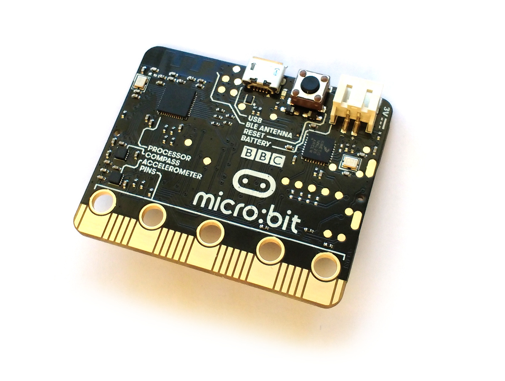

<!--- Copyright (c) 2016 Gordon Williams, Pur3 Ltd. See the file LICENSE for copying permission. -->
BBC micro:bit
============

<span style="color:red">:warning: **Please view the correctly rendered version of this page at https://www.espruino.com/MicroBit. Links, lists, videos, search, and other features will not work correctly when viewed on GitHub** :warning:</span>

* KEYWORDS: micro:bit,Micro Bit,MicroBit,nRF51822



The BBC micro:bit is a small microcontroller board designed for computer education in the UK - see the [Wikipedia Article](https://en.wikipedia.org/wiki/Micro_Bit) for more information.

It contains:

* USB comminications and JST power connectors
* A 5x5 array of LEDs for use as a display
* Two user-configurable buttons, and one reset button
* An accelerometer (MMA8652) and magnetometer (MAG3110)
* A Nordic nRF51822 ARM Cortex-M0 microcontroller (256kB flash, 16kB RAM)
* A Freescale Kinetis chip to handle USB - this provides a virtual USB flash drive that allows firmware updates just by saving a file.

**Note:** While we provide Espruino for the micro:bit, it takes a lot of memory
to provide bluetooth functionality and as a result some functionality has had to
be removed:

* No ES6 Features (ArrayBuffer map/forEach, template literals, arrow functions, etc)
* No advanced library functions (In [the reference](http://www.espruino.com/Reference),
any function with the comment "Note: This is only available in some devices: not
devices with low flash memory" will not be included)
* Low program memory (Espruino on micro:bit has only 350 vars available, whereas
on other devices it has over 10 times that)

If you want the full experience, please consider buying [an official Espruino Board](http://www.espruino.com/Order).
[Puck.js](http://www.espruino.com/Puck.js) is especially useful if you want to
experiment with Bluetooth LE.

Flashing Espruino
------------------

<a name="firmware-updates"></a>There is a build of Espruino designed specifically for the micro:bit. Releases are available from the [Download page](/Download) - however you may also download 'cutting edge' builds [from here](http://www.espruino.com/binaries/travis/master/) - these are updated every time something changes in Espruino's source code, so may occasionally not work.

To flash onto your micro:bit:

* Plug it into USB. A drive called `MICROBIT` should appear
* Download the `.hex` file for Espruino, and save it directly into the root of that drive
* The yellow LED on the micro:bit will blink quickly for a few seconds, and will then stop.
* The Espruino firmware is now installed!


Using the micro:bit
-------------------

There are two ways to communicate with your micro:bit:

### USB

This is the easiest, and recommended way of communicating with Espruino.

For Windows users, you will [need to install drivers first](https://developer.mbed.org/handbook/Windows-serial-configuration) - on other platforms, the board should 'just work'.

Follow the [instructions in the Quick Start tutorial](/Quick+Start) to install the Web IDE (ignore the `Plugging in` section), and you should be able to communicate with the micro:bit just like any other board.

**Note:** as the micro:bit has a display but no general-purpose LEDs, the tutorials in the Quick Start that use `LED1`/etc will not work without modification.

### Bluetooth Low Energy (BT 4.0 / Bluetooth Smart)

You can also program the micro:bit wirelessly! There are two main ways to do this:

#### Web Bluetooth (Google Chromebook, Android 6)

If you have a device that supports [Web Bluetooth](https://webbluetoothcg.github.io/web-bluetooth/), you can go directly to the [Online Web IDE](https://espruino.github.io/EspruinoWebIDE/) in your web browser, and can connect with that:

[[http://youtu.be/HKEHXOSLzCQ]]

* Click the connect icon at the top left
* Choose `Web Bluetooth` - if this doesn't exist, it's because your device doesn't have Web Bluetooth enabled.
* If it isn't enabled:
  * If you're on Android, make sure you install `Chrome Dev`
  * Enter `chrome://flags/#enable-web-bluetooth` in your address bar
  * Click to enable it, and restart Chrome
* Now you should be prompted for a device to connect to by the web browser
* Click it, and wait - connection can take around 10 seconds
* Finally the icon up the top left should change state to 'Connected', and you'll be able to program Espruino as normal - but via Bluetooth!

**Note:** You can still use Web Bluetooth on Android 5, but you need the latest 'Chromium' builds. [See this post on StackOverflow](http://stackoverflow.com/questions/34810194/can-i-try-web-bluetooth-on-chrome-for-android-lollipop/34810195#34810195)

micro:bit Functionality
-----------------------

The micro:bit has a few variables and functions that are useful:

## `BTN1` and `BTN2`

These read the state of the two buttons, for example:

`BTN1.read()` or `digitalRead(BTN1)` return 1 or 0 depending on the state of the button

The following will write `Pressed` each time the button is pressed:

```
setWatch(function() {
  console.log("Pressed");
}, BTN1, {repeat:true, debounce:20, edge:"falling"});
```

Or this will write `Pressed` or `Released`:

```
setWatch(function(e) {
  if (e.state) console.log("Released");
  else console.log("Pressed");
}, BTN1, {repeat:true, debounce:20, edge:"both"});
```

**Note:** Currently the state of the buttons is *inverted* - `1` means not pressed, `0` means pressed.

## `show(bitmap)`

Shows graphics on the built-in 5x5 LED screen. This takes a binary number or a string. For example:

* `show(0)` shows nothing
* `show(1)` lights the first LED
* `show(0b1000)` lights the fourth LED
* `show(0b1111111111111111111111111)` or `show(0x1FFFFFF)` lights all LEDs
* The following will draw a smiley face:

```
show("1   1\n"+
     "  1  \n"+
     "  1  \n"+
     "1   1\n"+
     " 111 \n");
````

You can use the Graphics library to display text and images, for example the following with scroll 'Espruino' across the display:

```
g = Graphics.createArrayBuffer(5,5,1);
g.flip = function(){show(this.buffer);};

var x = 0;
setInterval(function() {
  x++;
  if (x>50)x=0;
  g.clear();
  g.drawString("Espruino",5-x);
  g.flip();
}, 100);
```

## `acceleration()`

This returns an object with `x`, `y`, and `z` elements, each containing the force in that axis in `g`.

## `compass()`

This returns an object with `x`, `y`, and `z` elements, indicating the current direction of the magnetic field


Pinout
------

* APPEND_PINOUT: MICROBIT


Tutorials
--------

Tutorials using the micro:bit Board:

* APPEND_USES: MicroBit

Tutorials using Bluetooth LE:

* APPEND_USES: Only BLE,-MicroBit

Tutorials using Bluetooth LE and functionality that may not be part of the micro:bit:

* APPEND_USES: BLE,-Only BLE,-MicroBit


Buying
-------

micro:bits are currently available to buy [in the UK](https://www.element14.com/community/community/stem-academy/microbit) and [in the United States](https://www.techwillsaveus.com/shop/microbit/).


Official Espruino Boards
-------------------------

* APPEND_KEYWORD: Official Board
