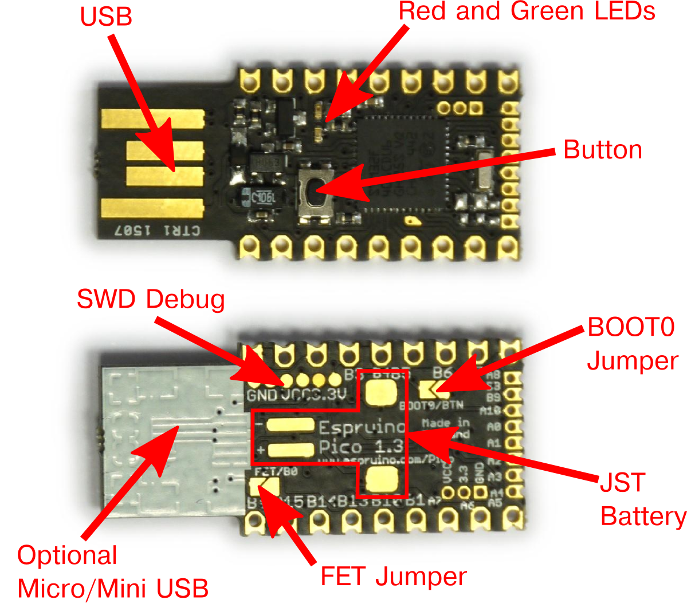
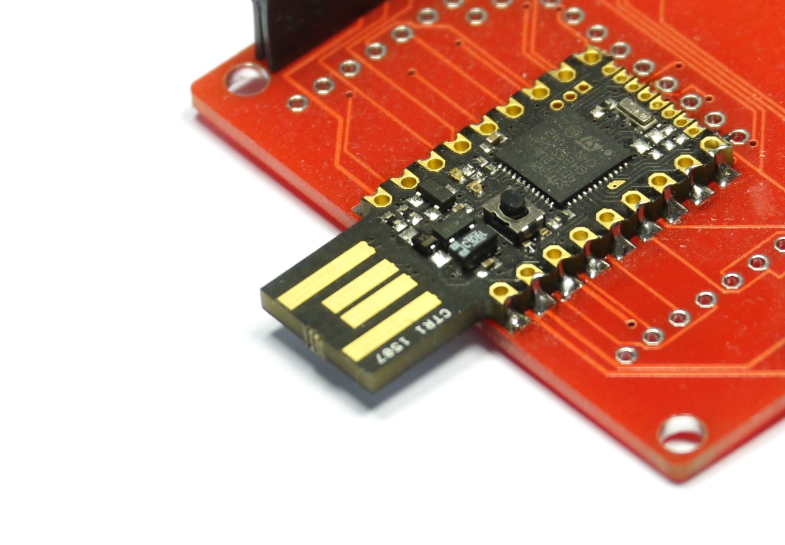
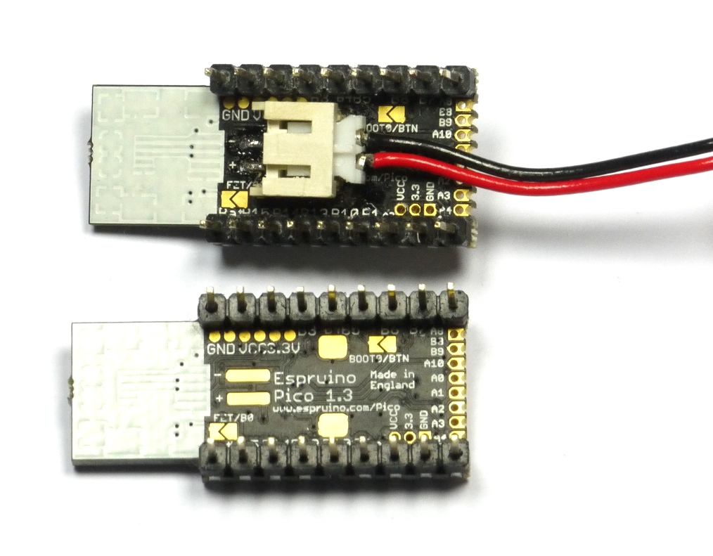
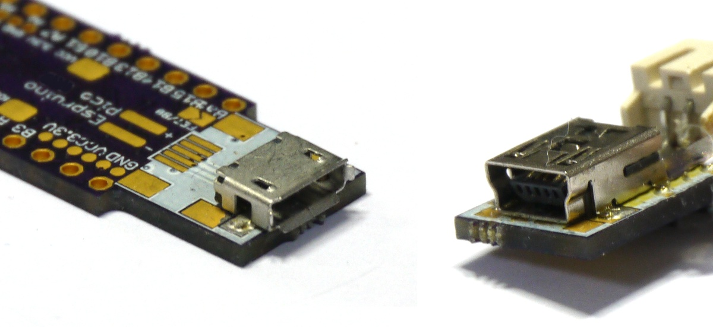
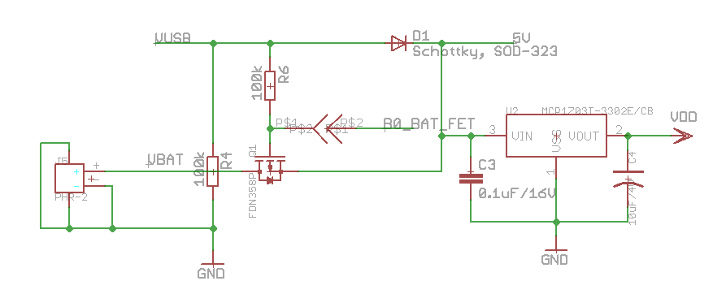

<!--- Copyright (c) 2013 Gordon Williams, Pur3 Ltd. See the file LICENSE for copying permission. -->
Espruino Pico
============

<span style="color:red">:warning: **Please view the correctly rendered version of this page at https://www.espruino.com/Pico. Links, lists, videos, search, and other features will not work correctly when viewed on GitHub** :warning:</span>

* KEYWORDS: Espruino Pico,Board,PCB,Pinout


Features
-------

* 33mm x 15mm (1.3 x 0.6 inch)
* 22 GPIO pins : 9 Analog inputs, 21 PWM, 2 Serial, 3 SPI, 3 I2C
* All GPIO is 5 volt tolerant (Arduino compatible)
* 2 rows of 9 0.1" pins, with a third 0.05" row of 8 pins on the end
* On-board USB Type A connector
* Two on-board LEDs and one button.
* [STM32F401CDU6](/datasheets/STM32F401xD.pdf) 32-bit 84MHz ARM Cortex M4 CPU
* 384kb flash, 96kb RAM
* On-board 3.3v 250mA voltage regulator, accepts voltages from 3.5v to 16v
* Current draw in sleep: &lt; 0.05mA - over 2.5 years on a 2500mAh battery
* On-board FET can be used to drive high-current outputs
* Rev 1v4: 500mA polyfuse on board
* Rev 1v4: CE and RoHS certification

<a name="buy"></a>Buying
------

You can now get an Espruino Pico from several different distributors. [Click here to see them.](/Order#pico)

Pinout
------

* APPEND_PINOUT: PICO_R1_3

<span style="color: red">**Note:** There is no built-in fuse on the Espruino Pico 1v3 (1v4 contains one). You should check that your circuit does not contain shorts with a volt meter *before you plug it into USB*, or you may damage your board.</span>

Information
-----------

* [Circuit Diagram](https://github.com/espruino/EspruinoBoard/raw/master/Pico/pdf/schematic_1v3.pdf)
* [Board Layout](https://github.com/espruino/EspruinoBoard/raw/master/Pico/pdf/board_1v3.pdf)
* [STM32F401CD Datasheet](/datasheets/STM32F401xD.pdf)
* [STM32F401CD Reference Manual](/datasheets/STM32F401xD_ref.pdf)
* [Part libraries for Eagle CAD and KiCad](https://github.com/espruino/EspruinoBoard/tree/master/Pico/Component)
* [Part library for Fritzing](https://github.com/espruino/EspruinoBoard/blob/master/frizting/Espruino_Pico.fzpz)

Tutorials
--------

Tutorials using the Pico Board:

* APPEND_USES: Pico

Layout
-----



| Name | Function |
|------|----------|
| USB  | Printed Type A USB connector plugs straight into standard socket |
| LEDs | Red and Green LEDs accessible using the built-in variables LED1 and LED2 |
| Button | Button accessible using the built-in variable BTN |
| SWD Debug | (Advanced) SWD debug connections for firmware debugging |
| BOOT0 Jumper | (Advanced) Short this jumper out to connect the button to BOOT0. Plugging the device in with the button pressed will the cause the DFU bootloader to be started, allowing you to change absolutely all of Espruino's firmware. |
| JST Battery | Pads for a surface mount JST PHR-2 [[Battery]] connector (see [below](#battery)) |
| Micro/Mini USB | Under the white silkscreen are pads to solder USB sockets on (see [below](#usb)) |
| FET Jumper | Shorting this jumper allows the PFET to be controlled from pin B0 (see [below](#power)) |

**Note:** The two jumpers can be shorted out just by scribbling over them with an HB pencil.

Embedding the Pico
----------------



The Pico is designed to be easy to include in your designs. The 0.1" pins are easy to fit in to sockets, and castellated edges mean that unpinned Picos can easily be surface-mounted directly to a PCB.

To make it even easier, there are [part libraries for Eagle CAD and KiCad](https://github.com/espruino/EspruinoBoard/tree/master/Pico/Component). The Eagle CAD library includes the Pico's footprint in several different configurations (KiCad is `SMDONLY`):


| Library Name | Description |
|--------------|-------------|
| PICO_PIN     | Through-hole connections for all of the Pico's pins |
| PICO_SMD     | Through-hole connections that can also be used to surface-mount a Pico |
| PICO_HALFSMD | 0.1" Through-hole connections, with surface-mount pads for 0.05" pins. This often helps with routing small boards (wires can be run under the 0.05" pads) |
| PICO_SMDONLY | Surface mount-only pads for a Pico. Good for double-sided boards with large SMD components on the other side |
| PICO_0.05    | Through-hole pads for just 0.05" pins (including power) - useful for very small add-on boards |

These parts are also used for a variety of [[Shims]] that allow the Pico to be easily attached to other hardware.

Hardware Limitations
------------------

* You can only have one watched pin of each number (Watching A0 and A1 is fine, but watching A1 and B1 isn't)
* When in Deep sleep, pin B9 cannot be used as a watch (as A9 is used to wake up on USB)
* The internal low speed oscillator is used for timekeeping unless an external crystal is soldered on. This is not accurate and can be +/- 10%

Troubleshooting
-------------

Please see the [[Troubleshooting]] section.

<a name="battery"></a>Battery
-------



Espruino Pico contains the circuitry needed to power itself from a battery without the voltage drop of a diode. This means that it will run off of normal 3.7v LiPo batteries (or any voltage up to 16v).

In order to connect to a battery, you can use either the pins marked `Bat` and `GND` (on opposite sides of the board, nearest the USB connector), or you can solder a JST S2B-PH-SM4-TB [[Battery]] connector connector onto the underside of the board.

Please see the [[Battery]] page for information on connectors and where to buy them.

<a name="usb"></a>Alternate USB connectors
-------------------------



On the rear of the Pico Board under the while block of silkscreen, there are pads for connectors. Espruino rev 1v3 has both Micro and Mini USB, but Espruino rev 1v4 only has Mini USB (due to potential issues with Apple's USB extension leads).

To use these, *carefully* scratch off the silkscreen until you have copper tracks, and solder on the connector.

The connectors you need are very standard parts. While some parts are listed below, many other parts from many different manufacturers would work perfectly well.


### Mini-B USB

(Pico Revision 1v3 and 1v4) - 5 pin, 4 pad surface mount

* [Seeed OPL (3400020P1)](http://www.seeedstudio.com/wiki/images/a/a9/3400020P1.pdf)
* [Digi-Key](http://www.digikey.co.uk/product-detail/en/DX2R005HN2E700/670-1190-1-ND/1283605)

### Micro-B USB

(Pico Revision 1v3 only) - 5 pin, 2 pad surface mount

* [Seeed OPL (3400150P1)](http://www.seeedstudio.com/wiki/images/a/aa/3400150P1.pdf)
* Octopart [list of distributors](https://octopart.com/zx62-b-5pa%2811%29-hirose-42422030)
* [Farnell](http://uk.farnell.com/hirose-hrs/zx62-b-5pa-11/micro-usb-b-type-receptacle/dp/1645325)
* [RS](http://uk.rs-online.com/web/p/products/6850965/)
* [Mouser](http://www.mouser.com/ProductDetail/Hirose-Electric/ZX62-B-5PA11/)


<a name="power"></a>Power, and the FET/B0 Jumper
-------------

| Pico Board | Quick Reference | Circuit Diagram (below) | Description |
|-----------|-----------|-------|----------|
| USB Plug | | VUSB  | USB voltage in |
| VCC      | 5V | 5V | USB voltage output (minus diode drop) if connected, Battery voltage if not |
| Bat (also pad marked `+`) | BAT_IN | VBAT | Battery voltage input (connect battery here) |
| 3.3V     | VDD     | VDD | Regulated 3.3v output (~200mA continuous) |

Currently the labelling for the Pico's pins is quite confusing (it's different on the circuit diagram, PCB silkscreen, and the Pinout diagram). Hopefully the table above will help to clear it up slightly.



Espruino's power circuitry is as above. When USB is connected the device is powered through a Schottky diode with 0.3v voltage drop. However when USB is disconnected then Espruino can be powered from a battery with no voltage drop. This is done by turning on the PFET Q1.

However, the `FET/B0` Jumper allows you to connect the PFET's gate to pin B0. This allows you to do several things:

* Check whether the device is running from USB or Battery (`digitalRead(B0)?"USB":"Bat"`)
* When running from USB, use the `Bat` Pin as a powered 5V output.
* When running from USB with a battery connected, charge the battery.

This last reason is why the jumper is *disconnected by default*. It could be dangerous to charge a LiPo battery this way unless your software also monitor's the battery's charge.

Once the `FET/B0` Jumper is shorted, the following commands will work:

```
digitalWrite(B0,0); // Turn on the 'Bat' output fully
digitalWrite(B0,1); // Partially turn on the 'Bat' output (this produces 3.3v on the FET, meaning it has just 1.4v between Gate and Drain)
digitalRead(B0); // turn off the output (also check if USB powered)
pinMode(B0, "af_opendrain");analogWrite(B0, 0.5, {freq:100}); // output a 100Hz 50% duty cycle square wave
```

The jumper can be shorted by scribbling over it with a normal HB pencil. See the [[Pico FET Output]] tutorial for an example.

Advanced Reflashing
-----------------

In very rare cases (if you are experimenting with writing to Flash Memory), you may be able to damage the bootloader, which will effecitively 'brick' the Pico.

To fix this, you'll have to use the hard-wired USB DFU (Device Firmware Upgrade) bootloader. You can also use this method for flashing non-Espruino firmwares to Espruino.

Just:

* Short out the `BOOT0/BTN` solder jumper on the back of the board - you can do this by drawing over it with a pencil.
* Install [ST's DFU utility](http://www.st.com/web/en/catalog/tools/FM147/CL1794/SC961/SS1533/PF257916) on Windows, or [dfu-util](http://dfu-util.sourceforge.net/) for Mac or Linux
* Download the latest Espruino Pico binary from [espruino.com/binaries](http://www.espruino.com/binaries/)
* Hold down the Pico's button while plugging it into USB
* Use the DFU tool to flash the firmware. Using the GUI on windows, or with the command `sudo dfu-util -a 0 -s 0x08000000 -D espruino_binary_file.bin` for `dfu-util` on Mac/Linux.
* Un-short the `BOOT0/BTN` jumper to re-use the original Espruino Bootloader. If you used a Pencil mark then you may need to use cleaning fluid and a small brush to totally clear out the graphite.

**Note:** If you can't access the bottom side of the board (maybe it is soldered down), on rev 1v3 boards BOOT0 is available via a gold teardrop-shaped pad on the top of the board. Short this to 3.3v while applying power to enable DFU mode (holding down the button is then not required).

Advanced Debugging
----------------

The Pico also has SWD Debug connections on the back of it. An ST-Link debugger (or ST Discovery/Nucleo board) can be connected to these connections for fast firmware uploads and source-level debugging of the interpreter itself.

See the [[AdvancedDebug]] page for more information.
