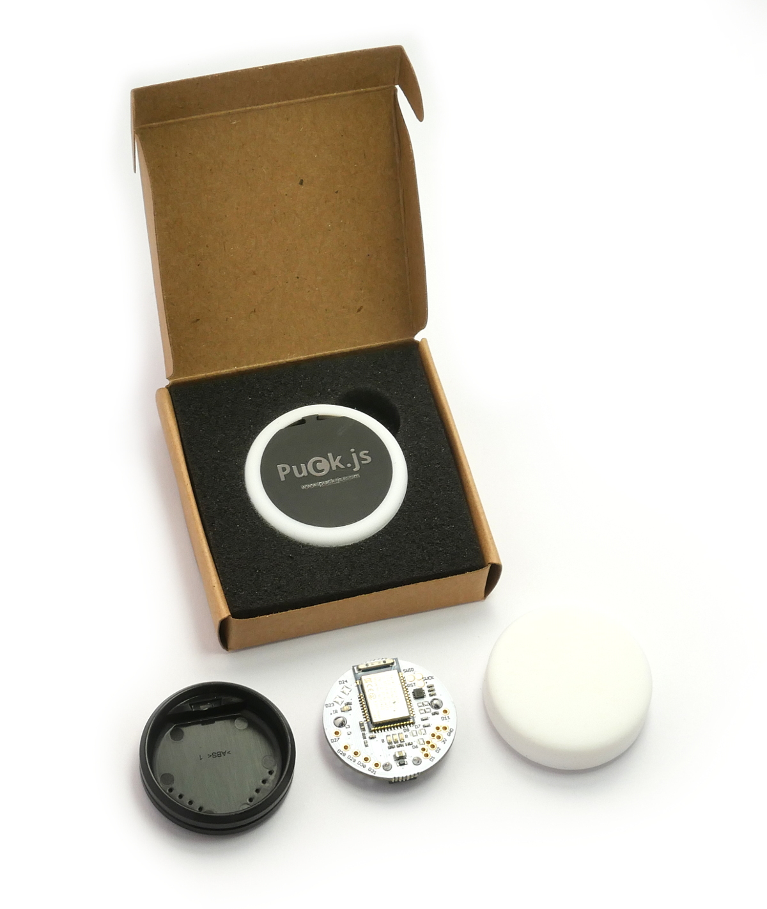

<!--- Copyright (c) 2016 Gordon Williams, Pur3 Ltd. See the file LICENSE for copying permission. -->
Puck.js
=======

* KEYWORDS: Espruino,Puck,Puckjs,Board,PCB,Pinout,Bluetooth,BLE,Bluetooth LE

Features
--------

* Espruino JavaScript interpreter pre-installed
* nRF52832 SoC - Cortex M4, 64kB RAM, 512kB Flash
* 8 x 0.1" GPIO (capable of PWM, SPI, I2C, UART, Analog Input)
* 9 x SMD GPIO (capable of PWM, SPI, I2C, UART)
* ABS plastic rear case with lanyard mount
* Silicone cover with tactile button
* MAX3110 Magnetometer
* IR Transmitter
* Red, Green and Blue LEDs
* NFC tag programmable from JavaScript
* Pin capable of capacitive sensing

Tutorials
--------

Tutorials using Puck.js:

* APPEND_USES: Puck.js

Power Consumption
-----------------

Puck.js's power consumption depends a huge amount on not just how much
JavaScript code you execute, but how much you transmit, how often,
and at what power level.

Nordic provides [a tool to work out power consumption](https://devzone.nordicsemi.com/power/),
for advertising, but values are roughly:

* Not doing anything - 2.5uA
* Advertising, 750ms 0dBm (default mode) - 20uA
* Advertising, magnetometer reading 0.63 Hz - 50uA
* Advertising, magnetometer reading 10 Hz - 200uA
* Connected via BLE - 200uA
* One LED lit - 1-2mA
* 100% CPU usage running JavaScript - 4mA
* All LEDs lit, 100% CPU usage running JavaScript - 10mA

Puck.js sends advertising data without ever executing JavaScript. To get
the best power consumption, make sure your code executes as rarely as
possible.

Firmware Updates
-----------------

* On your Bluetooth LE capable phone, install the `nRF Connect` app
* Download the latest `espruino_xxx_puckjs.zip` file from [the binaries folder](/binaries)
* Remove the battery from Puck.js, and re-insert it with the button held down momentarily
* The Green LED should light while the button is pressed, and when released the Red LED should stay lit
* Open the `nRF Connect` app
* It should show some Bluetooth devices, including one called `DfuTarg`
* Click `Connect` to the right of `DfuTarg`
* Once connected, a `DFU` symbol in a circle will appear in the top right of the App
* Click it, choose `Distribution Packet (ZIP)`, and your Download
* The DFU process will start - it will take around 90 seconds to complete

Troubleshooting
---------------

### Web Bluetooth doesn't appear in my Web IDE connection options

* Try following [these instructions](Puck.js Quick Start#with_web_bluetooth)
* Do you have an up to date version of Chrome? (`Help` -> `About Google Chrome`) - it should be at least version 51
* Have you enabled Web Bluetooth in `chrome://flags`?
* You need a Bluetooth LE-capable adaptor (at least Bluetooth 4.0). If your PC doesn't have one, you can [buy one for well under $10](http://www.ebay.com/sch/i.html?_nkw=usb+bluetooth+4+dongle&_sacat=0)
* **Android** needs to be at least version 6 (or version 5 with recent builds of Chromium)
* **Windows** isn't currently supported, but it should be (at least for 10 and above) in 2017. Otherwise you'll need to use the packaged version of the Web IDE
* **Linux** needs Bluez 5.41 or above - [see here for instructions on how to install it](/Web Bluetooth On Linux)
* **MacOS** needs OS X Yosemite or later. Older hardware will need an external USB dongle though - check that `Low Energy` supported in `About this Mac` -> `System Report`/`Bluetooth`  
* **Chrome OS** works fine

### I can't get the battery out

Poke it with something nonconductive from behind (where the button is)

### When I insert the battery the green light comes on

This is because you're pressing the button down while putting it in. Try inserting the battery without the button pressed.

### When I insert the battery the red light comes on

You're in bootloader mode. You get to this when you press the button while inserting the battery and then release it.

To get out, just take the battery out and re-insert it without pressing the button.

### I disassembled my Puck.js and now the button won't click

Take it apart again, and place the area on the back with the text `Puck.js`
against the ledge on the plastic case (the dimples in the case should
align with the holes in the PCB).

### I can no longer connect to my Puck.js device from Android

Have you been running one of the `Nordic`/`nRF` applications? If so, make sure
it is closed (Click the square icon to get to the application chooser, and swipe
the application to the left or right)

### I saved some code and my Puck no longer works

* Take the battery out
* Re-insert it with the button held down, the Green LED will light
* Keep the button pressed for ~3 seconds until all 3 LEDs light
* Release the button
* The Green LED will flash 3 times (this is the self-test)

Puck.js will now have booted without loading the saved code. However it won't
have deleted your saved code. To do that, you'll need to log in and type
`save()`.
