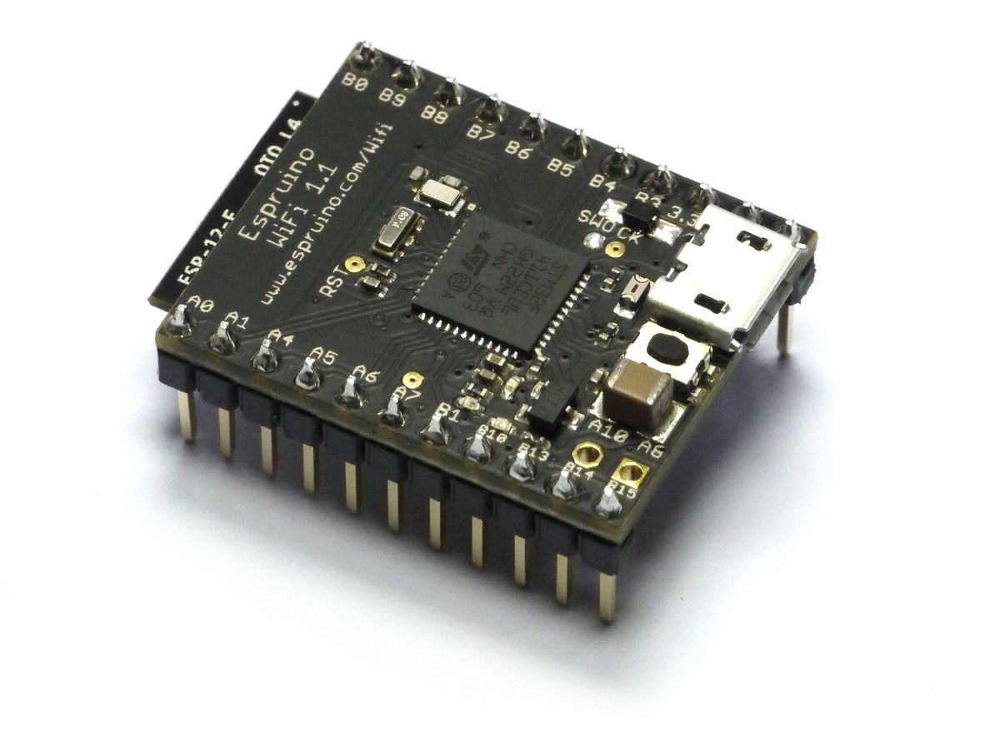

<!--- Copyright (c) 2013 Gordon Williams, Pur3 Ltd. See the file LICENSE for copying permission. -->
Espruino WiFi
=============

<span style="color:red">:warning: **Please view the correctly rendered version of this page at https://www.espruino.com/WiFi. Links, lists, videos, search, and other features will not work correctly when viewed on GitHub** :warning:</span>

* KEYWORDS: Espruino WiFi,WiFi,Wireless,Internet,Radio,ESP8266,Board,PCB,Pinout



**Note:** Espruino WiFi provides an easy, well-supported way to get on the Internet, however it's not the only way to access a WiFi network from an Espruino board. [See here](/Internet#related-pages) for more information.

Features
-------

* 30mm x 23mm (1.2 x 0.9 inch)
* On-board Micro USB connector
* 2 rows of 11 0.1" pins, with 2 extra 0.1" holes
* 21 GPIO pins : 8 Analog inputs, 20 PWM, 1 Serial, 3 SPI, 3 I2C
* Three on-board LEDs (2x user programmable, 1x WiFi activity) and one button.
* [STM32F411CEU6](/datasheets/STM32F411xE.pdf) 32-bit 100MHz ARM Cortex M4 CPU
* 512kb flash, 128kb RAM
* ESP8266 WiFi (802.11 b/g/n)
* All GPIO is 5 volt tolerant (Arduino compatible)
* RTC with external oscillator
* On-board 3.3v 250mA voltage regulator, accepts voltages from 3.5v to 5v (please see notes under [pinout](#pinout) below)
* Current draw in sleep: &lt; 0.05mA - over 2.5 years on a 2500mAh battery
* 500mA polyfuse on board

<a name="buy"></a>Buying
------

You can now get an Espruino WiFi from several different distributors. [Click here to see them.](/Order#wifi)


Pinout
------

* APPEND_PINOUT: ESPRUINOWIFI

<span style="color: red">**Note:** Unlike [Espruino Pico](/Pico) and the [original Espruino board](/EspruinoBoard), Espruno WiFi **doesn't** contain any
battery switchover circuitry. The `+`/`+VUSB` pin is connected straight to **USB 5V**, and shouldn't be used to power the
WiFi board while Micro USB is plugged in, unless it is via a diode from 5V.</span>

Information
-----------

* [Circuit Diagram](https://github.com/espruino/EspruinoBoard/blob/master/WiFi/pdf/espruino_wifi_sch.pdf)
* [Board Layout](https://github.com/espruino/EspruinoBoard/blob/master/WiFi/pdf/espruino_wifi_brd.pdf)
* [STM32F411CE Datasheet](/datasheets/STM32F411xE.pdf)
* [STM32F411CE Reference Manual](/datasheets/STM32F411xE_ref.pdf)


Using WiFi
----------

### Connecting to an AP

To use wifi, simply require the EspruinoWiFi module and call `connect`:

```
var WIFI_NAME = "";
var WIFI_OPTIONS = { password : "" };

var wifi = require("EspruinoWiFi");
wifi.connect(WIFI_NAME, WIFI_OPTIONS, function(err) {
  if (err) {
    console.log("Connection error: "+err);
    return;
  }
  console.log("Connected!");
  getPage();
});

function getPage() {
  require("http").get("http://www.pur3.co.uk/hello.txt", function(res) {
    console.log("Response: ",res);
    res.on('data', function(d) {
      console.log("--->"+d);
    });
  });
}
```

**Note:** If you want Espruino to connect at power on after you have
saved, make sure that you call the WiFi initialisation code inside an
`onInit` function - eg:

```
var WIFI_NAME = "";
var WIFI_OPTIONS = { password : "" };

var wifi;

function onInit() {
  wifi = require("EspruinoWiFi");
  wifi.connect(WIFI_NAME, WIFI_OPTIONS, function(err) {
    if (err) {
      console.log("Connection error: "+err);
      return;
    }
    console.log("Connected!");
    getPage();
  });
}
```

### Access Point Mode

Espruino WiFi can be made into a WiFi access point with:

```
var wifi = require("EspruinoWiFi");

wifi.startAP('EspruinoAP', { password: '0123456789', authMode: 'wpa2' }, function(err) {
  if (err) throw err;
  console.log("Connected!");
});
```

See the reference below for more information. `startAP` and `connect` can be used together to make Espruino become an access point while also connecting to another WiFi network. In that case, it'll have the DHCP-assigned IP address on the WiFi network it is connected to, and the IP address `192.168.4.1` on the access point it has created.

### WiFi events

You can also be notified on particular WiFi events:

```
wifi.on('associated',function() { console.log("We're connected to an AP"); });
wifi.on('connected',function() { console.log("We have an IP Address"); });
wifi.on('disconnected',function() { console.log("We disconnected"); });
```

Reference
---------

Espruino WiFi's `EspruinoWiFi` module (code library) is designed to look and behave almost the same as the [ESP8266 native `WiFi` module](http://www.espruino.com/Reference#Wifi).
However *you can't use the `WiFi` module directly*, for example by using `require("WiFi")`. You will be able to it future firmware versions, however for now you must use `require("EspruinoWiFi")`.

* APPEND_JSDOC: ../devices/EspruinoWiFi.js


Tutorials
---------

Tutorials using the Espruino WiFi Board:

* APPEND_USES: EspruinoWiFi

There aren't currently many tutorials using this board, however it can be used just like the [Espruino Pico](/Pico), which has a lot of tutorials available.


Hardware Limitations
------------------

* You can only have one watched pin of each number (Watching A0 and A1 is fine, but watching A1 and B1 isn't)
* When in Deep sleep, pin B9 cannot be used as a watch (as A9 is used to wake up on USB)


Troubleshooting
-------------

Please see the [[Troubleshooting]] section.


Advanced Reflashing
-----------------

In very rare cases (if you are experimenting with writing to Flash Memory), you may be able to damage the bootloader, which will effecitively 'brick' the Espruino WiFi.

To fix this, you'll have to use the hard-wired USB DFU (Device Firmware Upgrade) bootloader. You can also use this method for flashing non-Espruino firmwares to Espruino.

Just:

* Short out the `BOOT0/BTN` solder jumper on the back of the board - you can do this by drawing over it with a pencil.
* Install [ST's DFU utility](http://www.st.com/web/en/catalog/tools/FM147/CL1794/SC961/SS1533/PF257916) on Windows, or [dfu-util](http://dfu-util.sourceforge.net/) for Mac or Linux
* Download the latest Espruino WiFi binary from [espruino.com/binaries](http://www.espruino.com/binaries/)
* Hold down the Espruino WiFi's button while plugging it into USB
* Use the DFU tool to flash the firmware. Using the GUI on windows, or with the command `sudo dfu-util -a 0 -s 0x08000000 -D espruino_binary_file.bin` for `dfu-util` on Mac/Linux.
* Un-short the `BOOT0/BTN` jumper to re-use the original Espruino Bootloader. If you used a Pencil mark then you may need to use cleaning fluid and a small brush to totally clear out the graphite.
