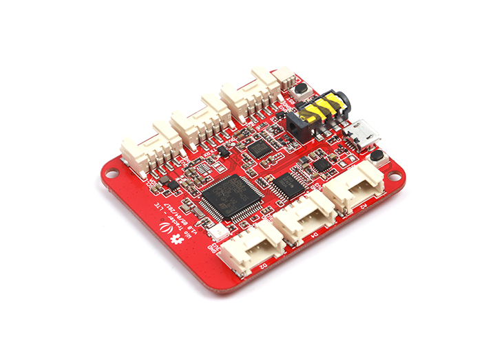

<!--- Copyright (c) 2017 Gordon Williams, Pur3 Ltd. See the file LICENSE for copying permission. -->
Seeed Wio LTE
=============

<span style="color:red">:warning: **Please view the correctly rendered version of this page at https://www.espruino.com/WioLTE. Links, lists, videos, search, and other features will not work correctly when viewed on GitHub** :warning:</span>

* KEYWORDS: Seeed,Wio,LTE,UMTS,Board,Module,GPS



The [Seeed Wio LTE](http://wiki.seeed.cc/Wio_Tracker_LTE_CAT1/) board is an open source gateway which enable faster IoT GPS solutions.

It contains:

* Worldwide LTE and UMTS/HSPA+
* GPS/BeiDou/GLONASS/Galileo and QZSS
* 6 [Grove](/Grove) Connectors
* Nano SIM and TF card 2 in 1 socket

Full details on flashing can be found on [Seeed's website](http://wiki.seeed.cc/Wio_Tracker_LTE_CAT1/)

Binaries can be found in:

* the [Downloadable zip of firmare](/Download) (current version)
* the [binaries folder](/binaries) (current version)
* the [automatic Travis Builds](https://www.espruino.com/binaries/travis/master/) (cutting edge builds)

Using
-----

Seeed Wio LTE can be used much like any other Espruino USB device, with
the exception of the on-board LED which needs to be accessed with the
`WioLTE.LED(r,g,b)` function.

The built-in object `WioLTE` provides useful functionality:

```
WioLTE.LED(r,g,b); // Output a color on the LED (values range 0..255)
WioLTE.setGrovePower(true); // Enable power to Grove sockets
```

There are also built-in variables for each of the [Grove](/Grove)
connectors marked on the board. These are two-element arrays of Pins: 

```
WioLTE.D38
WioLTE.D20
WioLTE.A6
WioLTE.A4
WioLTE.I2C 
WioLTE.UART
```

They can be used with Espruino's [Grove modules](/Grove),
however remember to turn power on with `WioLTE.setGrovePower(true);`
first!

You can also access them directly:

```
WioLTE.D38[0].write(1);
digitalWrite(WioLTE.D38[0]);

var pin = WioLTE.D38[0];
digitalWrite(pin, 0);
```


Using SD Card
-------------

The SD card can be accessed with [Espruino's normal File IO](/File+IO).

However you must be careful not to use it less than 4 seconds before
power-on, as the SD card will not have initialised by that point.


Using LTE and GPS
-----------------

Coming soon... 


Pinout
------

* APPEND_PINOUT: WIO_LTE
