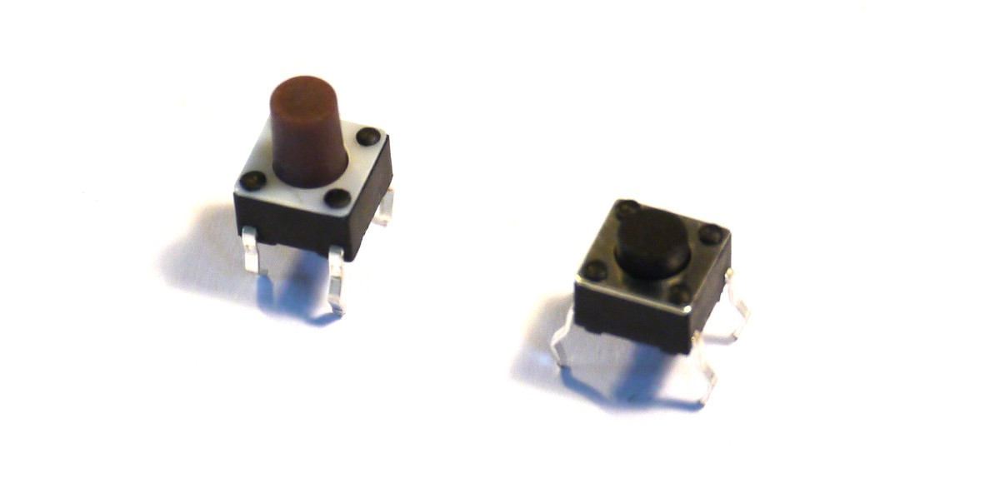

<!--- Copyright (c) 2015 Gordon Williams, Pur3 Ltd. See the file LICENSE for copying permission. -->
Buttons
=======

<span style="color:red">:warning: **Please view the correctly rendered version of this page at https://www.espruino.com/Button**. Links, lists, videos, search, and other features will not work correctly when viewed on GitHub.</span>

* KEYWORDS: Button,Pushbutton,Switch,Tactile Switch



Pushbuttons are some of the most simple components. They usually have two
contacts (those pictured above have 4 pins, but the pins opposite each other are connected together).

Most buttons are 'normally open' which means that when not pressed the contacts
are open circuit. When you press the button down, the contacts become shorted
together.


Wiring
-------

Wiring is easy - you need to connect one side of the button to a source of voltage,
and another side to an IO pin on the Espruino. On some microcontrollers you may need
to add a resistor, to hold the voltage steady when the button is released - however
Espruino has resistors built in that can be added with software.

### Wiring to 3.3v

Connect one side of the button to 3.3v, and another to an IO pin on Espruino, for instance B1.

You now need to add a 'pull-down' resistor to make the voltage drop to 0 when the button isn't pressed:

```
pinMode(B1, 'input_pulldown');
```

### Wiring to 0v

You can also wire to 0v, but this means that the value from the button will be inverted - 0 when pressed, and 1 when released.

Connect one side of the button to 0v (often called GND), and another to an IO pin on Espruino, for instance B1.

You now need to add a 'pull-up' resistor to make the voltage raise to 3.3v when the button isn't pressed:

```
pinMode(B1, 'input_pullup');
```

### Wiring to another IO pin

Sometimes it's just more convenient to wire the button between two IO pins. In this case you make one of them an input, and one an output.

Connect one side of the button to one of Espruino's pins (eg. A6), and the other to another pin, for instance B1.

You now need to make `A6` a 3.3v output, and to add a 'pull-down' resistor to make the voltage lower to 0v when the button isn't pressed:

```
digitalWrite(A6, 1);
pinMode(B1, 'input_pulldown');
```

Software
--------

We've done a bit of software already to set up the internal resistors, but to read the button's value you have two options:

### Checking it

You can check the value just by writing ```digitalRead(B1)```. This will return 
a number - 0 when the button is released and 1 when it is pressed (unless you 
connected to 0v, in which case it's reversed);

For instance you could check the button 10 times a second and use it to light
an LED:

```
setInterval(function() {
  digitalWrite(LED1, digitalRead(B1));
}, 100);
```

### Watching when it changes

Checking the button all the time isn't ideal - the hardware itself can look at
the input and can check when it changes state. For instance:

```
setWatch(function(e) {
  console.log("Button pressed");
}, BTN, { repeat: true, edge: 'rising' });
// you'll need to use  edge: 'falling' if you connected the button to 0v
```

Using the hardware like this allows Espruino to get very low 
[[Power Consumption]] as it can stay asleep until the button is pressed.

If you press the button hard or quickly, you may find that you get `'Button Pressed'`
printed more than once. This is because the button is a mechanical device, and
it can 'bounce' - opening and closing the contact multiple times.

In order to try and detect this, you can turn on something called 'debounce',
which makes Espruino only call your code once the button has stayed in the
same state for more than a certain number of milliseconds. In the case below
the button has to stay pressed for at least 50 milliseconds before `'Button Pressed'`
is printed:
  
```
setWatch(function(e) {
  console.log("Button pressed");
}, BTN, { repeat: true, edge: 'rising', debounce: 50 });
// you'll need to use  edge: 'falling' if you connected the button to 0v
```

Using 
-----

* APPEND_USES: Button,Pushbutton

Buying
-----

* [eBay](http://www.ebay.com/sch/i.html?_nkw=tactile switch)

