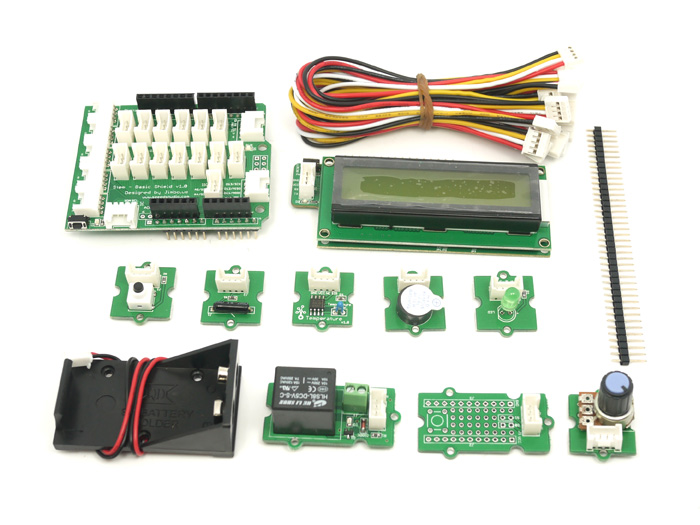

<!--- Copyright (c) 2015 Gordon Williams, Pur3 Ltd. See the file LICENSE for copying permission. -->
SeeedStudio Grove System
=====================

<span style="color:red">:warning: **Please view the correctly rendered version of this page at https://www.espruino.com/Grove. Links, lists, videos, search, and other features will not work correctly when viewed on GitHub** :warning:</span>

* KEYWORDS: Module,SeeedStudio,Grove,System



The [Seeed Studio](http://www.seeedstudio.com) [Grove System](http://www.seeedstudio.com/wiki/Grove_System) is an open modular toolset, designed to minimize the difficulty of electronic engineering. Each board has unified 4pin interface and standardized jigsaw shape for easy combination.

Wiring
-----

When using the [Arduino adaptor shield](/ArduinoPico) on the Pico, just plug the Grove Arduino Shield on top of it.
A direct Grove Pico adaptor will be available soon as well.

Otherwise, you need to wire each module up to GND, VCC, and to signal wires on the Pico. The connections should be written on the board. If it specifies `SDA`/`SCL`, make sure you use pins on the Pico that can handle [[I2C]].

Software
-------

Each 'Grove' library in Espruino expects to be given an array of 2 pins as an argument, for instance [A0,A1].

To make this easier we've added some modules with these arrays already defined, just choose from the table:

| Adaptor | Module |
|---------|--------|
| [Arduino Adaptor shield for Pico](/ArduinoPico) | [[GroveArduinoPico.js]] |
| Pico Mini Adaptor Shield | [[GrovePico.js]] |

Once you're using the correct module, for instance with `var grove = require("GrovePico");`, 
you can then access the relevant pins just by typing `grove.NAME` where `NAME` is the name 
written on the Grove board. For instance for a button connected to `D2` on the Pico Shield,
you'd simply do:

```
var grove = require("GrovePico");
new (require("GroveButton"))(grove.D2, function(e) {
  if (e.state) console.log("Pressed");
  else console.log("Released");
});
```

If you've wired up a grove module manually, just put the 2 pins you used in an array, and use that instead:

```
new (require("GroveButton"))([A0,A1], function(e) {
  if (e.state) console.log("Pressed");
  else console.log("Released");
});
```

Button
-----

* APPEND_JSDOC: GroveButton.js

Buzzer
-----

* APPEND_JSDOC: GroveBuzzer.js

Touch
----

* APPEND_JSDOC: GroveTouch.js

Rotation
-------

* APPEND_JSDOC: GroveRotation.js

Light Sensor
----------

* APPEND_JSDOC: GroveLightSensor.js

Temperature
----------

* APPEND_JSDOC: GroveTemperature.js

Moisture Sensor
---------------

* APPEND_JSDOC: GroveMoistureSensor.js

Relay
----

* APPEND_JSDOC: GroveRelay.js

LCD RGB
------

* APPEND_JSDOC: GroveLCDRGB.js


Buying
------

The Grove System Starter kits and individual parts are available directly from SeeedStudio in China, or from a range of distributors.

* [SeeedStudio](http://www.seeedstudio.com/depot/s/grove.html)
* [digitalmeans](https://digitalmeans.co.uk/shop/index.php?search=grove)
