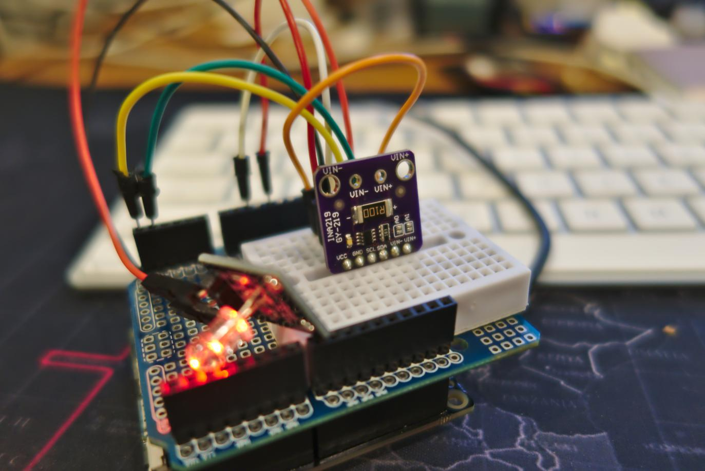

<!--- Copyright (c) 2020 parasquid. See the file LICENSE for copying permission. -->
INA219 Zero-Drift, Bidirectional Current/Power Monitor With I2C Interface
=====================

* KEYWORDS: Module,I2C,INA219,voltage,current,power,watts,amps

The [TI INA219](https://www.ti.com/product/INA219) is a voltage and current
monitor designed for voltages up to 26v. In Espruino, the [INA219](/modules/INA219.js) module ([About Modules](/Modules)) can be used to interface to it.

You can buy (see below) breakout board containing the INA219 along with a shunt resistor pre-wired:



Wiring
------

You can wire this up as follows:

| Device Pin | Espruino |
| ---------- | -------- |
| GND | GND                                                |
| VCC | 3.3                                                |
| SCL | I2C SCL - connect to an I2C-capable pin on Espruino |
| SDA | I2C SDA - connect to an I2C-capable pin on Espruino |

Usage
-----

Example usage (using a Pixl.js)

```
I2C1.setup({ sda: A4, scl: A5 });

const ina219 = require("INA219").connect(I2C1);

console.log(ina219.initDevice());

setInterval(() => {
  console.log(ina219.getBusMilliVolts() / 1000 + 'V');
  console.log(ina219.getBusMicroAmps() * 1000 + 'mA');
  console.log(ina219.getBusMicroWatts() * 1000 + 'mW');
  console.log('-----');
}, 1000);
```

The default maximum expected current is 3.2A and the resistor shunt is 0.1 ohms.

`connect()` also accepts an options object for its second positional parameter.
This allows you to customize the accuracy of the sensor depending on the shunt
and the maximum current you will be using.

For example:

```
I2C1.setup({ sda: A4, scl: A5 });

const options = {
  maximumExpectedCurrent: 1, // in amps
  rShunt: 0.1, // in ohms
};
const ina219 = exports.connect(I2C1, options);
```

Will increase the precision of the measurements in exchange for a lower maximum
current that can be measured.

See page 12 of the [datasheet](https://www.ti.com/lit/gpn/ina219) for more
information.

Reference
---------

* APPEND_JSDOC: INA219.js

Using
-----

* APPEND_USES: INA219
