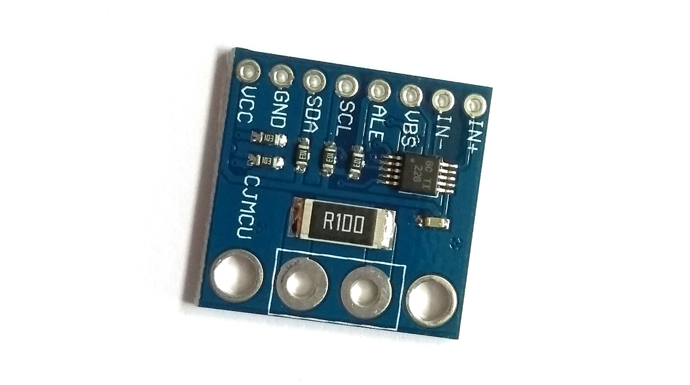

<!--- Copyright (c) 2017 SunElectrum. See the file LICENSE for copying permission. -->
INA226 Current/Voltage Measurement IC
=====================================

<span style="color:red">:warning: **Please view the correctly rendered version of this page at https://www.espruino.com/INA226. Links, lists, videos, search, and other features will not work correctly when viewed on GitHub** :warning:</span>

* KEYWORDS: Module,I2C,INA226,INA219,voltage,current,power,watts,amps

The [TI INA226](http://www.ti.com/product/INA226) is a voltage and current
monitor designed for voltages up to 36v. In Espruino, the [INA226](/modules/INA226.js) module ([About Modules](/Modules)) can be used to interface to it.

You can buy (see below) breakout board containing the INA226
along with a shunt resistor pre-wired:




Wiring
------

| IN+ | Shunt side 1 - DON'T CONNECT TO ESPRUINO |
| IN- | Shunt side 2 - DON'T CONNECT TO ESPRUINO |
| VBS | Voltage being measured - connect to one side of the shunt or the other (depending which voltage you want to measure) |
| ALE | Alert Output (pulled to 0v when data is ready) |
| SCL | I2C SCL - connect to an I2C-cpable pin on Espruino |
| SDA | I2C SDA - connect to an I2C-cpable pin on Espruino |
| GND | Ground |
| VCC | 3.3v Supply voltage |
| A0/A1 | May not be available - I2C address selection |


Usage
-----

Usage is pretty straightforward. 

In this example `SCL` is connected to `B3`, and `SDA` is connected to `B4` - software I2C
is being used so you could connect using any available pins.

```
// Setip I2C
var i2c = new I2C();
i2c.setup({sda:B4, scl:B3});
// initialise INA226
var INA226 = require("INA226");
var ina = new INA226(i2c, { 
  average:1024, // how many samples to take and average (1024 = about 1 reading a second)
  shunt:0.1, // the shunt resistor's value
  maxCurrent: 10  // max current we expect to measure (the lower this is the more accurate measurements are)
});
// You can now simply read the data
print(ina.read());
/* Outputs something like:
{ "vshunt": 0.024475, 
  "vbus": 9.80875, 
  "power": 0.23651123046, 
  "current": 0.0244140625,
  "overflow": false 
}
*/
```

You can also use the alert pin (connected here to pin `B5`) to
detect when a conversion has been done and read the data.

```
pinMode(B5,"input_pullup");
setWatch(function() {
  print(ina.read());
}, B5, {edge:"falling",repeat:true});
```

Reference
---------

* APPEND_JSDOC: INA226.js

Buying
-----

INA226 sensors on breakout boards can be purchased from:

* [eBay](http://www.ebay.com/sch/i.html?_nkw=INA226)

(Other types of TI current sensor, eg. INA219 can also be purchased, but won't directly work with this module)


