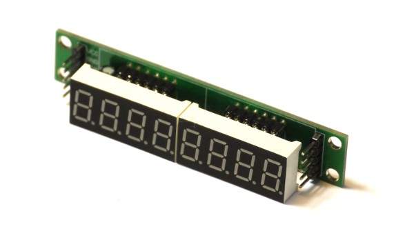
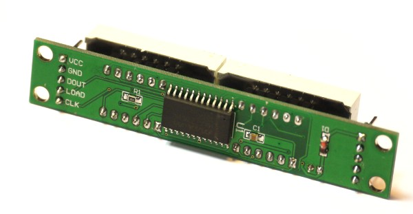

<!--- Copyright (c) 2013 Gordon Williams, Pur3 Ltd. See the file LICENSE for copying permission. -->
MAX7219 7 segment display driver
=======================

<span style="color:red">:warning: **Please view the correctly rendered version of this page at https://www.espruino.com/MAX7219. Links, lists, videos, search, and other features will not work correctly when viewed on GitHub** :warning:</span>

* KEYWORDS: Module,SPI,7,segment,LED,LEDs,display,driver,7 segment,7seg,seven,seven segment





[Datasheet](/datasheets/MAX7219.pdf)

Simple SPI 7 segment display driver. Use the [[MAX7219.js]] module for it.

Wiring
-----

This module needs 5 wires: Power, ground, clock (SPI SCK), data (SPI MOSI), and chip select (can be any pin). Just wire them up, set up SPI, specify the chip select pin, and you're ready to go.

Here we've connected:

|  Module   |   Espruino  |
|-----------|-------------|
| GND       | GND         |
| VCC       | VBAT        |
| DIN       | B15         |
| CS        | B14         |
| CLK       | B13         |

Software
-------

### General usage

```
SPI2.setup({mosi:B15, sck:B13});
var disp = require("MAX7219").connect(SPI2,B14);
disp.set("--HELP--"); // disp can display strings with the following chars: 0123456789-EHLP

setTimeout(function() {
  disp.raw([1,2,4,8,16,32,64,128]); // or you can set the LEDs directly
}, 1000);

setTimeout(function() {
  var n = 0;
  setInterval(function() {
    disp.set(n++); // it can display integers
    disp.intensity(0.5+0.5*Math.sin(n*0.2)); // you set set intensity
  }, 100);
}, 2000);
```

### Graphics Library

You can also use the [[Graphics]] Library with these displays:

```
SPI2.setup({mosi:B15, sck:B13});
var disp = require("MAX7219").connect(SPI2, B14);

var g = Graphics.createArrayBuffer(8,8,1); // Create graphics
g.flip = function() { disp.raw(g.buffer); }; // To send to the display

g.drawString("Hi");
g.flip(); // update what's on the display
```

You can also use `g.setRotation( ... );` with a number from 0 to 3 to set the rotation of what is displayed on the screen.
`

### Multiple chained MAX7219 (bigger than 8x8)

For multiple MAX7219 devices, you need to specify the number of devices in the `connect` function. You can then create a [[Graphics]] object of the correct size and use it just like you would any Graphics.

The example below is for 4 chained MAX7219 devices, so 32 by 8 pixels:

```
SPI2.setup({mosi:B15, sck:B13});
var disp = require("MAX7219").connect(SPI2, B14, 4 /* 4 chained devices */);

var g = Graphics.createArrayBuffer(32, 8, 1);
g.flip = function() { disp.raw(g.buffer); }; // To send to the display

g.drawString("Hello");
g.flip(); // update what's on the display
```

**Note:** With (for example) 4 drivers, you have 32 * 8 = 256 LEDs, which can draw 5 Amps if all on (which might be the default state). If so you'll need to come up with another power source, as this is substanially more power than can be drawn from USB.

### Matrix setting

In this sample, we define an object called `matrix` that allows us to individually set on or off
a given LED in the 8x8 physical matrix by specifying the LED x and y coordinates. One corner of
the LED matrix is (0,0) while the other is (7,7).

```
var matrix = {
  // Initialize the matrix
  init: function(max) {
    this.max = max;
    this.clear();
    max.scanLimit(8);
    max.raw(this.data);
  },
  data: new Array(8),
  // Set the given led (switch it on)
  set: function(x,y, value) {
    if (x > 7 || y > 7) {
      return;
    }
    if (value === true) {
      this.data[y] |= 1<<x;
    } else {
      this.data[y] &= ~(1<<x);
    }
    max.raw(this.data);
  },
  // Clear all leds
  clear: function() {
    for (var i=0; i<8; i++) {
       this.data[i] = 0;
    }
  }
};

matrix.init(mySPI)
matrix.set(0,0);
matrix.set(1,1);
```


Reference
--------

### connect(SPI, CS, devs)

Connect the MAX7219 to a SPI and Chip select

* `SPI` (Type: SPI) - an instance of a SPI interface.
* `CS` (Type: Pin) - a pin that is used for chip select. 
* `devs` (optional) - the number of chained MAX7219 devices (otherwise defaults to 1)

### set(val)

Set the values for the 7 segment displays.

* `val` - An array of digits (maximum 8) providing the values to show on the 7 segment displays.


### raw(val)

Choose which led segments/LEDs to light.

* `val` - An array of bytes (maximum 8) providing a bit mask of illuminated LEDs.  One byte per column.


### on()

Switches the display on().


### off()

Switches the display off().

### scanLimit(limit)

Set the number of digits or columns to display.  

* `limit` - A value between 1 and 8 inclusive indicating digits or columns to include.

### intensity(val)

Set the brightness of the display.

* `val` - A float between 0 (darkest) and 1 (brightest)

### displayTest(mode)

Test the display.

* `mode` - If `true`, all the segments/leds are lit.   If `false`, then normal mode.

----


Using 
-----

* APPEND_USES: MAX7219

Buying
-----

* [eBay](http://www.ebay.com/sch/i.html?_nkw=MAX7219)
