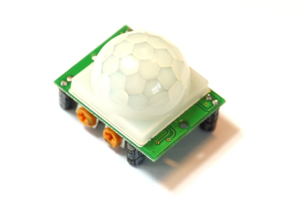
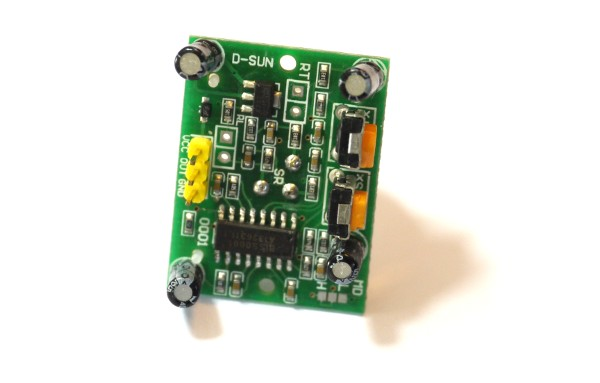

<!--- Copyright (c) 2013 Gordon Williams, Pur3 Ltd. See the file LICENSE for copying permission. -->
Pyroelectric Motion Sensor
=======================

<span style="color:red">:warning: **Please view the correctly rendered version of this page at https://www.espruino.com/Pyroelectric**. Links, lists, videos, search, and other features will not work correctly when viewed on GitHub.</span>

* KEYWORDS: Pyroelectric Motion Sensor,PIR,Motion,Movement,Sensor,HC-SR501





Pyroelectric (PIR) Motion Sensor's are what you'd find in a home burglar alarm or a motion sensitive light. The module shown is the HC-SR501, and it outputs a 3.3v pulse on the output pin whenever movement is detected (some units may be open drain, or output a pulse at the operating voltage). The length of this pulse is adjustable by one of the potentiometers on the unit, being about 2 seconds long at the minimum setting, and 5 minutes or more at the maximum setting (allowing it to control motion sensing lights without external components). 

The HC-SR501 draws less than 50uA when it is on, which means it'll run off a battery for ages.

Connect as follows:

| HC-SR501 | Espruino   |
| ------- | ------- |
| VCC | VBAT (5v) |
| OUT | A1      |
| GND | GND     |

**Note:** any GPIO pin will do for OUT

You can then easily trigger something to happen when movement is detected:

```
setWatch(function() {
  console.log("Movement detected");
}, A1, {repeat:true, edge:"rising"});
```

Specs
----

| Specification | Value |
| ------- | ------- |
| Input Voltage | 4.5-20v |
| Output Voltage | 0 (low), 3.3v (high) |
| Current Draw | &lt; 50uA |


Using 
-----

* APPEND_USES: Pyroelectric

Buying
-----

* [eBay](http://www.ebay.com/sch/i.html?_nkw=HC-SR501)
