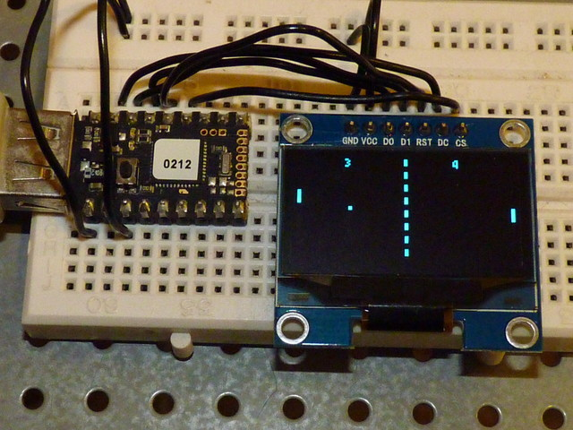

<!--- Copyright (c) 2015 J H Richards. See the file LICENSE for copying permission. -->
SH1106 OLED driver
=====================

* KEYWORDS: Module,I2C,SPI,SH1106,Graphics,Graphics Driver,OLED,Monochrome



Support is included in the [[SH1106.js]] module, using the [[Graphics]] library.

The display shown can be set to operate in one of three modes by changing links on the pcb.

The modes are 4-wire SPI (with a D/C pin), 3-wire SPI, and I2C.

Other variants have only the I2C mode available, and 4 pins on the header: VCC, GND SDA & SCL.

SPI
---

SPI 3-wire isn't supported by this driver, only 4-wire is.

| OLED pin  | Example pin on Espruino Board |
|-----------|-------------------------------|
| GND       | GND |
| VCC/3.3V       | 3.3/vBat |
| D0/SCK/SCLK    | B13 |
| D1/MOSI/SDIN   | B15 |
| DC        | B14 |
| RST       | B10 (if you have this pin) |
| CE/CS     | B1 (if you have this pin - see the Software section for more info) |

I2C
---

Just wire up as follows:

| OLED pin | Example pin on Espruino Board |
|----------|-------------------------------|
| GND      | GND |
| VCC    | 3.3/vBat |
| SDA (D1)    | B7 |
| SCL (D0)  | B6 |
| RST | 3.3V (if you have this pin) |
| DC | GND, address = 0x3C; 3.3V, address = 0x3D (if you have this pin) |
| CS | GND or 3.3V, has no effect (if you have this pin) |

Software
-------

```
function start(){
 // write some text
 g.drawString("Hello World!",2,2);
 // write to the screen
 g.flip(); 
}

// I2C
I2C1.setup({scl:B6,sda:B7});
var g = require("SH1106").connect(I2C1, start);

// SPI
var s = new SPI();
s.setup({mosi: B6 /* D1 */, sck:B5 /* D0 */});
var g = require("SH1106").connectSPI(s, A8 /* DC */, B7 /* RST - can leave as undefined */, start);
```

**Note:** This module uses a double buffer, which means you need to call ```g.flip()``` before any changes take effect.

### 128x32

By default the module is configured for 128x64 OLEDs. If you want to use 128x32 OLEDs, you must specify the height in the optional last argument. This has not yet been tried.

```
// I2C
require("SH1106").connect(I2C1, start, { height : 32 });
// SPI
require("SH1106").connectSPI(s, A8 /* DC */, B7 /* RST */, start, { height : 32 });
```

### Chip Select (CS)

By default, chip select on the SPI OLEDs isn't used. You can however enable it with the following:

```
require("SH1106").connectSPI(s, A8 /* DC */, B7 /* RST */, start, { cs : MY_CS_PIN });
```

### Non-standard I2C addresses

Some I2C modules are configured such that they aren't on the normal I2C address of 0x3C.

Also, if pin DC is tied to 3.3V.

If this is the case then you'll have to explicitly specify the address:

```
require("SH1106").connect(I2C1, start, { address : 0x3D });
```

### Contrast

You can set the contrast after initialisation using `g.setContrast(31)` with a value between 0 and 255.

However you can also set this at startup, using the `options` object:

```
require("SH1106").connect(I2C1, start, { 
  contrast : 31,
});
```

Using 
-----

* APPEND_USES: SH1106

Buying
-----

* [Hobby Components](http://hobbycomponents.com/displays/622-3-sh1106-uoled-display-module-white)
