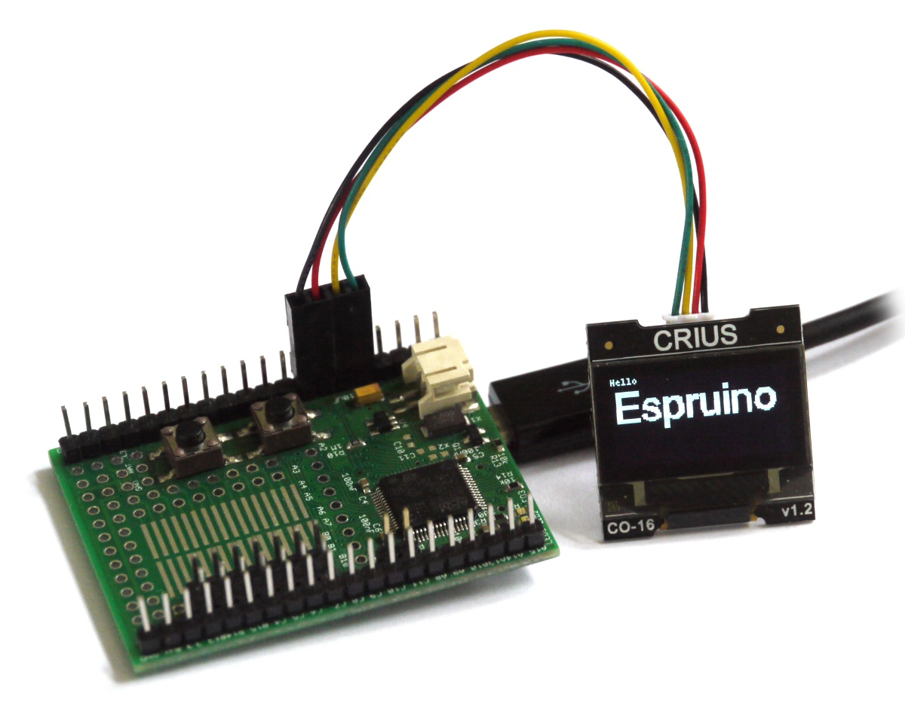

<!--- Copyright (c) 2013 Gordon Williams, Pur3 Ltd. See the file LICENSE for copying permission. -->
SSD1306 OLED driver
=======================

<span style="color:red">:warning: **Please view the correctly rendered version of this page at https://www.espruino.com/SSD1306. Links, lists, videos, search, and other features will not work correctly when viewed on GitHub** :warning:</span>

* KEYWORDS: Module,I2C,SPI,Crius,CO-16,CO16,HO01,HO-01,Graphics,Graphics Driver,OLED,Monochrome



This is the monochome OLED display driver found in the Crius C0-16 display (128x64), the hexTronic HO-01 (128x64), and many other 128x64 or 128x32 OLED screens.

The modules draw around 2.5mA (although this will increase if more pixels are lit).

Support is included in the [[SSD1306.js]] module, using the [[Graphics]] library.

These displays come in a few forms, allowing communication via 4-wire SPI (with a D/C pin), 3-wire SPI, and I2C.

SPI
---

[[SPI]] 3-wire isn't supported by this driver, only 4-wire is.

| OLED pin  | Example pin on Espruino Board |
|-----------|-------------------------------|
| GND       | GND |
| VCC/3.3V       | 3.3/vBat |
| D0/SCK/SCLK    | B5 |
| D1/MOSI/SDIN   | B6 |
| DC        | A8 |
| RST       | B7 (if you have this pin) |
| CE/CS     | GND (if you have this pin - see the Software section for more info) |

The example below uses software SPI, so you can connect to whatever pins you require. 
In fact the display draws so little power that VCC can be powered directly from one 
of Espruino's GPIO pins.

I2C
---

Just wire up as follows:

| OLED pin | Pin type | Example pin on Espruino Board |
|---------|----------|-------------------------------|
|  1 (black)   | GND      | GND |
|  2 (red) | 5V    | 3.3/vBat |
|  3 (yellow) | SDA (D1)    | B7 |
|  4 (green) | SCL (D0)  | B6 |

If you get [[I2C]] timeouts, you may need to add two 4.7 kOhm resistors, one from SDA to 3.3v, and one from SCL to 3.3v. 

If you keep getting timeouts it might be because your display is set to the 3-wire SPI mode. To fix this, you can carefully short out pins 19 and 20 on the ribbon cable on the back of your module with a blob of solder.

**Note:** If your display needs

Software
-------

```
function start(){
 // write some text
 g.drawString("Hello World!",2,2);
 // write to the screen
 g.flip(); 
}

// I2C
I2C1.setup({scl:B6,sda:B7});
var g = require("SSD1306").connect(I2C1, start);

// SPI
var s = new SPI();
s.setup({mosi: B6 /* D1 */, sck:B5 /* D0 */});
var g = require("SSD1306").connectSPI(s, A8 /* DC */, B7 /* RST - can leave as undefined */, start);
```

**Note:** This module uses a double buffer, which means you need to call ```g.flip()``` before any changes take effect.

### 128x32

By default the module is configured for 128x64 OLEDs. If you want to use 128x32 OLEDs, you must specify the height in the optional last argument. 

```
// I2C
require("SSD1306").connect(I2C1, start, { height : 32 });
// SPI
require("SSD1306").connectSPI(s, A8 /* DC */, B7 /* RST */, start, { height : 32 });
```

### Chip Select (CS)

By default, chip select on the SPI OLEDs isn't used. You can however enable it with the following:

```
require("SSD1306").connectSPI(s, A8 /* DC */, B7 /* RST */, start, { cs : MY_CS_PIN });
```

### Non-standard I2C addresses

Some I2C modules are configured such that they aren't on the normal I2C address of 0x3C.

If this is the case then you'll have to explicitly specify the address:

```
require("SSD1306").connect(I2C1, start, { address : 0x3D });
```

### Contrast

You can set the contrast after initialisation using `g.setContrast(31)` with a value between 0 and 255.

However you can also set this at startup, using the `options` object:

```
require("SSD1306").connect(I2C1, start, { 
  contrast : 31,
});
```

### On / Off

You can switch the display ON or OFF with the following:

```
// on 
g.on();

//off
g.off();
```

### Reset 

Some displays need to be reset to work properly.

When connecting via [[SPI]] you can supply the reset pin as a parameter in the `connect` command (see above), or if you're using [[I2C]] you can add the RST pin to the options supplied when initialising the display as follows:

```
require("SSD1306").connect(I2C1, start, { 
  rst : D2,
});
```

Using 
-----

* APPEND_USES: SSD1306

Buying
-----

* [eBay](http://www.ebay.com/sch/i.html?_nkw=crius+co-16)
* [Adafruit 0.96"](http://www.adafruit.com/products/326)
* [Adafruit 1.3"](http://www.adafruit.com/products/938)
* [Embedded Adventures 0.96"](http://www.embeddedadventures.com/oled_display_128x64_OLED-12864-WHITE.html)
* [Embedded Adventures 1.3"](http://www.embeddedadventures.com/oled_display_128x64_OLED-12864B-WHITE.html)
