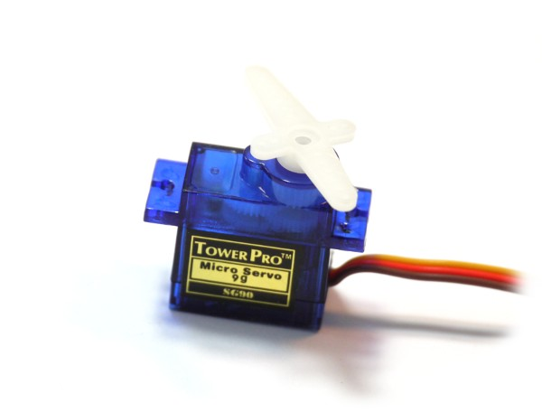

<!--- Copyright (c) 2013 Gordon Williams, Pur3 Ltd. See the file LICENSE for copying permission. -->
Servo Motors
===========

<span style="color:red">:warning: **Please view the correctly rendered version of this page at https://www.espruino.com/Servo+Motors. Links, lists, videos, search, and other features will not work correctly when viewed on GitHub** :warning:</span>

* KEYWORDS: Servo,Motor,Servomotor,Servo motor,RC,Built-In,Module



RC Servo Motors are great for controlling things from a microcontroller. They're cheap (around $3), and need only power, ground, and a series of pulses between 1ms and 2ms to work - the length of the pulse determines where they move to.

Wiring Up
--------

Servo motors have 3 wires. Ground, Power, and Signal. For power, they will run off varying voltages. Generally they expect to run off of 4xAA cells, but you can run them off of slightly lower voltages - in which case they move slightly less quickly and produce less force. While you can run them off of USB 5v power, we'd recommend that you don't because of the electrical noise produced (and current drawn) by them.

Just take a power source (4xAA batteries, or a 3.7v LiPo battery) and connect negative to the black wires of the servos, and to the ground connection on your Espruino board. Connect Positive on the battery to the red wires on the servos. Now connect the each white wire on each servo to a different signal pin on your Espruino board.

For information on wiring up your Espruino Board for Servo Motors, see the [[Pin Strip]] page.

Servo Motor Module
----------

If you just want to move servo motors around in the simplest possible way, use the [[servo.js]] module. 

Just use `require("servo").connect` with the pin the servo motor is attached to, and call `move` with a position between 0 and 1, and an optional parameter specifying the time taken to move, and another parameter that is a function to call when the movement is finished:

```
var s = require("servo").connect(C7);

s.move(0); // move to position 0 over 1 second
s.move(1); // move to position 1 over 1 second
s.move(0.5, 3000); // move to position 0.5 over 3 seconds

// move to position 0 over 1 second, then move to position 1
s.move(0, 1000, function() {
  s.move(1, 1000);
}); 
```

The module will handle everything else, making sure that the Servo motor is not being continually pulsed when it has had time to reach the correct position.

However there are other ways of controlling servos...
 
Simple Control
------------

You can easily send a pulse using Espruino:

```JavaScript
digitalPulse(A1,1,1.5);
```

This means 'pulse pin A1 high(1) for 1.5ms'

Sending this command repeatedly will gradually move the servo to its middle location.

You can call it automatically 20 times a second with setInterval:

```JavaScript
var servoPos = 0.5;
var interval = setInterval("digitalPulse(A1,1,1+E.clip(servoPos,0,1))", 50);
```

Note that we've added the 'clip' function which stops a pulse of the wrong length being sent to the servo if servoPos is out of range.

Now, if you change servoPos, the servo will automatically change position:

```JavaScript
servoPos = 0;
servoPos = 1;
```

You can also stop sending the servo commands with:

```JavaScript
clearInterval(interval)
``` 

Moving Automatically
------------------

Maybe you want to move two servos in a steady circle? No problem:

```JavaScript
var servoPos = [0,0];
function getPositions() {
 var t = getTime();
 servoPos = [ 0.5+Math.sin(t)*0.5, 0.5+Math.cos(t)*0.5 ];
}
function moveServos() {
 digitalPulse(A1,1,1+E.clip(servoPos[0],0,1));
 digitalPulse(A2,1,1+E.clip(servoPos[1],0,1));
}
setInterval("getPositions();moveServos()", 50);
```

Better Method
-----------

You can also use a hardware timer to produce the pulse - this means that you don't have to worry about sending the pulses - you just tell Espruino to start sending them, and it will continue without you having to write any code:

```JavaScript
function setServo(pin,pos) {
 if (pos<0) pos=0;
 if (pos>1) pos=1;
 analogWrite(pin, (1+pos) / 50.0, {freq:20});
}

setServo(A1, 0.5); // set servo connected to A1 to the halfway position
```

Note that some pins don't have hardware timers on them. You can find which ones do by typing: 'analogWrite()'

Using 
-----

* APPEND_USES: Servo Motor

Buying
-----

* [eBay](http://www.ebay.com/sch/i.html?_nkw=9g+servo)
* [digitalmeans.co.uk](https://digitalmeans.co.uk/shop/index.php?route=product/search&search=9g%20servo)
