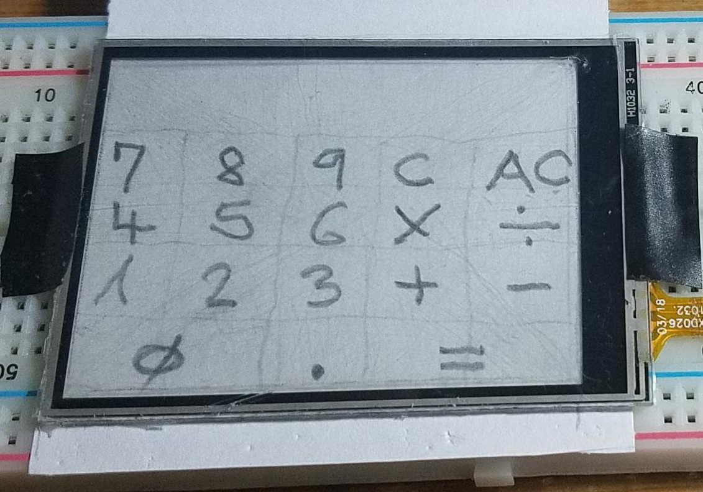
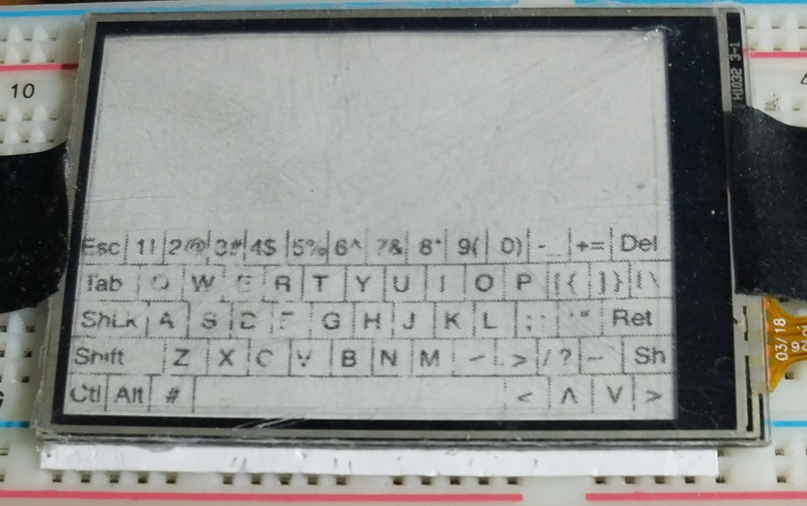

<!--- Copyright (c) 2018 allObjects / Pur3 Ltd. See the file LICENSE for copying permission. -->
Touch Key Pad based on Touchscreen
===================================

<span style="color:red">:warning: **Please view the correctly rendered version of this page at https://www.espruino.com/TouchKeyPad. Links, lists, videos, search, and other features will not work correctly when viewed on GitHub** :warning:</span>

* KEYWORDS: UI,LCD,display,resistive,touch,screen,touchscreen,controller,Graphics,ILI9341,ADS7843,XPT2046

Overview
------------------

A module [[TouchKeyPad.js]] that maps a particular x and y within a gridded x y area safely to a
key value and holds on to last grid .r(ow), .c(ol), and k(ey) index.


The module is useful with a touch screen on a display or sketched key pad as multi-button input
device. Example of application is a simple calculator with a 5 columns x 4 rows grid layout as
below (48x48 pixel per grid element). Ultimate application is a keyboard on a touch screen.




Wiring Up
-------------------

There is no wiring up. The touchscreen and module delivering the x and y for the key.


Usage
-------------------

Usage - with values for grid elements passed as single string:

```
`
.-------------------.
| 1 | 2 | 3 | C | AC|
|---+---+---+---+---|
| 4 | 5 | 6 | / | * |
|---+---+---+---+---|
| 7 | 8 | 9 | - | + |
|---+---+---+---+---|
|   0   | . |   =   |
'-------------------'
`
var touchKeyPad = new (require("TouchKeyPad))(
  5,4,0,240,128,192,"123CA456/*789-+00.==");

console.log(touchKeyPad.xy(48,296)); // --> "0"
console.log("col",touchKeyPad.c); // --> col 1
console.log("row",touchKeyPad.r); // --> row 3
console.log("kdx",touchKeyPad.k); // --> kdx 16 // = 3*5 + 1
```

Usage - with values for staggered grid elements passed array:

Assume, a 4x3 grid with elements 60 width x 40 height pixel,
but each row should be shifted about a third of a key width
to the right compared to the one above one. There will always
be the same number - 4 - grid elements in a row, but by adjusting
the first one in each row makes the last to be narrower or wider
or - depending the needs - the last two will - from the key value
perspective - fall together. This option allows the creation of
layout for regular keyboard where the keys stagger - are somewhat
diagonally arranged, such as below:

```
`
0     60    120   180   240 ----> x
:     :     :     :     :
:     :     :     :     : wAdj=// array w/ width adjust for 1st key:
.-----------------------.
|  1 %|& 2  |  3  |  #  | [  0 // 1st like all other keys: same size
|-----------------------|
|   4% &|  5  |  6  |  @| ,+15 // 1st about 1/3 wider, last narrower
|-----------------------|
| 7 |% &8 |  9  |  0    | ,-15 // 1st about 1/3 narrower, last wider
'-----------------------'
     ^ ^                  ];
     | |
 x = | 70 when touch at &
 x = 50 when touch at %
`
var touchKeyPad = new (require("TouchKeyPad))(
  4,3,0,240,0,120,"123#456@7890",[0,+15,-15]):
                                   // key value // column in grid
console.log(touchKeyPad( 50, 20)); // %--> "1"  // .c = 0
console.log(touchKeyPad( 50, 60)); // %--> "4"  // .c = 0
console.log(touchKeyPad( 50,100)); // %--> "8"  // .c = 1
console.log(touchKeyPad( 70, 20)); // &--> "2"  // .c = 1
console.log(touchKeyPad( 70, 60)); // &--> "4"  // .c = 0
console.log(touchKeyPad( 70,100)); // &--> "8"  // .c = 1
```

Example for a key board implementation:



For the working calculator input example see forum conversation: [Poor man's flexible input device: keyboard sketched on paper and a touchscreen](http://forum.espruino.com/conversations/326332)
