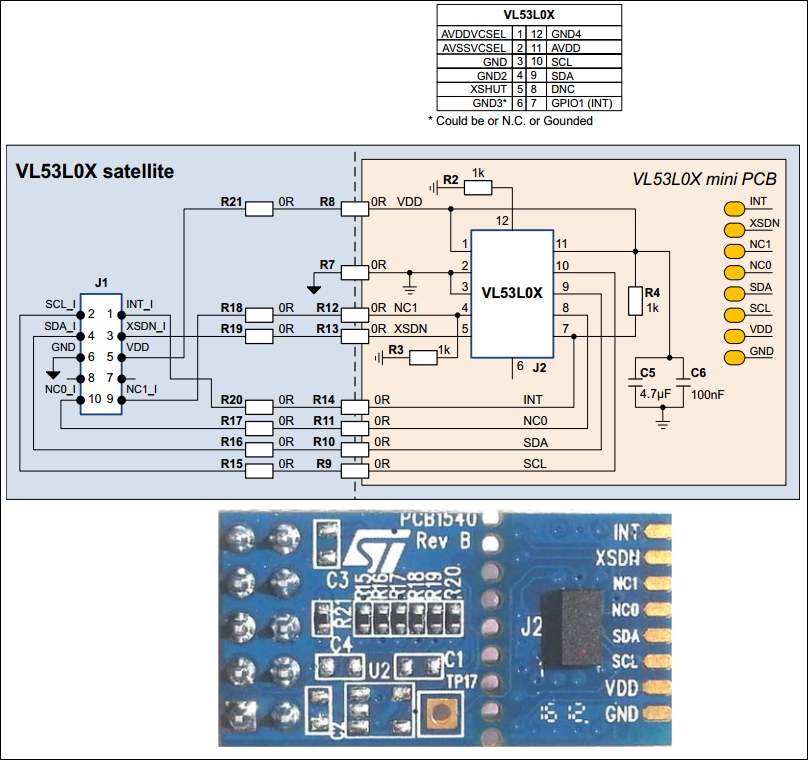

<!--- Copyright (c) 2017 Gordon Williams, Pur3 Ltd. See the file LICENSE for copying permission. -->
VL53L0X 
=======

<span style="color:red">:warning: **Please view the correctly rendered version of this page at https://www.espruino.com/VL53L0X. Links, lists, videos, search, and other features will not work correctly when viewed on GitHub** :warning:</span>

* KEYWORDS: Module,Laser,Range,Distance,VL53L0X,53L0A1,VL53L0A1,I2C,Sensor


The VL53L0X is an amazing laser time of flight range sensor that connects via [[I2C]]. It can be used in similar ways to  the [HC-SR04](/HC-SR04) module, but doesn't suffer from many of the HC-SR04's problems.

It'll measure distances up to 2m, accurate to around 5%, and needs between 2.5 and 3.6 volts.

Wiring
------

The easiest solution is to use a 'VL53L0X satellite' board from the X-NUCLEO-53L0A1:
 


You need to wire up as follows:

| Pin | Name | Espruino |
|-----|------|----------|
| 1   | INT  | N/C      |
| 2   | SCL  | I2C SCL (B10)  |
| 3   | XSDN | Any GPIO (B4)  |
| 4   | SDA  | I2C SDA (B3)   |
| 5   | VDD | 3.3v      |
| 6   | GND | GND       |
| 7   |     | N/C       |
| 8   |     | N/C       |
| 9   |     | N/C       |
| 10  |     | N/C       |

**The square pin on the PCB is pin 1**

**XSDN is for shitting down/waking up the device.** 
You can just connect it straight to VDD if needed.

Software
--------

You can use the [[VL53L0X.js]] module with the VL53L0X as follows:

```
I2C2.setup({sda:B3,scl:B10});
digitalWrite(B4,1); // set XSDN -> turn the sensor on
var laser;
setTimeout(function() {
  laser = require("VL53L0X").connect(I2C2);
  // make one reading
  console.log(laser.performSingleMeasurement().distance+" mm");
  // or repeatedly measure
  setInterval(function() {
    // sets LED brightness depending on distance
    var dist = laser.performSingleMeasurement().distance;
    analogWrite(LED1, (300-dist)/300, { soft:true, freq:200 });
  }, 50);
});
```

**XSDN** isn't needed and can be connected to 3.3v. It is used
for powering the device on and off (and you must leave a 2ms 
delay between powering the VL53L0X on and using it).

Currently there is no calibration performed so the results aren't
as accurate as they could be. ST don't appear to have documented
the sensor's interface properly, so to calibrate you would need
to reverse engineer their libraries.

Reference
---------
 
* APPEND_JSDOC: VL53L0X.js

Buying
------

The cheapest way to get a VL53L0X at the moment seems to be [from eBay](http://www.ebay.com/sch/i.html?_nkw=VL53L0X)

However you can also use ST's X-NUCLEO-53L0A1 kit (shown above):

* [Mouser](http://www.mouser.co.uk/ProductDetail/STMicroelectronics/X-NUCLEO-53L0A1)
* [Digikey](http://www.digikey.co.uk/product-detail/en/stmicroelectronics/X-NUCLEO-53L0A1/497-16533-ND/6023686)

Or can also buy boards from:

* [Adafruit](https://www.adafruit.com/product/3317)
* [Pololu](https://www.pololu.com/product/2490)
* and others...
