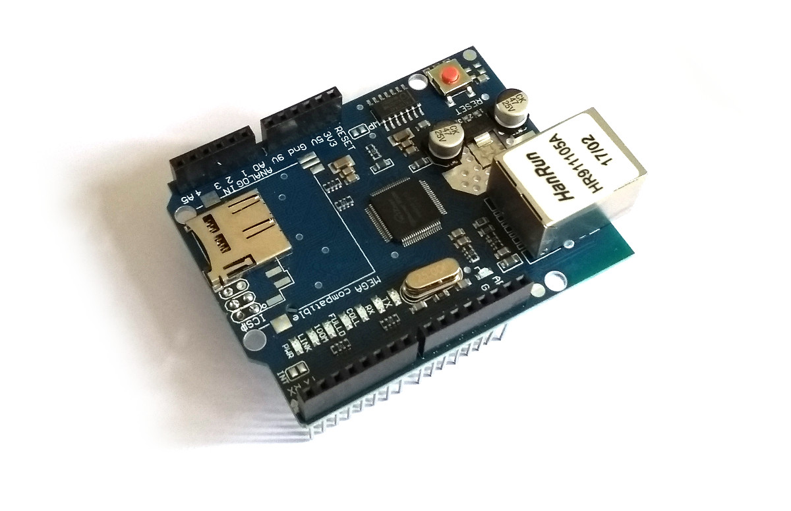

<!--- Copyright (c) 2018 Gordon Williams, Pur3 Ltd. See the file LICENSE for copying permission. -->
Arduino Ethernet and SD card shield (WIZnet W5100)
==================================================

<span style="color:red">:warning: **Please view the correctly rendered version of this page at https://www.espruino.com/arduino-w5100. Links, lists, videos, search, and other features will not work correctly when viewed on GitHub** :warning:</span>

* KEYWORDS: Arduino,Shield,Arduino Shield,Ethernet,Internet,W5100,WIZnet,microsd,microsd card
* USES: Pixl.js,W5100,WIZnet



Standard Arduino Ethernet shields use the WIZnet W5100 chip, which provides
hardware support for TCP/IP. The W5100 is supported out of the box by [Pixl.js](/Pixl.js)

Most other offical Espruino boards have firmware with support for the
[WIZnet W5500](/WIZnet) and will not work with the W5100 without
a special firmware build.

Wiring
------

The Ethernet shield shown above exposes the W5100 through pins on
the Arduino 2x3 pin `ICSP` header (which isn't present on [Pixl.js](/Pixl.js))
rather than the standard Arduino footprint.

To connect it up, you will need to add 3 wires to the shield (mirroring the
  connections there would be on an Arduino UNO board), connecting:

* ICSP MOSI to `D11`
* ICSP MISO to `D12`
* ICSP SCK to `D13`

```
 ---------------------------------
|              D13  D12  D11      |
|              SCK MISO  MOSI     |
|                                  \
| ETH                               |
| JACK                              |
|                                   |
|                        MISO ---   |
|                        SCK  MOSI  |
|                        ---- GND   |
|                                   |
|                         SD CARD   |
|                                   |
|                                   |
| RESET                            /
 ----------------------------------
```

The easiest method is to remove the `ICSP` header completely and add wires on
the underside of the board.

## Pinout

This board has the following connections:

| Pin | Connection |
|-----|------------|
| D13 | SCK        |
| D12 | MISO       |
| D11 | MOSI       |
| D10 | W5100 CS   |
| D4  | SD Card CS |
| D2  | W5100 IRQ  |

Software
---------

## Ethernet

First, you need to set up communications with the WIZnet chip:

```
SPI1.setup({ mosi:D11, miso:D12, sck:D13 });
var eth = require("WIZnet").connect(SPI1, D10 /*CS*/);
```

Unlike the W5500 the W5100 doesn't come in a module with a pre-assigned
MAC address set. You can either set one and then use DHCP to get an IP address:

```
eth.setIP({mac:"00:08:dc:ab:cd:ef"});
eth.setIP();
```

or can set the IP address manually:

```
eth.setIP({
  ip:"192.168.1.123",
  subnet:"255.255.255.0",
  gateway:"192.168.1.1",
  dns:"8.8.8.8",
  mac:"00:08:dc:ab:cd:ef"
});
```

Now you're ready to go - you can request a webpage:

```
require("http").get("http://www.pur3.co.uk/hello.txt", function(res) {
  res.on('data', function(d) {
    console.log("--->"+d);
  });
});
```

**Note:** there is currently an issue in the W5100 library that causes
Espruino to pause for 30 seconds when closing a socket, however everything
else works.

Or can even start a web server:

```
function pageHandler(req, res) {
  res.writeHead(200);
  res.end("Hello World");
}

require("http").createServer(pageHandler).listen(80);
console.log("Connect to http://"+eth.getIP().ip)
```

Functions that are available on `eth` are documented in [the Ethernet Class](/Reference#Ethernet)

See the [Internet](/Internet) page for more examples
of things you can do on Espruino  with an Internet connection.

## SD Card

All you need to do to set up the SD card is:

```
// Setup SPI - no need to call this if you've already set up Ethernet
SPI1.setup({ mosi:D11, miso:D12, sck:D13 });
// Configure the SD card
E.connectSDCard(SPI1, D4 /*CS*/);
```

Then:

```
// see what's on the device
console.log(require("fs").readdirSync());
// write
require("fs")writeFileSync("test.txt","Some Data");
// read
print(require("fs").readFileSync("test.txt"));
```

See [the page on File IO](/File+IO) for more information.


Buying
-----

* [eBay](http://www.ebay.com/sch/i.html?_nkw=arduino+w5100+shield)
