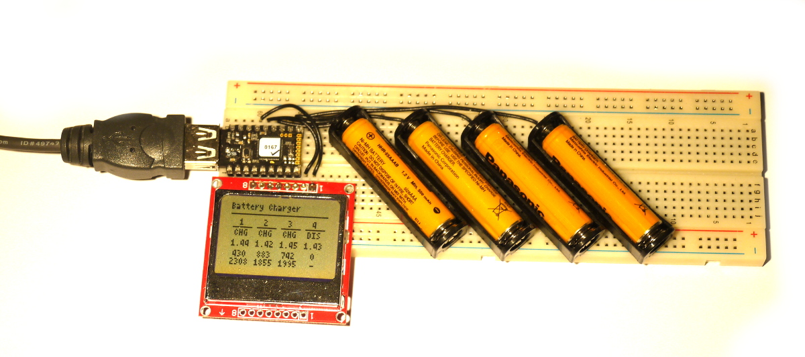
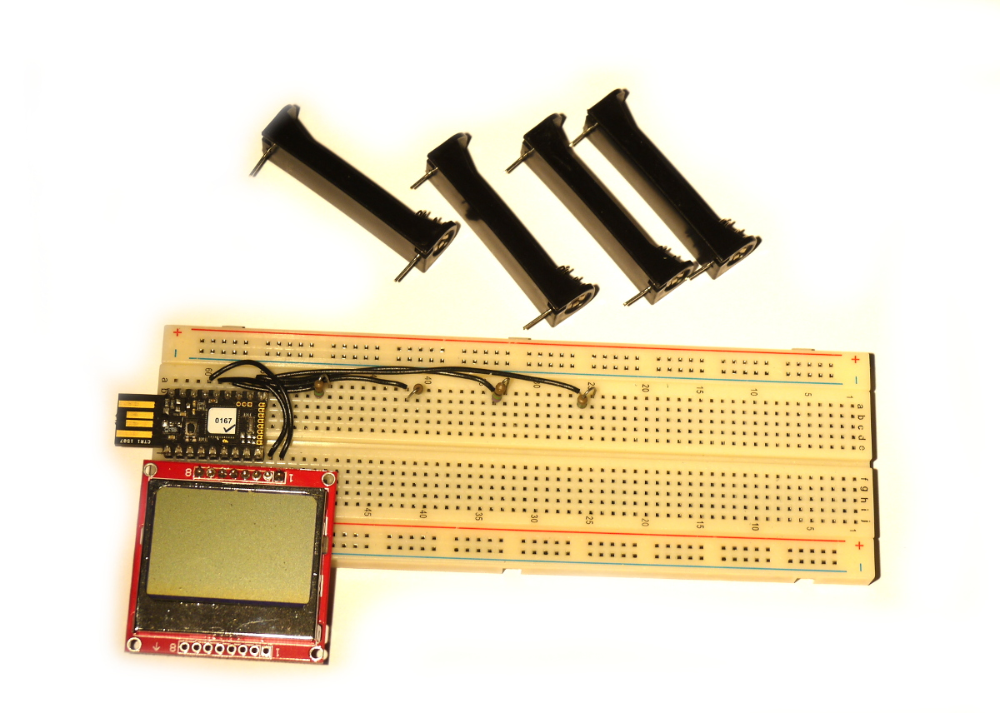
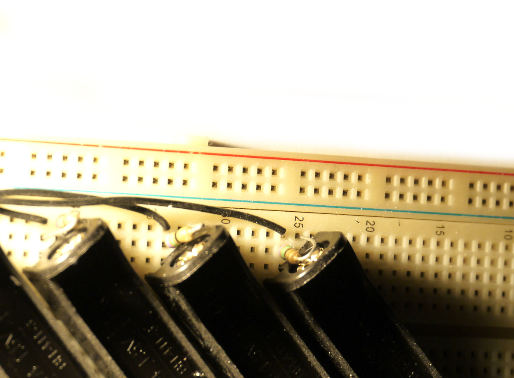

<!--- Copyright (c) 2016 Gordon Williams, Pur3 Ltd. See the file LICENSE for copying permission. -->
AA/AAA Battery Charger
======================

<span style="color:red">:warning: **Please view the correctly rendered version of this page at https://www.espruino.com/Battery Charger**. Links, lists, videos, search, and other features will not work correctly when viewed on GitHub.</span>

* KEYWORDS: AA,AAA,Battery Charger
* USES: Pico,PCD8544,ADC,Breadboard

Introduction
------------



Many AA or AAA battery chargers charge batteries in pairs, but plenty of devices use 1 or 3 batteries, meaning that some of your batteries get overcharged and some get undercharged. NiCd and NiMH batteries also benefit from an occasional full discharge, which most normal battery chargers won't do.

If you're anything like me you'll end up with a lot of rechargeable batteries, none of which end up being charged properly, and some of which turn out to be completely unusable. It'd be perfect if you had a low-power battery charger that you could leave on all the time, that would charge your batteries individually, automatically discharge them, and give you an idea of their real capacity. That's what you'll make in this tutorial!

**Note:** To make this nice and simple, the charger uses Espruino's GPIO pins to directly charge and discharge the batteries. This means it can't charge batteries very quickly (it can take *days* to charge and discharge them!). 


You'll Need
----------

* One [Espruino Pico](/Pico)
* A long [[Breadboard]]
* A [[PCD8544]] LCD display
* Some patch wire (normal solid core wire is fine)
* 4x 100 Ohm resistors
* AA or AAA battery holders with pins (available from Rapid Electronics: [AA](http://www.rapidonline.com/Electrical-Power/TruPower-BH-311-1P-1-X-AA-PCB-Battery-Holder-18-2960) or [AAA](http://www.rapidonline.com/Electrical-Power/TruPower-BH-411-3P-1-X-AAA-PCB-Battery-Holder-18-2920))


Wiring Up
--------



* Place the breadboard with the `-` row of pins right at the bottom, and the `+` row right at the top.
* Plug the Espruino [[Pico]] into the breadboard as far left as it will go (as in the picture)
* Add a wire from Espruino's `GND` pin (on the far left) straight down to the bottom `-` row of pins. You can't see this in the picture because it's under the LCD screen.
* Plug the [[PCD8544]] into the breadboard below the [[Pico]], with 2 pins sticking out to the right of the [[Pico]] (it should overlap the GND wire)
* Take a patch wire and connect from pin `B1` on the [[Pico]] to the top of a column 5 pins to the right of the Pico (see the picture)
* Fold a 75 Ohm resistor, cut it to length, and add it diagonally between the 5th column right of the Pico and the 6th.
* Now add 3 more sets of wires and resistors, from pins `A7`, `A6` and `A5`, to new columns, each with 7 columns of pins between it and the last. **Note:** This works for AAA batteries - for AA you will need to space the columns out a bit more. 
* Cut the pins on your battery holders down so they'll fit in the breadboard, and then place the battery holders in the breadboard at an angle: With the `+` contact relative to the resistor (as shown below), and with the `-` contact in the bottom `-` row of pins on the breadboard.



* Now add 2 wires for the LCD: `B10` to the pin nearest the [[Pico]], and `B13` to the pin right on the edge.

And you're done! 


Software
-------

Connect to the Web IDE, copy the following software into the right-hand side, and upload it:

```
var g;

B3.write(0); // GND
// B4.write(1); // Backlight
B5.write(1); // VCC

// The pins each battery is connected to
var BATS = [ B1, A7, A6, A5 ];

// The resistor's value
var RESISTOR_VALUE = 100;

// Are we charging or discharging batteries?
var batCharge = [ 0, 0, 0, 0 ];

// How much charge has gone into batteries (in mAh-ish)
var cntCharge = [ 0, 0, 0, 0 ];

// How much have batteries been discharged (in mAh-ish)
var cntDischarge = [ 0, 0, 0, 0 ];

function getBatteryVoltages() {
  var voltages = [0,0,0,0];
  // read voltages multiple times, and take an average
  var N = 20;
  for (var i=0;i<N;i++) {
    for (var b=0;b<BATS.length;b++) {
      digitalWrite(BATS[b], 0);
      voltages[b] += analogRead(BATS[b])*3.3/N;
    }
  }
  // Check for disconnected battery be enabling the pullup and seeing
  // if the voltage rises
  for (var b=0;b<BATS.length;b++) {
    pinMode(BATS[b], "input_pullup");
    if (digitalRead(BATS[b]))
      voltages[b] = -1; // no battery
    pinMode(BATS[b]); // auto
  }
  return voltages;
}

var lastInterval;

function onInterval() {
  var time = getTime() - lastInterval;
  lastInterval = getTime();
  var hrs = time/3600; // fractions of an hour
  
  // for each battery... 
  var volts = getBatteryVoltages();
  for (var i=0;i<4;i++) {
    // update charge counters
    if (batCharge[i])
      cntCharge[i] += hrs*(3.3-volts[i])/RESISTOR_VALUE;
    else
      cntDischarge[i] += hrs*volts[i]/RESISTOR_VALUE;
    // work out if we're charging or discharging
    if (!batCharge[i] && volts[i]<=0.8)
      batCharge[i] = 1; // now charge
    if (volts[i] < 0) {
      // no battery - reset to defaults
      batCharge[i] = 0; 
      cntCharge[i] = 0;
      cntDischarge[i] = 0;
    }
    digitalWrite(BATS[i], batCharge[i]);
  }
  
  // now update display
  g.clear();
  g.drawString("Battery Charger",0,0);
  g.drawLine(0,8,84,8);
  for (i=0;i<4;i++) {
    var x = 84*(i+0.5)/4;
    g.drawStringCenter(i+1, x, 12);
    g.drawLine(x-8,18,x+8,18);
    if (volts[i] >= 0) {
      g.drawStringCenter(batCharge[i] ? "CHG" : "DIS", x, 20);
      g.drawStringCenter(volts[i].toFixed(2), x, 28);
      g.drawStringCenter(cntDischarge[i] ? (cntDischarge[i]|0) : "-", x, 36);
      g.drawStringCenter(cntCharge[i] ? (cntCharge[i]|0) : "-", x, 42);
    } else {
      g.drawStringCenter("-", x, 20);
    }
  }
  g.flip();
}

function onInit() {
  var spi = new SPI();
  spi.setup({ sck:B6, mosi:B7 });
  g = require("PCD8544").connect(spi, A8 /*DC*/, B10 /*CE*/, B13 /*RST*/, function() {
    g.setRotation(2);
    g.clear();
    g.drawString("Loading...",0,0);
    g.drawLine(0,10,84,10);
    g.flip();
  });
  g.drawStringCenter = function(txt,x,y) {
    this.drawString(txt, x-this.stringWidth(txt)/2, y);
  };
  
  lastInterval = getTime();
  setInterval(onInterval, 2000);
}

// What happens when we press a button
setWatch(function() {
  if (batCharge=="0,0,0,0") batCharge.fill(1);
  else batCharge.fill(0);
  cntCharge.fill(0);
  cntDischarge.fill(0);
  onInterval();
}, BTN, { repeat: true, edge:"rising", debounce:50});
```

Then type `save()` in the left-hand size of the IDE, it should show `Loading...` on the LCD display, and 2 seconds later will start showing the charging status of the 4 batteries.


Using
-----

Just plug in your batteries and they'll be recognised. The LCD will show the current voltage, and `DIS` next to the battery to mark that is is discharging (at around 20mA - this could take a few days!).

* The top counter will show roughly how much power has been drained from the battery so far (in something close to mAh).
* When the battery reaches 0.8v, Espruino will start recharging it. The top counter will now give you some idea of the cell's capacity (in something close to mAh)
* Espruino will keep recharging the battery at around 20mA while it is displaying `CHG`, and the second counter will show how much power has been added to the battery (in something near mAh). Both NiMH and NiCd batteries are fine with being 'trickle charged' at this level for long periods of time.
* You can press the Pico's button to swap all cells between charging and discharging. If you want to swap just one cell, disconnect it for a few seconds and reconnect it.


Next Steps
----------

* One easy next step is to extend your Battery charger to charge more than just 4 batteries. By using the analog pins on the small 0.05" pins on the end of the Pico, you could charge another 5 batteries (so 9 in total). However the chip in Espruino is rated to provide 25mA on each pin, and 100mA in total - so you would need to be careful not to exceed this by trying to charge all the batteries at once.
* You could also use FETs, or something like a motor driver IC to allow you to 'fast charge' your batteries.


