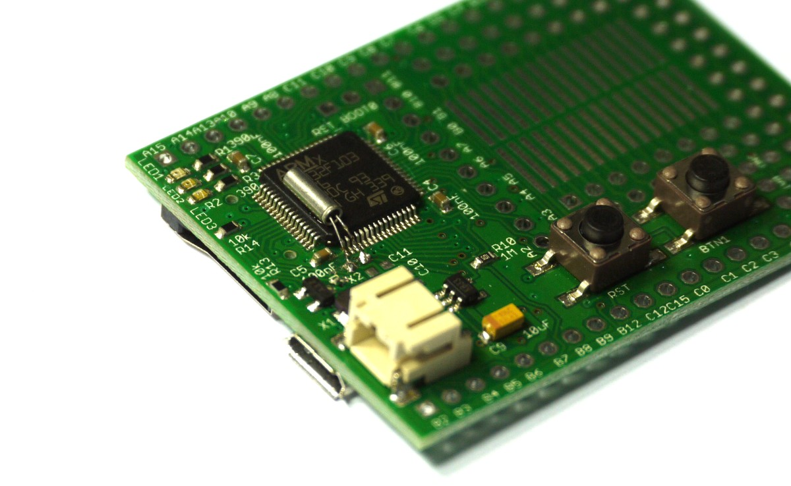

<!--- Copyright (c) 2013 Gordon Williams, Pur3 Ltd. See the file LICENSE for copying permission. -->
Espruino's Real Time Clock
=========================

:warning: **Please view the correctly rendered version of this page at https://www.espruino.com/Clocks. Links, lists, videos, search, and other features will not work correctly when viewed on GitHub** :warning:

* KEYWORDS: Clock,Time,Accuracy,RTC,Real Time Clock,Espruino Board,crystal,oscillator

Introduction
-----------

Often you might want to keep the current time - either for a clock, or maybe for Data Logging.

All Espruino boards contain their own Real-Time Clock which allows them to keep time even when it is saving power by being in Deep Sleep. However, depending on the board you have, the accuracy of the clock can vary wildly:

| Board | Oscillator | Accuracy |
|-------|------------|----------|
| Espruino [Original](/Original) 1v4+ | External Crystal | Good |
| Espruino [Original](/Original) 1v3 | Internal RC | 1% |
| Espruino [Pico](/Pico) | Internal RC | 10% |
| Espruino [WiFi](/WiFi) | External Crystal | Good |
| [Puck.js](/Puck.js) | Internal RC w. calibration | Good |
| [Pixl.js](/Pixl.js) | Internal RC w. calibration | Good |
| [MDBT42Q](/MDBT42Q) | Internal RC w. calibration | Good |
| [Bangle.js](/Bangle.js) | Internal RC w. calibration | Good |

If you have an Espruino Original or Pico without a crystal it is possible to add one - see below.

**Note:** You could also use an external module like the [[DS3231]].

Adding Crystals
-------------------

### Espruino Original

**Note:** Espruino [revision 1.4](/Original#layout) boards already have a low speed oscillator on board. It's only 1.3 where you might want to add one.

You can get crystals from pretty much any electronic component supplier, for instance:

* [Farnell](http://uk.farnell.com/multicomp/mcrj332768f1220how/crystal-32-768khz-12-5pf-thru-hole/dp/1701100)
* [eBay](http://www.ebay.com/sch/i.html?_nkw=Crystal+32.768)

You need something that looks like the above - roughly 8mm long and 2mm wide, with 2 very thin wires. They're not very expensive - less than £1 each usually, however you may also be able to scavenge them from old Quartz watches.

* Apply two small blobs of solder to the two pads indicated above
* Cut your crystal's wires to length, and tin them.
* Solder the crystal on to the board (it doesn't matter which way around it is)
* Fold it down on to the ARM chip, and apply some Super Glue to hold it in place

The other four empty pads nearby are for two capacitors for the crystal. These crystals require around 12pF for each capacitor - however in reality there is enough capacitance in the PCB, and the crystal will work perfectly well without them.

### Espruino Pico

There are 6 empty pads on the end of the board opposite the USB connector. You'll need:

* An Abracon ABS06-107 Crystal
* 2x 4pF 0603 Capacitors

The crystal goes on the 2 big pads, and the two capacitors go on the small ones.

If you have access to a hot air rework station and some tweezers then that's
definitely the easiest way to install the crystal. It is possible to use a
soldering iron with a thin tip, but it will take a lot of time and care.

Software
-------

Nothing is needed! Just plug your Espruino in, and the Crystal will automatically be detected and used!

It's recommended that you turn on `Set Current Time` in the Web IDE's communications settings. Then, when you upload code the correct time (and timezone) will be set, and `new Date()` will return a [Date object](http://www.espruino.com/Reference#Date) which can be queried for the current time.

To set the time manually you can just use the `setTime(...)` function with the number of seconds since 1970.

However you can also use the [[clock]] module which will keep track of time independent of the system time.
