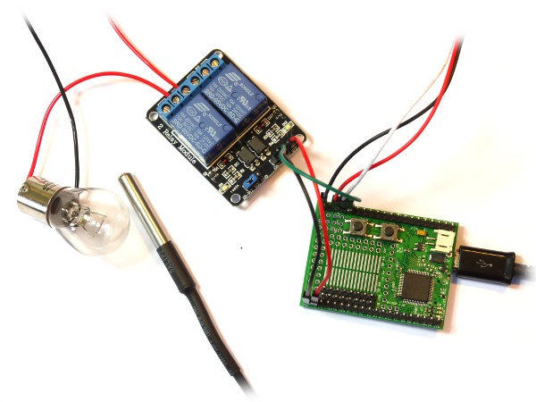

<!--- Copyright (c) 2013 Gordon Williams, Pur3 Ltd. See the file LICENSE for copying permission. -->
Heater Controller
===============

<span style="color:red">:warning: **Please view the correctly rendered version of this page at https://www.espruino.com/Heater+Controller. Links, lists, videos, search, and other features will not work correctly when viewed on GitHub** :warning:</span>

* KEYWORDS: Heater,Temperature,Temp,Controller
* USES: DS18B20,Resistor,4.7k Resistor,Relay Module

Introduction
-----------

There are plenty of times that you might need to control the temperature in something. Just a few are:

* Homebrew
* Germinating Plants
* Fancy 'sous-vide' cooking
* Heating your house

and so on... 

Here we'll show you a very quick, easy way to control the temperature of something. There are plenty of other ways (especially if you have more control over your heater than just On or Off), but this is a good starting point.


You'll Need
----------

* An [Espruino Board](/EspruinoBoard)
* A [[DS18B20]] temperature sensor
* A 4.7k resistor (for the temperature sensor)
* A heater of some kind. I'll be using a [P21W](http://www.ebay.com/sch/i.html?_nkw=P21W+12V+21W+-led) car indicator bulb, and a 5v Power Supply that will supply at least 1 Amp to power it
* A [relay module](/Relays), to turn the heater on and off

Wiring Up
--------



We need to wire up 3 things:

### Temperature Sensor

You can follow the [instructions here](/DS18B20), however for convenience you need to connect:

| Sensor Wire | Espruino   | 4.7k Resistor |
| --------- | ---------- | ------------- |
| Black     |  GND   |               |
| Red       |  3.3v  | 1st wire      |
| White     |  A1    | 2nd wire      |

### Heater to the relay module

We just need to make a simple Bulb + battery circuit here, where instead of a switch, we use the relay. Connect as follows:

| Wire From | Wire To |
| --------- | ---------- |
| Metal shell Bulb   | GND on Power Supply          |
| End of Bulb        | 2nd pin on relay (marked K1) |
| 5V on Power Supply | 3rd Pin on relay             |

### Relay module to Espruino

| Relay Module | Espruino   |
| --- | --------- |
| GND |  GND      |
| VCC |  Bat (5V) |
| IN1 |  A0       |


Software
-------

The software itself is really simple, just copy and paste this into the right-hand window, then click the ```Send to Espruino``` button.

```
// Turn the heater on or off (depending on the value of isOn)
// Also turns the red LED on and off as an indicator
function setHeater(isOn) {
  digitalWrite(LED1, isOn);
  digitalWrite(A0, !isOn); // 0 turns the relay on, 1 turns it off
}

var ow = new OneWire(A1);
var sensor = require("DS18B20").connect(ow);
// Target temperature to reach
var targetTemp = 30;

// Every second...
setInterval(function() {
  // Get temperature
  var temp = sensor.getTemp();
  // if Temperature is a bit too low, turn the heater on
  if (temp < targetTemp-1)
    setHeater(true);
  // if Temperature is too high, turn heater off and let it cool down
  if (temp > targetTemp+1)
    setHeater(false);
}, 1000);
```

Now, if the temperature is below 30 degrees C (the value of ```targetTemp```), the bulb will turn on and will generate heat. When the temperature is exceeded by a small amount, the bulb will turn off. When the temperature drops a bit below 30 degrees the bulb will turn back on again!

**Note:** If the temperature sensor and the bulb aren't close enough together or aren't in an enclosed space, the sensor will never reach the correct temperature. Try placing the bulb and sensor in a small cardboard box, or taping them together. 

We use ```targetTemp-1``` and ```targetTemp+1``` in our if statements because we want a bit of [hysteresis](http://en.wikipedia.org/wiki/Hysteresis). This is what is built into all thermostats (for instance in your fridge or house's central heating), and it makes sure that we don't reach the stage where we're turning our bulb on and off every second!

If you type ```sensor.getTemp()``` in the left pane while your code is running, you should be able to see the current temperature. You can even add the line ```console.log(temp);``` after the line ```var temp = sensor.getTemp();``` and re-upload, and Espruino will show you the temperature automatically so you can see how it rises and falls.


