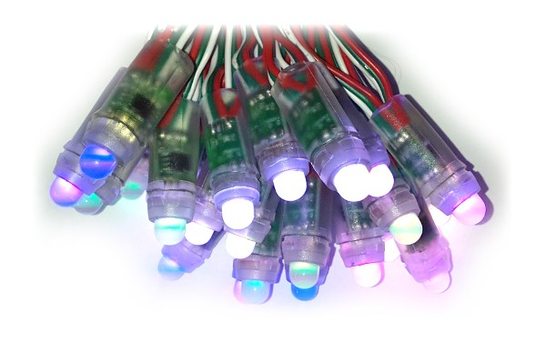
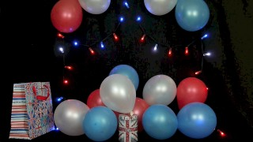

<!--- Copyright (c) 2013 Gordon Williams, Pur3 Ltd. See the file LICENSE for copying permission. -->
Individually Addressable LEDs
===============================

<span style="color:red">:warning: **Please view the correctly rendered version of this page at https://www.espruino.com/Individually Addressable LEDs**. Links, lists, videos, search, and other features will not work correctly when viewed on GitHub.</span>

* KEYWORDS: Individually Addressable LEDs,Light,Lights,LED,LEDs,WS2811,WS2812,WS2812B,APA104,APA106,SK6812,Multicolour,Fairy
* USES: WS2811



Introduction
-----------

In the last few years, individually addressable RGB lights have been getting cheaper and cheaper. These lights contain a small controller chip alongside the RGB LED which makes it show a certain colour. The controller chips have a serial data input and output, and can be daisy-chained together. In this way you can control many different lights using just a few control wires (rather than needing wires going to each individual light).

 

There are two main types of Individually addressable LED at the moment - 3 wire and 4 wire.

LEDs like the [WS2801](/datasheets/WS2801.pdf) use 4 wires - ground, power, clock and data. They can be controlled using SPI, which is available on most microcontrollers. There are some small disadvantages though:

* You need 4 wires between each LED (which increases cost)
* The package for the controller/LED needs more wires, increasing size and cost

Many newer controllers use 3 wires, like the [[WS2811/WS2812/APA104/APA106 and SK6812](/WS2811)]. The use a one-wire style serial protocol, which only requires (as the name suggests) one wire for data. This means:

* Only 3 wires between each LED
* The controller chip fits in a smaller package, which fits on a smaller PCB
* Many LEDs (in fact all apart from the WS2811) put the controller chip inside the LED package itself.

All this adds up to make RGB LED lighting that is significantly cheaper than the WS2801 controller.

In this tutorial we'll show you how to drive these 3 wire LEDs from Espruino. The LEDs require a series of pulses at 800 kHz, where a 0 bit is a short pulse, and a 1 bit is a long pulse. To do this, we'll use the SPI port - but instead of sending individual bits, we'll send bits in chunks of 4 - 0b0001 for a 0, and 0b0011 for a 1.

You'll Need
----------

* A chain of [[WS2811]] style lights. I'll be using individually wired ones (rather than the ones on a flexible PCB) in a string of 25.
* An Espruino board

Wiring Up
--------

Your WS2811 LED light chain should have two ends, with 3 wires at each end (some may be duplicated). The colours for these are Red, White and Green. Red is 5v power, White is Ground, and Green is Signal. If you have instructions with your LED light chain, please use those instead.

At one end, the signal is an input, and at the other it is an output - so that you can chain more than 50 lights together. On the lights we have, the female plug is the input - however if you can see `DI`/`DO` markings on the LEDs or you have other documentation, use that instead.

So to wire up, all you need to do is:

Connect White (0v) and Red (5v) wires to a 5v power source. You probably shouldn't use USB, as when all on, 50 LEDs draw around 1A - which is too much!

Connect White to ground on the Espruino board, and Green to an SPI MOSI pin on your Espruino board. On the Espruino Board, B15 is good (although there are others available). On discovery boards this is usually A7, and on Maple/Olimexino boards it is D11. However if in doubt please check the [[Reference]].

Software
-------

So now it's connected up, we need to send some data. First off, we'll set up SPI:

```SPI2.setup({baud:3200000, mosi:B15});```

Note that we're using pin B15 here - if you want to use a different pin (see the wiring up section) then you'll have to change this.

We choose 3200000 baud because we want to transmit 4 bits of information for each real bit, and we want to transmit at 800000 baud. So 800000 * 4 = 3200000. However the STM32 chips can't get exactly the SPI baud rate you request - they'll try to get it right to within +/- 50%.

And now, we'll send data to the first light. The data is transmitted as sets of bytes for red, green, and blue:

```SPI2.send4bit([255,0,0], 0b0001, 0b0011);```

This will make the first LED red. Note the use of 0b0001 and 0b0011, which are the two sets of bit patterns to use for the 0 and 1 bits.

We can do other colours too:

```
SPI2.send4bit([0,255,0], 0b0001, 0b0011); // green

SPI2.send4bit([0,0,255], 0b0001, 0b0011); // blue

SPI2.send4bit([255,255,255], 0b0001, 0b0011); // white
```

And we can then control a second or third LED by just sending more data:

```SPI2.send4bit([255,0,0, 0,255,0, 0,0,255], 0b0001, 0b0011);```

So now, we could make a function with a for loop that would create colours for every LED. This one just makes all 50 LEDs progressively brighter white (the first LED will be off) :

```
var rgb = new Uint8ClampedArray(25*3);

function getPattern() {
  for (var i=0;i<rgb.length;i+=3) {
     rgb[i  ] = i*10;
     rgb[i+1] = i*10;
     rgb[i+2] = i*10;
  }
}
```

Note that we define the array `rgb` once, as a `Uint8ClampedArray`. You could use a normal array, but Typed Arrays are faster and more memory efficient when all you need to store are values between 0 and 255.
Using `Uint8ClampedArray` also means that any values greater than 255 or less than 0 are 'clamped'. If you used `Uint8Array` instead than a value would just have the top bits removed, turning 256 into 0, 257 to 1 and so on.

Then we can make a function which will send this information to the lights - and can call it:

```
function doLights() {
  getPattern();
  SPI2.send4bit(rgb, 0b0001, 0b0011);
}

doLights();
```

So now, you should have a nice greyscale. But we can animate the lights too:

```
var pos = 0;
function getPattern() {
  pos++;
  for (var i=0;i<rgb.length;i+=3) {
     var col = (Math.sin(i+pos*0.2)+1) * 127;
     rgb[i  ] = col;
     rgb[i+1] = col;
     rgb[i+2] = col;
  }
}
doLights();
```

This uses a sine wave to have the lights move between on and off. pos is used to store the position in the animation. Now, every time you call doLights, the lights will change!
You can animate this using setInterval!

```setInterval(doLights,50);```

Now, we can try some other things. For instance, we could use sine waves at different frequencies to display animating rainbow colours:

```
function getPattern() {
  pos++;
  for (var i=0;i<rgb.length;i+=3) {
     rgb[i  ] = (1 + Math.sin((i+pos)*0.1324)) * 127;
     rgb[i+1] = (1 + Math.sin((i+pos)*0.1654)) * 127;
     rgb[i+2] = (1 + Math.sin((i+pos)*0.1)) * 127;
  }
}
```

Or we could just use random numbers for a blue twinking effect:

```
function getPattern() {
  for (var i=0;i<rgb.length;i+=3) {
     rgb[i  ] = 0;
     rgb[i+1] = 0;
     rgb[i+2] = Math.random()*255;
  }
}
```

Now, we could store all our different getPattern functions in an array, and switch between them when a button is pressed:

```
var patterns = [];
patterns.push(function() {
  pos++;
  for (var i=0;i<rgb.length;i+=3) {
     var col = (Math.sin(i+pos*0.2)+1) * 127;
     rgb[i  ] = col;
     rgb[i+1] = col;
     rgb[i+2] = col;
  }
});
patterns.push(function() {
  pos++;
  for (var i=0;i<rgb.length;i+=3) {
     rgb[i  ] = (1 + Math.sin((i+pos)*0.1324)) * 127;
     rgb[i+1] = (1 + Math.sin((i+pos)*0.1654)) * 127;
     rgb[i+2] = (1 + Math.sin((i+pos)*0.1)) * 127;
  }
});
patterns.push(function() {
  for (var i=0;i<rgb.length;i+=3) {
     rgb[i  ] = 0;
     rgb[i+1] = 0;
     rgb[i+2] = Math.random()*255;
  }
});

var patternNumber = 0;
function changePattern() {
  patternNumber = (patternNumber+1) % patterns.length;
  getPattern = patterns[patternNumber];
}
setWatch(changePattern, BTN, { repeat: true, edge:'falling' });
```

So now, if you press the button (not the reset one!) on your Espruino board, the pattern will change. You can also go back and edit getPattern to create the pattern you want:

```edit(getPattern);```

Now change it, go to the end of the function with the arrow keys (or Page Down) and hit enter. The pattern on the LEDs will change. You can now type the following and your new pattern will be saved into the list of patterns (so you can change to it by pressing the button again):

```patterns.push(getPattern)```

The full code (if you just want to copy it in all at once) is:

```
SPI2.setup({baud:3200000, mosi:B15});
var rgb = new Uint8ClampedArray(25*3);

var pos=0;

var patterns = [];
patterns.push(function() {
  pos++;
  for (var i=0;i<rgb.length;i+=3) {
     var col = (Math.sin(i+pos*0.2)+1) * 127;
     rgb[i  ] = col;
     rgb[i+1] = col;
     rgb[i+2] = col;
  }
});
patterns.push(function() {
  pos++;
  for (var i=0;i<rgb.length;i+=3) {
     rgb[i  ] = (1 + Math.sin((i+pos)*0.1324)) * 127;
     rgb[i+1] = (1 + Math.sin((i+pos)*0.1654)) * 127;
     rgb[i+2] = (1 + Math.sin((i+pos)*0.1)) * 127;
  }
});
patterns.push(function() {
  for (var i=0;i<rgb.length;i+=3) {
     rgb[i  ] = 0;
     rgb[i+1] = 0;
     rgb[i+2] = Math.random()*255;
  }
});
var getPattern = patterns[0];
function doLights() {
  getPattern();
  SPI2.send4bit(rgb, 0b0001, 0b0011);
}

var patternNumber = 0;
function changePattern() {
  patternNumber = (patternNumber+1) % patterns.length;
  getPattern = patterns[patternNumber];
}

setWatch(changePattern, BTN, { repeat: true, edge:'falling' });
setInterval(doLights,50);
```

That's it! If you come up with any good patterns, please [[Contact Us]] and let us know!
