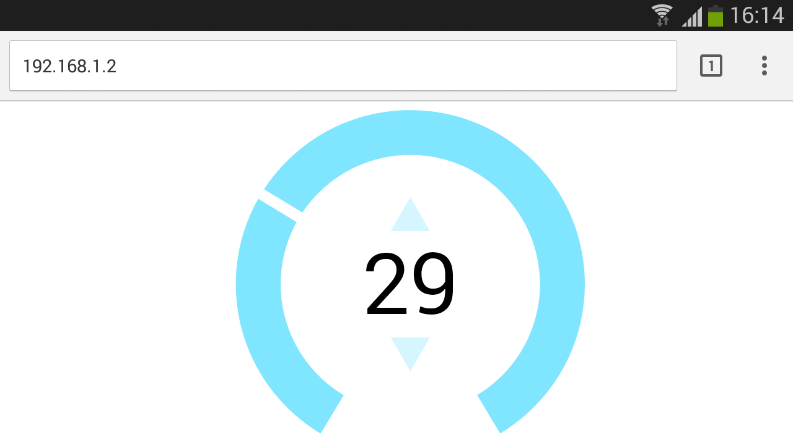
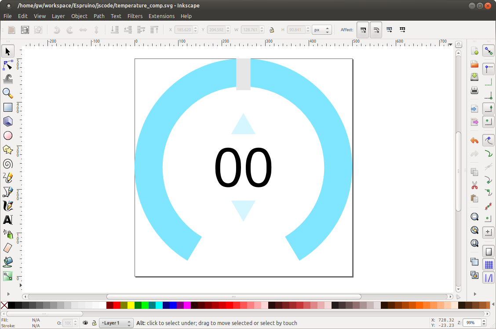

<!--- Copyright (c) 2015 Gordon Williams, Pur3 Ltd. See the file LICENSE for copying permission. -->
Interactive Web-based UI
========================

<span style="color:red">:warning: **Please view the correctly rendered version of this page at https://www.espruino.com/Interactive Web UI**. Links, lists, videos, search, and other features will not work correctly when viewed on GitHub.</span>

* KEYWORDS: Wifi,Web Server,Graphical,SVG
* USES: Internet,ESP8266,Pico,WIZnet



Introduction
-----------

If you're using Ethernet or WiFi in your project, a modern user interface will make it look significantly more professional.

Often, doing this with raw HTML is quite a painful process. However, modern web browsers support
[SVG](http://en.wikipedia.org/wiki/Scalable_Vector_Graphics) elements which allow you to embed 
(and modify) vector graphics as if they were normal HTML elements.

In this tutorial we'll show you how to create a modern-looking user interface in a vector graphics
editor such as [Inkscape](https://inkscape.org/en/), and how to use it in Espruino to create a fast,
easy to use interface.


You'll Need
----------

* One [Espruino Pico](/Pico)
* An [ESP8266 WiFi](/ESP8266) or [WIZnet W550io Ethernet](/WIZnet) module

Wiring Up
--------

Just follow the wiring instructions for either [the ESP8266 WiFi](/ESP8266) or [WIZnet W550io Ethernet](/WIZnet) modules.

Software
-------

First off, you need to run [Inkscape](http://www.inkscape.org/en/) and design some graphics. I just created a simple temperature dial with some basic parts - a ring, text, up/down arrows, and a needle (shown in grey).

 

When you have something like this, make sure you right-click on each item, go to `Object Properties`, and set the `id` to something simple. I've chosen `ring`, `label`, `up`, `dn`, and `needle`. Then, save the file as a `Plain SVG` file using `Save As`. This will remove any Inkscape-specific tags that aren't needed. Finally, create a simple HTML file and paste it in (I've already removed a few extra tags):

```HTML
<html>
    <body>
<svg width="500" height="500">
    <path
       style="fill:#80e5ff;fill-opacity:1;fill-rule:nonzero;stroke:none"
       d="M 250 0 C 111.92882 3.7895613e-14 0 111.92882 0 250 C -1.249508e-14 341.05067 48.689713 420.72528 121.4375 464.4375 L 154.625 409.40625 C 100.50052 376.95218 64.28125 317.69934 64.28125 250 C 64.28125 147.43284 147.43284 64.28125 250 64.28125 C 352.56716 64.28125 435.71875 147.43284 435.71875 250 C 435.71875 317.53896 399.66155 376.65256 345.75 409.15625 L 378.71875 464.34375 C 451.37991 420.61135 500 340.98541 500 250 C 500 111.92882 388.07118 -1.8947806e-14 250 0 z " id="ring"/>
    <rect
       style="fill:#ffffff;fill-opacity:1;fill-rule:nonzero;stroke:none"
       id="needle"
       width="16"
       height="80"
       x="242"/>
    <text
       xml:space="preserve"
       style="font-size:122.59261322px;font-style:normal;font-variant:normal;font-weight:normal;font-stretch:normal;text-align:center;line-height:125%;letter-spacing:0px;word-spacing:0px;text-anchor:middle;fill:#000000;fill-opacity:1;stroke:none;font-family:Helvetica;-inkscape-font-specification:Helvetica"
       x="250.01915"
       y="845.31812"
       id="text"><tspan
         id="label"
         x="250.01915"
         y="292.95594">0</tspan></text>
    <path
       style="fill:#d5f6ff;fill-opacity:1;fill-rule:nonzero;stroke:none"
       id="up"
       d="m 294.75099,133.39225 -90.93056,0 45.46528,-78.748173 z"
       transform="matrix(0.61903879,0,0,0.61903879,95.682477,91.16682)"
       />
    <path
       transform="matrix(0.61903879,0,0,-0.61903879,95.682477,408.80767)"
       d="m 294.75099,133.39225 -90.93056,0 45.46528,-78.748173 z"
       id="dn"
       style="fill:#d5f6ff;fill-opacity:1;fill-rule:nonzero;stroke:none" />
</svg>

</body></html>
```

If you load up this HTML file, it should display your image. Now to make some changes...

* Add a 'head' tag with `<head><meta name="viewport" content="width=device-width,initial-scale=1"></head>` - this will ensure that is displays fullscreen on mobile devices
* Make sure the`<body` tag contains `<body style="width:100%;height:100%;overflow:hidden;">` - again, this will ensure fullscreen display
* And make sure the SVG itself can stretch to the new size. Replace the `<svg width="500" height="500" id="svg">` tag with `<svg style="width:100%;height:100%;" viewbox="0 0 500 500" id="svg">`
* Now, we need to add some JavaScript code that will help to make your SVG interactive. This will vary depending on what you've drawn, but I've included the code I used below:

```HTML
<html>
<head><meta name="viewport" content="width=device-width,initial-scale=1"></head>
<body style="width:100%;height:100%;overflow:hidden;">
<svg style="width:100%;height:100%;"
   viewbox="0 0 500 500" id="svg">
    <path
       style="fill:#80e5ff;fill-opacity:1;fill-rule:nonzero;stroke:none"
       d="M 250 0 C 111.92882 3.7895613e-14 0 111.92882 0 250 C -1.249508e-14 341.05067 48.689713 420.72528 121.4375 464.4375 L 154.625 409.40625 C 100.50052 376.95218 64.28125 317.69934 64.28125 250 C 64.28125 147.43284 147.43284 64.28125 250 64.28125 C 352.56716 64.28125 435.71875 147.43284 435.71875 250 C 435.71875 317.53896 399.66155 376.65256 345.75 409.15625 L 378.71875 464.34375 C 451.37991 420.61135 500 340.98541 500 250 C 500 111.92882 388.07118 -1.8947806e-14 250 0 z " id="ring"/>
    <rect
       style="fill:#ffffff;fill-opacity:1;fill-rule:nonzero;stroke:none"
       id="needle"
       width="16"
       height="80"
       x="242"/>
    <text
       xml:space="preserve"
       style="font-size:122.59261322px;font-style:normal;font-variant:normal;font-weight:normal;font-stretch:normal;text-align:center;line-height:125%;letter-spacing:0px;word-spacing:0px;text-anchor:middle;fill:#000000;fill-opacity:1;stroke:none;font-family:Helvetica;-inkscape-font-specification:Helvetica"
       x="250.01915"
       y="845.31812"
       id="text"><tspan
         id="label"
         x="250.01915"
         y="292.95594">0</tspan></text>
    <path
       style="fill:#d5f6ff;fill-opacity:1;fill-rule:nonzero;stroke:none"
       id="up"
       d="m 294.75099,133.39225 -90.93056,0 45.46528,-78.748173 z"
       transform="matrix(0.61903879,0,0,0.61903879,95.682477,91.16682)"
       />
    <path
       transform="matrix(0.61903879,0,0,-0.61903879,95.682477,408.80767)"
       d="m 294.75099,133.39225 -90.93056,0 45.46528,-78.748173 z"
       id="dn"
       style="fill:#d5f6ff;fill-opacity:1;fill-rule:nonzero;stroke:none" />
</svg>

<script>
// Convert touch to mouse event for mobile devices
function touchHandler(event) {
  var touches = event.changedTouches,
       first = touches[0], type = "";
  switch(event.type) {
    case "touchstart": type="mousedown"; break;
    case "touchmove":  type="mousemove"; break;        
    case "touchend":   type="mouseup"; break;
    default: return;
  }
  var simulatedEvent = document.createEvent("MouseEvent");
  simulatedEvent.initMouseEvent(type, true, true, window, 1, 
                            first.screenX, first.screenY, 
                            first.clientX, first.clientY, false, 
                            false, false, false, 0/*left*/, null);
  first.target.dispatchEvent(simulatedEvent);
  event.preventDefault();
}
document.addEventListener("touchstart", touchHandler, true);
document.addEventListener("touchmove", touchHandler, true);
document.addEventListener("touchend", touchHandler, true);
document.addEventListener("touchcancel", touchHandler, true); 

// rotate needle to correct position
var pos = 50;
function setPos(p) {
  if (p<0) p=0;
  if (p>100) p=100;
  pos = p;
  // change the label's text
  document.getElementById("label").textContent = pos;    
  // rotate the 'needle' around the middle of the SVG
  var a = (pos-50)*2.8;
  document.getElementById("needle").setAttribute("transform","rotate("+a+" 250 250)");    
}
setPos(pos);

// handle events
var dragging = false;
function dragStart() {
  dragging = true;
  document.getElementById("ring").style.fill = "#ff0000";
}
document.addEventListener("mousemove", function(e) {
  if (dragging) {
    e.preventDefault();
    var svg = document.getElementById("svg");
    // work out the angle from coordinates - note that the coordinates are in window pixels, not SVG pixels
    var ang = Math.atan2(e.clientX-(svg.clientWidth/2),(svg.clientHeight/2)-e.clientY)*180/Math.PI;
    // move to new location
    setPos(Math.round((ang/2.8)+50));
  }
});
document.addEventListener("mouseup", function(e) {
  dragging = false;
  document.getElementById("ring").style.fill = "#80e5ff";
  document.getElementById("up").style.fill = "#d5f6ff";
  document.getElementById("dn").style.fill = "#d5f6ff";
});
document.getElementById("ring").onmousedown = dragStart;
document.getElementById("needle").onmousedown = dragStart;
document.getElementById("up").onmousedown = function(e) { e.preventDefault(); this.style.fill = "#ff0000"; };
document.getElementById("dn").onmousedown = function(e) { e.preventDefault(); this.style.fill = "#00ff00"; };
document.getElementById("up").onmouseup = function(e) { setPos(pos+10); };
document.getElementById("dn").onmouseup = function(e) { setPos(pos-10); };
</script>
</body>
</html>
```

The code itself is quite simple. At first, we use some general boilerplate code to make sure that the
special 'touch' events generated by mobile devices get converted to mouse events. Then, we use normal
JavaScript DOM commands to access the SVG elements and move them or change their background colours.

If you use the code above in a normal webpage, you should get a fully functioning dial that can be
moved from 0 to 100.

Now we've got that, we need to integrate it into Espruino. We'll modify the `mouseup` handler so that
it uses an `XMLHttpRequest` to send the new data to Espruino as soon as the user has released their mouse/finger:

```
document.addEventListener("mouseup", function(e) {
  dragging = false;
  document.getElementById("ring").style.fill = "#80e5ff";
  document.getElementById("up").style.fill = "#d5f6ff";
  document.getElementById("dn").style.fill = "#d5f6ff";
  // POST data to Espruino
  var req=new XMLHttpRequest();
  req.open("POST","?pos="+pos, true);
  req.send();
});
```
Save it all to disk, and then use the [[File Converter]] page to convert it to a string. While you could load it off an SD card without converting it to a string, storing the file as a variable means that Espruino can work without requiring an SD card at all.

Finally, you just need to write some code for Espruino that will serve up the webpage and will do something when data is POSTed back via HTTP.

```JavaScript
var page = "<html>\n<head><meta name=\"viewport\" content=\"width=device-width,initial-scale=1\"></head>\n<body style=\"width:100%;height:100%;overflow:hidden;\">\n<svg style=\"width:100%;height:100%;\"\n   viewbox=\"0 0 500 500\" id=\"svg\">\n    <path\n       style=\"fill:#80e5ff;fill-opacity:1;fill-rule:nonzero;stroke:none\"\n       d=\"M 250 0 C 111.92882 3.7895613e-14 0 111.92882 0 250 C -1.249508e-14 341.05067 48.689713 420.72528 121.4375 464.4375 L 154.625 409.40625 C 100.50052 376.95218 64.28125 317.69934 64.28125 250 C 64.28125 147.43284 147.43284 64.28125 250 64.28125 C 352.56716 64.28125 435.71875 147.43284 435.71875 250 C 435.71875 317.53896 399.66155 376.65256 345.75 409.15625 L 378.71875 464.34375 C 451.37991 420.61135 500 340.98541 500 250 C 500 111.92882 388.07118 -1.8947806e-14 250 0 z \" id=\"ring\"/>\n    <rect\n       style=\"fill:#ffffff;fill-opacity:1;fill-rule:nonzero;stroke:none\"\n       id=\"needle\"\n       width=\"16\"\n       height=\"80\"\n       x=\"242\"/>\n    <text\n       xml:space=\"preserve\"\n       style=\"font-size:122.59261322px;font-style:normal;font-variant:normal;font-weight:normal;font-stretch:normal;text-align:center;line-height:125%;letter-spacing:0px;word-spacing:0px;text-anchor:middle;fill:#000000;fill-opacity:1;stroke:none;font-family:Helvetica;-inkscape-font-specification:Helvetica\"\n       x=\"250.01915\"\n       y=\"845.31812\"\n       id=\"text\"><tspan\n         id=\"label\"\n         x=\"250.01915\"\n         y=\"292.95594\">0</tspan></text>\n    <path\n       style=\"fill:#d5f6ff;fill-opacity:1;fill-rule:nonzero;stroke:none\"\n       id=\"up\"\n       d=\"m 294.75099,133.39225 -90.93056,0 45.46528,-78.748173 z\"\n       transform=\"matrix(0.61903879,0,0,0.61903879,95.682477,91.16682)\"\n       />\n    <path\n       transform=\"matrix(0.61903879,0,0,-0.61903879,95.682477,408.80767)\"\n       d=\"m 294.75099,133.39225 -90.93056,0 45.46528,-78.748173 z\"\n       id=\"dn\"\n       style=\"fill:#d5f6ff;fill-opacity:1;fill-rule:nonzero;stroke:none\" />\n</svg>\n\n<script>\n// Convert touch to mouse event for mobile devices\nfunction touchHandler(event) {\n  var touches = event.changedTouches,\n       first = touches[0], type = \"\";\n  switch(event.type) {\n    case \"touchstart\": type=\"mousedown\"; break;\n    case \"touchmove\":  type=\"mousemove\"; break;        \n    case \"touchend\":   type=\"mouseup\"; break;\n    default: return;\n  }\n  var simulatedEvent = document.createEvent(\"MouseEvent\");\n  simulatedEvent.initMouseEvent(type, true, true, window, 1, \n                            first.screenX, first.screenY, \n                            first.clientX, first.clientY, false, \n                            false, false, false, 0/*left*/, null);\n  first.target.dispatchEvent(simulatedEvent);\n  event.preventDefault();\n}\ndocument.addEventListener(\"touchstart\", touchHandler, true);\ndocument.addEventListener(\"touchmove\", touchHandler, true);\ndocument.addEventListener(\"touchend\", touchHandler, true);\ndocument.addEventListener(\"touchcancel\", touchHandler, true); \n\n// rotate needle to correct position\nvar pos = 50;\nfunction setPos(p) {\n  if (p<0) p=0;\n  if (p>100) p=100;\n  pos = p;\n  document.getElementById(\"label\").textContent = pos;    \n  var a = (pos-50)*2.8;\n  document.getElementById(\"needle\").setAttribute(\"transform\",\"rotate(\"+a+\" 250 250)\");    \n}\nsetPos(pos);\n\n// handle events\nvar dragging = false;\nfunction dragStart() {\n  dragging = true;\n  document.getElementById(\"ring\").style.fill = \"#ff0000\";\n}\ndocument.addEventListener(\"mousemove\", function(e) {\n  if (dragging) {\n    e.preventDefault();\n    var svg = document.getElementById(\"svg\");\n    var ang = Math.atan2(e.clientX-(svg.clientWidth/2),(svg.clientHeight/2)-e.clientY)*180/Math.PI;\n    setPos(Math.round((ang/2.8)+50));\n  }\n});\ndocument.addEventListener(\"mouseup\", function(e) {\n  dragging = false;\n  document.getElementById(\"ring\").style.fill = \"#80e5ff\";\n  document.getElementById(\"up\").style.fill = \"#d5f6ff\";\n  document.getElementById(\"dn\").style.fill = \"#d5f6ff\";\n  // POST data to Espruino\n  var req=new XMLHttpRequest();\n  req.open(\"POST\",\"?pos=\"+pos, true);\n  req.send();\n});\ndocument.getElementById(\"ring\").onmousedown = dragStart;\ndocument.getElementById(\"needle\").onmousedown = dragStart;\ndocument.getElementById(\"up\").onmousedown = function(e) { e.preventDefault(); this.style.fill = \"#ff0000\"; };\ndocument.getElementById(\"dn\").onmousedown = function(e) { e.preventDefault(); this.style.fill = \"#00ff00\"; };\ndocument.getElementById(\"up\").onmouseup = function(e) { setPos(pos+10); };\ndocument.getElementById(\"dn\").onmouseup = function(e) { setPos(pos-10); };\n</script>\n</body>\n</html>";


// Define our 'pos' variable
var pos = 50;
// Do vary simple software PWM on LED1 to show value of Pos
setInterval(function() {
  digitalPulse(LED1, 1, pos/7);
}, 20);


function setPos(p) {
  pos = p;
  console.log("Pos changed to "+p);
}

// When a page is requested...
function pageHandler(req, res) {
  if (req.method=="POST") {
    // If it's a POST, save the data
    var info = url.parse(req.url,true);
    console.log("POST ",info);
    if (info.query && "pos" in info.query)
      setPos(parseFloat(info.query.pos));
    res.writeHead(200);
    res.end("Ok.");
  } else {
    // otherwise write the page out
    console.log("GET "+req.url);
    if (req.url=="/") {
      res.writeHead(200);
      res.end(page);
    } else {
      res.writeHead(404);
      res.end("404: Not found");
    }
  }
}

// ESP8266 WiFi
/*var WIFI_NAME = "wifi_name";
var WIFI_PASS = "wifi_key";

Serial2.setup(9600, { rx: A3, tx : A2 });
var wifi = require("ESP8266WiFi").connect(Serial2, function(err) {
  if (err) throw err;
  wifi.reset(function(err) {
    if (err) throw err;
    console.log("Connecting to WiFi");
    wifi.connect(WIFI_NAME, WIFI_PASS, function(err) {
      if (err) throw err;
      console.log("Connected");
      // print IP address
      wifi.getIP(console.log);
      // Create a server
      require("http").createServer(pageHandler).listen(80);
    });
  });
});*/

// WIZnet W550io
SPI2.setup({ mosi:B15, miso:B14, sck:B13 });
var eth = require("WIZnet").connect(SPI2, B10);
console.log("IP = "+eth.getIP().ip);
require("http").createServer(pageHandler).listen(80);
```

Paste this into the right-hand side of the Web IDE, being sure to uncomment the correct code at the bottom depending on your network device (and to set your WiFi credentials is using WiFi). Then just click the `Send to Espruino` button.

The WiFi will take a while to connect, but when it does Espruino will print its IP address. You can then connect to that with a web browser, for instance to `http://192.168.1.84`.

When you connect, you should see UI - served entirely off of the Espruino. If you then move the dial or click the buttons, and HTTP POST request will be made to the Espruino, which will then interpret that request and call `setPos` with the new value (which will change the brightness of the Red LED).

