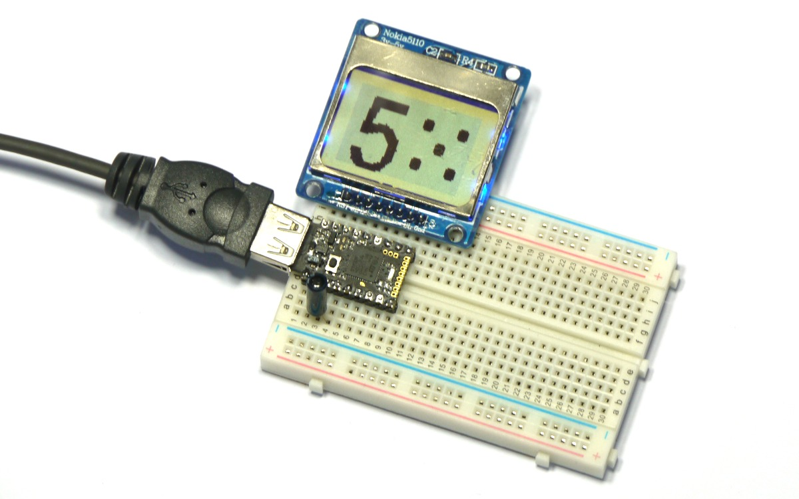

<!--- Copyright (c) 2015 Gordon Williams, Pur3 Ltd. See the file LICENSE for copying permission. -->
Pico Electronic Dice
=========================

<span style="color:red">:warning: **Please view the correctly rendered version of this page at https://www.espruino.com/Pico Electronic Dice**. Links, lists, videos, search, and other features will not work correctly when viewed on GitHub.</span>

* KEYWORDS: Pico,LCD,Vibration,Dice,Die,Random
* USES: Pico,PCD8544,Vibration,SW18010P,PicoStarterKit

Introduction
-----------

This is a simple electronic dice that comes up with a new random number each time it's shaken.

You'll Need
----------

* An Espruino [[Pico]]
* A [Nokia 5110 LCD](/PCD8544)
* An [SW18010P Vibration Sensor](/Vibration)
* [[Breadboard]]

Wiring Up
--------



This one's really easy...

* Simply place the Espruino Pico on the breadboard with the USB connector facing left
* Put the LCD directly above it, aligned to the right (so the pin on the Pico nearest the USB connector should not be connected to anything)
* Finally push the vibration sensor into the 3rd and 4th holes from the left, on the bottom edge of the Pico board, it can be any way around. Be careful as one of the wires is very delicate and bends easily.

Software
-------

First we'll just copy and paste the code that we used in the [[Pico Hello World]] example, with the code from the [[Pico Vibration]] example. Put the following in the right-hand side  of the Web IDE and click `Send to Espruino`:

```
A5.write(0); // GND
A7.write(1); // VCC
A6.write(1); // Turn on the backlight

var g; // Define g globally, so that it can be used by other functions

function onInit() {
  // Setup SPI
  var spi = new SPI();
  spi.setup({ sck:B1, mosi:B10 });
  // Initialise the LCD
  g = require("PCD8544").connect(spi,B13,B14,B15, function() {
    // When it's initialised, clear it and write some text
    g.clear();
    g.drawString("Hello World!",0,0);
    // send the graphics to the display
    g.flip();
  });
}

var on = false;
function shaken() {
  if (on) return; // if we haven't timed out, ignore this
  // otherwise, turn the light on
  on = true;
  digitalWrite(LED1, on);
  // now set a timeout to turn it off after 200ms = 1/5 second
  setTimeout(function() {
    on = false;
    digitalWrite(LED1, on);
  }, 200);
}

pinMode(B3,"input_pulldown"); // enable the pull-down resistor
// Now 'watch' B3 for shakes
setWatch(shaken, B3, {repeat:true, edge:"rising"});

onInit();
```

Now, the screen will display `"Hello World"` and if you shake the board it'll light the LED for a fraction of a second.

The next step is just to modify the `shaken` function to display a random number - replace it with the following:

```
function showRandom() {
  // get a random number between 1 and 6
  var n = 1 + Math.floor(Math.random()*6);
  // Clear the screen
  g.clear();
  // big font - as high as the screen
  g.setFontVector(g.getHeight()); 
  // draw the number, in the middle of the screen
  g.drawString(n, (g.getWidth()-g.stringWidth(n))/2, 0);
  // send to the LCD
  g.flip();
}

function shaken() {
  if (on) return; // if we haven't timed out, ignore this
  // otherwise, turn the light on
  on = true;
  digitalWrite(LED1, on);
  showRandom();
  // now set a timeout to turn it off after 200ms = 1/5 second
  setTimeout(function() {
    on = false;
    digitalWrite(LED1, on);
  }, 200);
}
```

And that's it, A simple electronic dice!

You could expand it to draw the dice itself by changing the `showRandom` function:

```
// the dots defined on each face
var dots = [
  undefined,
  [ [0,0] ],
  [ [-1,-1],[1,1] ],
  [ [1,-1],[0,0],[-1,1] ],
  [ [-1,-1],[1,1],[1,-1],[-1,1] ],
  [ [-1,-1],[1,1],[1,-1],[-1,1],[0,0] ],
  [ [-1,-1],[0,-1],[1,-1],[-1,1],[0,1],[1,1] ],
];

var on = false;
function showRandom() {
  // get a random number between 1 and 6
  var n = 1 + Math.floor(Math.random()*6);
  // Clear the screen
  g.clear();
  // big font - as high as the screen
  g.setFontVector(g.getHeight()); 
  // draw the number
  g.drawString(n, (g.getWidth()/2-g.stringWidth(n))/2, 0);
  // draw the dice
  dots[n].forEach(function(coords) {
    var x = g.getWidth()*3/4 + coords[0]*12;
    var y = g.getHeight()/2 + coords[1]*12;
    g.fillRect(x-3,y-2,x+3,y+2);
    g.fillRect(x-2,y-3,x+2,y+3);
  });
  // send to the LCD
  g.flip();
}
```

