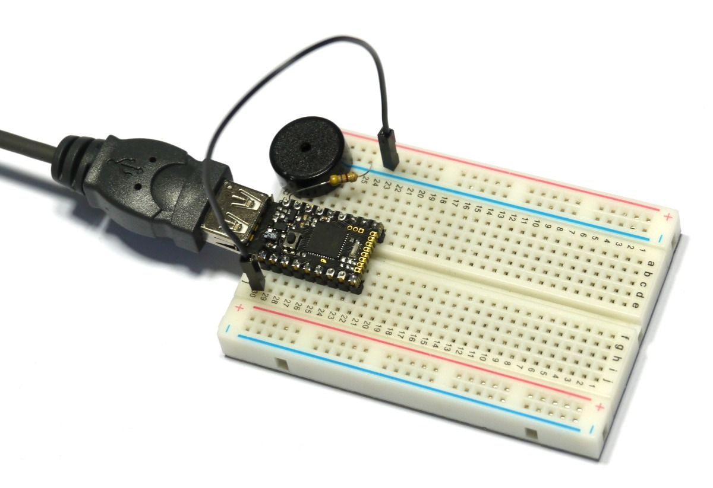

<!--- Copyright (c) 2015 Gordon Williams, Pur3 Ltd. See the file LICENSE for copying permission. -->
Pico FET Output
=============

<span style="color:red">:warning: **Please view the correctly rendered version of this page at https://www.espruino.com/Pico FET Output**. Links, lists, videos, search, and other features will not work correctly when viewed on GitHub.</span>

* KEYWORDS: Pico,FET,High Power,
* USES: Pico,FET,PicoStarterKit

Introduction
-----------

The Espruino [[Pico]] has a [FET](/Pico#power) built in, which can supply a 1.5A (or even 5A pulsed) 5v output.

While this is usually used to power Espruino from a battery, when the Pico is running from USB it is not needed and can be controlled from the Pico itself.

As an example, we're going to connect the piezo speaker up - if you compare the output to that of the [[Pico Piano]] it should be louder. However the output is capable of much more - for example driving bigger speakers, light bulbs, or relays.

You'll Need
----------

* An Espruino [[Pico]]
* A [[Speaker]]
* [[Breadboard]]
* A 470 Ohm resistor (yellow, purple, brown)
* A Jumper Wire

Wiring Up
--------

Because the FET can be used to charge a battery from USB (and this could be dangerous with LiPo batteries) the FET is disabled by default. To enable it, you need to short out the `FET/B0` jumper on the back of the board. 

You can do that just by scribbling over it with an HB pencil:



Now:

* Take the Pico board and place it in the breadboard so that the USB connector sticks out to the left.
* Attach the jumper wire from the bottom left pin, to the second from top row marked '-'
* Insert the Piezo speaker so one pin is in the row rising from the top-left pin (`Bat`) of the Pico, and the other is in the second from top row of the breadboard (`GND`).
* Insert the resistor across the Piezo speaker (so between `Bat` and `GND` again) - as the FET only pulls the voltage up to 5v, you need the resistor to pull it back down to 0v and to make a sound.

If you wanted to power something else you'd just connect it straight between `Bat` and `GND` - there's no need for the resistor.

Software
-------

Now we're all wired up, the code to drive the output is simple. As [shown here](/Pico#power), to turn the output off you'll need to make sure the pin `B0` is an input (or is in [open drain](http://en.wikipedia.org/wiki/Open_collector) mode) first.

As we don't want to damage the piezo we're only going to output a square wave, but you could connect some other device and use the [other bits of example code](/Pico#power) to turn it fully (or half) on.


```
pinMode(B0, "af_opendrain");
analogWrite(B0, 0.5, {freq:3000}); // Start the sound

// Now save our ears
setTimeout(function() {
  pinMode(B0, "input");
}, 1000);
```

or something a bit more tuneful:

```
var pitches = {
  'A':440.00, 'B':493.88, 'C':523.25, 'D':587.33,
  'E':659.26, 'F':698.46, 'G':783.99, 'a':880
};
var tune = "E BCD CBA ACE DCB  CD E C A A    D Fa GFE  CE DCB BCD E C A A   ";
var pos=0;
setInterval(function() {
  var ch = tune[pos];
  if (ch !== undefined) pos++; else pos=0;
  if (ch in pitches) {
    pinMode(B0, "af_opendrain"); 
    analogWrite(B0, 0.5, {freq:pitches[ch]});
  } else pinMode(B0, "input");
}, 100);
```
