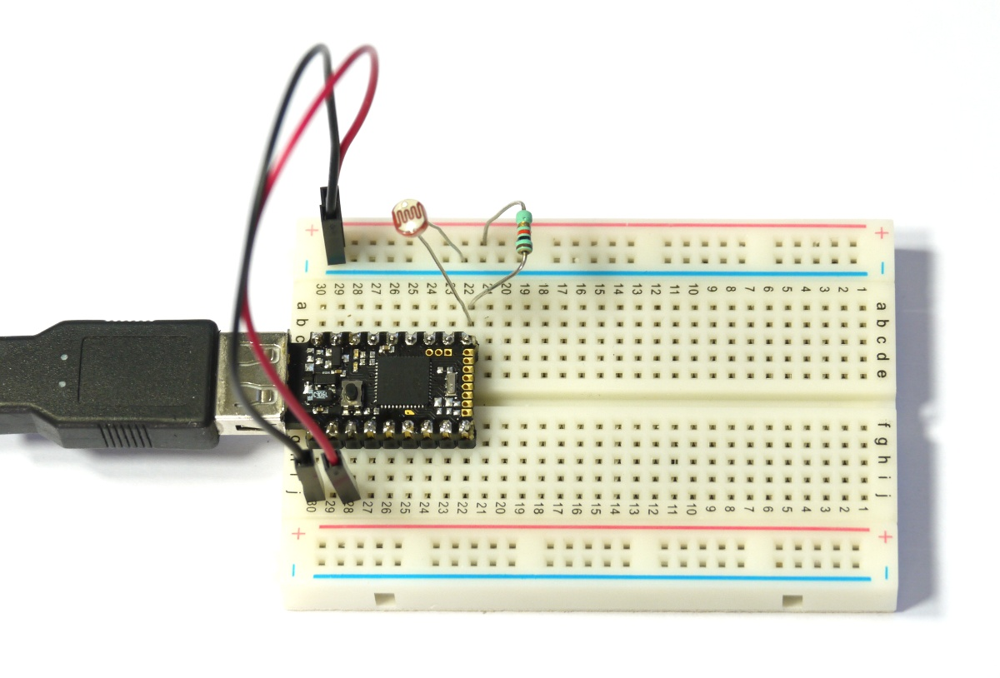

<!--- Copyright (c) 2015 Gordon Williams, Pur3 Ltd. See the file LICENSE for copying permission. -->
Pico Light Sensor
===============

<span style="color:red">:warning: **Please view the correctly rendered version of this page at https://www.espruino.com/Pico Light Sensor**. Links, lists, videos, search, and other features will not work correctly when viewed on GitHub.</span>

* KEYWORDS: Pico,LDR,Light,Brightness
* USES: Pico,LDR,PicoStarterKit

Introduction
-----------

We're going to wire up a Light Sensor on some breadboard, and experiment with turning a light on and off based on the light.

You'll Need
----------

* An Espruino [[Pico]]
* A [Light Dependent Resistor](/LDR)
* A 10,000 Ohm Resistor ( Brown, Black, Orange )
* [[Breadboard]]
* Two Jumper Wires

Wiring Up
--------



We're going to set up a very simple [Voltage Divider](http://en.wikipedia.org/wiki/Voltage_divider) circuit, with a known resistor on one side and the [Light Dependent Resistor](/LDR) on the other.

* Plug your Espruino Pico into a breadboard with the USB connector on the left-hand side. 
* With a Black Jumper wire, connect the bottom left pin (GND) to the '-' rail of the breadboard
* With a Red Jumper wire, connect the bottom pin 3rd from the left (3.3v) to the '+' rail of the breadboard
* Connect the [LDR](/LDR) between the top right pin (A5) and the '-' rail
* Connect the 10,000 Ohm resistor between the top right pin (A5) and the '+' rail

Software
-------

Now our voltage divider is set up, all we have to do is read the voltage that we've created. Type the following in the left-hand side of the Web IDE and press Enter:

```
analogRead(A5)
```

This will read the voltage and return a value between 0 (for 0v) and 1 (for 3.3v). For instance here it prints `0.27612726024`, but the value will depend on the light falling on the sensor.

Now put your hand over the top of the LDR, press the up arrow (to select the last command) and press Enter again. Less light should fall on the LDR, making its resistance (and so the voltage) higher. For instance I get `=0.62012664988`.

While it's interesting to read the light value, it would be better for Espruino to be able to do something automatically. 

First, lets save some readings. Leave your hand away from the LDR and type the following:

```
var light = analogRead(A5);
```

This will save the reading when the room is light.

Cover the sensor, and type the following:

```
var dark = analogRead(A5);
```

Now we have two values that we can use. Let's work out the mid-point:

```
var mid = 0.5*light + 0.5*dark;
```

We can now write a function that will compare this with the current voltage, and will light an LED if it is darker than the midpoint:

```
function step() {
  var l = analogRead(A5);
  digitalWrite(LED1, l > mid);
}
```

By itself this won't do anything, but let's tell Espruino to execute it every 10ms (100 times a second).

```
setInterval(step, 10);
```

Now, move you hand near the sensor. You should notice that when you cover it, the red LED lights up. At some point when you move your hand away (especially if you try and cover it with a white sheet of paper) you should notice that the light starts blinking on and off very quicky. This is because the light sensor is detecting the light from the LED - when it is dark the LED turns on, but 1/100th of a second later the LED is on, which makes it bright enough that it should turn off, and so on.

You can also experiment with turning the light on at different light levels, for instance try:

```
var mid = 0.8*light + 0.2*dark;
```

That should make the light a lot more sensitive. It'll use 80% of the light value and 20% of the dark value (the two numbers need to add up). If you experiment with different values you'll find that the light either gets harder or easier to turn on.

So now, what if you wanted to use this to control a real light, that turned on when it got dark, and off when it got light, but that didn't flicker. You'd need something called [Hysteresis](http://en.wikipedia.org/wiki/Hysteresis). Hysteresis is what happens when you make the state of a system dependent on its past state, as well as its current inputs. For this simple example we'll do this by turning the light on when it gets too dark, and off when it gets too light (rather than deciding on the LED's state based on a single value).

First we'll define the two points at which the light will change state:

```
var lightOn = 0.5*light + 0.5*dark;
var lightOff = 0.9*light + 0.1*dark;
```

And then we'll update our function to turn LED2 on and off based on these values as well:

```
function step() {
  var l = analogRead(A5);
  digitalWrite(LED1, l > mid);
  if (l > lightOn) digitalWrite(LED2, 1);
  if (l < lightOff) digitalWrite(LED2, 0);
}
```

So now, while the Red LED starts blinking on and off as you move you hand nearer, the Green LED takes longer to light, and tends to stay lit until you move your hand a long way away.

As before, you can easily modify the points that the light turns on and off by changing the values of `lightOn` and `lightOff`. When the values get closer together the green LED will start to flicker more like the red one, but if they get too far apart then you'll find it hard to turn the light on or off at all.

You can use this kind of simple control system for all kinds of things - from light, to temperature, and even sound.
