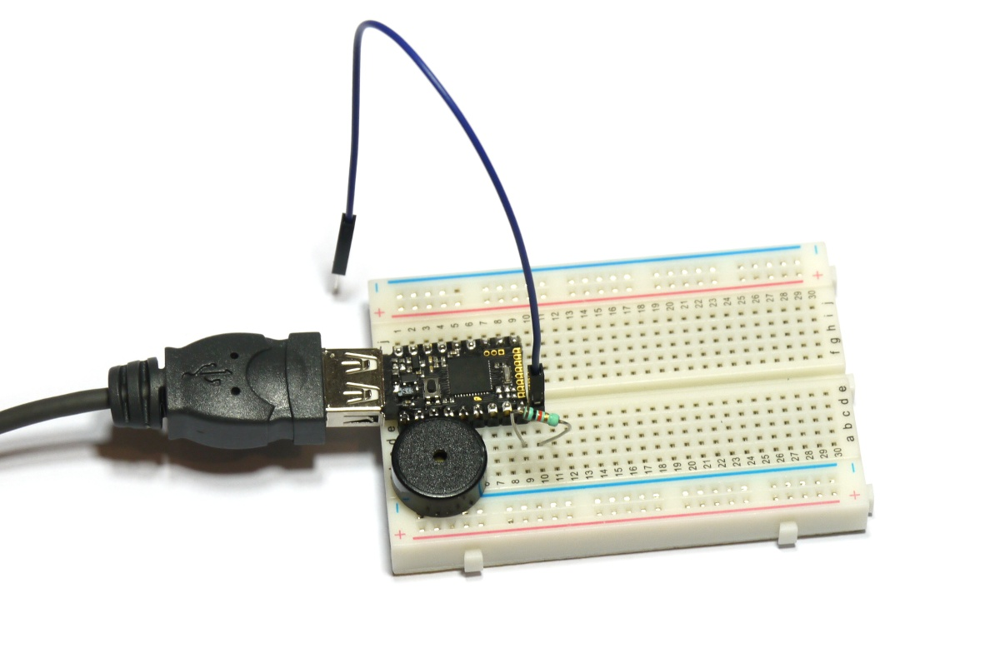

<!--- Copyright (c) 2015 Gordon Williams, Pur3 Ltd. See the file LICENSE for copying permission. -->
Pico Piano
=========

<span style="color:red">:warning: **Please view the correctly rendered version of this page at https://www.espruino.com/Pico Piano**. Links, lists, videos, search, and other features will not work correctly when viewed on GitHub.</span>

* KEYWORDS: Pico,Piano,Sound,Music,Stylophone,Waveform
* USES: Pico,Speaker,Waveform,PicoStarterKit

Introduction
-----------

We're going to make a very simple [Stylophone-style](http://en.wikipedia.org/wiki/Stylophone) piano with the Espruino Pico.

By touching the top row of pins with a jumper wire, you'll be able to make notes play.

You'll Need
----------

* An Espruino [[Pico]]
* A [Speaker](/Speaker)
* A 10,000 Ohm Resistor ( Brown, Black, Orange )
* [[Breadboard]]
* One Jumper Wire

Wiring Up
--------



* Plug your Espruino Pico into a breadboard with the USB connector on the left-hand side, and as far up as possible (to leave room for the speaker!)
* Plug the speaker in under the Espruino, as far left as it'll go (it'll connect to `GND` and pin `B4`)
* Connect the 10,000 Ohm resistor between the bottom right pin `A8` and the slot to the right of it
* Connect one end of the Jumper Wire to the slot next to the Pico that you put the resistor in - leave the other and floating as that's what we'll use to play notes.

Software
-------

First off, we'll copy the code from the [[Making Music]] tutorial that will play notes, changing the pin for the buzzer to match where we've plugged ours in (`B4`).

Copy and paste the following into the left hand side of the Web IDE.

```
var BUZZER = B4;

function freq(f) { 
  if (f===0) digitalWrite(BUZZER,0);
  else analogWrite(BUZZER, 0.5, { freq: f } );
}

var pitches = {
  'a':220.00,
  'b':246.94,
  'c':261.63,
  'd':293.66,
  'e':329.63,
  'f':349.23,
  'g':392.00,
  'A':440.00,
  'B':493.88,
  'C':523.25,
  'D':587.33,
  'E':659.26,
  'F':698.46,
  'G':783.99
};
```

You can play a note by typing `freq(pitches.a)`, and can stop it by typing `freq(0)`

So now, we want to map the pins that we'll touch to the notes that should play:

```
var notes = {
  B15 : 'a',
  B14 : 'b',
  B13 : 'c',
  B10 : 'd',
  B1  : 'e',
  A7  : 'f',
  A6  : 'g',
  A5  : 'A'};
```

And then write some code that checks each pin for a change, and plays a note:

```
// Make sure A8 (connected to the Jumper wire) has voltage on it
digitalWrite(A8, 1); 
function setupPin(pin) {
 // turn on the internal pull-down resistor
  pinMode(pin, "input_pulldown");
  // if/when it changes state...
  setWatch(function(e) {
    // depending on whether it is pressed, play a note or stop
    if (e.state)
      freq(pitches[notes[pin]]);
    else
      freq(0);
  }, pin, { repeat: true, debounce:10 });
}

// Function to set up each pin we want to listen on
function setupPin(pin) {
 // turn on the internal pull-down resistor
  pinMode(pin, "input_pulldown");
  // if/when it changes state...
  setWatch(function(e) {
    // depending on whether it is pressed, play a note or stop
    if (e.state)
      freq(pitches[notes[pin]]);
    else
      freq(0);
  }, pin, { repeat: true, debounce:50 });
}
// Setup each pin...
for (var pin in notes) setupPin(pin);
```

And now, you have a working piano! Take the floating end of the Jumper Wire and touch it against the top row of pins on Espruino Pico. When you press it against one you'll get a different pitch on the speaker. The leftmost pin is the `Bat` pin, not an input, so it won't create a noise.

Espruino can play waveforms though, so we can do better than a beep. For this, we'll use a simple 'pop' sound effect. I've loaded it with [Audacity](http://audacity.sourceforge.net/), exported it as an 8 bit raw file, and then converted it to a base64 encoded string using the [[File Converter]] page.

The following will load the 'ding' sound, and will play it back:

```
var s = atob("f4GBgoODh5GtnmgkE1m435g/MobgzYJbd41YHkHD/7UoEZPysyscl/K5PSqLy5tLToqdfHGdrXI1V7vUeiVIqceEUG2kmWVfj6qIWFuKpZFpXXiXknNthZB9cH6LgG5vgJKSdWF7oZVoXHuRioJ8c3iJjHtweomLf3JygpCHdHOCiYJ8fYCBg4ODgn53d4CGiIZ8cHGAjo1+dn6Jh3pzeoWHfXd8hYd8d3+Gg3t1e4F9d36KiHp0fYZ+cneLlol3cnyEgXt8g4WBeXV8hoqDdnOCjoNxc4aRhnd3f4J6cXmNlIJxd4mKeXJ5iI2Denh9fX1/f4B/g4N2bnuSlYJzdoOIgXp7g4V+dnmDhoF9gIF+eHqDioJyb3+Oi3xzeIOHgXp7gIB+fH+DgHt8hIh/cnOEjoVzb32Mi3pxeYeLf3N2hIqBdXaBhoB7fYSGfXZ7hYeAeXl9goJ9e36BgYGCgoF8e4GDgHp6f4ODgHo=");
var w = new Waveform(s.length);
w.buffer.set(s);

analogWrite(BUZZER, 0.5, {freq:20000}); 
w.startOutput(BUZZER,4000);
```

It works by producing a 20kHz square wave (which you hopefully won't be able to hear) and varying the duty cycle over time to produce the waveform. It will however be much more quiet than the beeping.

And you can now replace the `freq` function with one that instead plays the waveform:

```
function freq(f) { 
  if (f!==0) {
    if (w.running) w.stop();
    w.startOutput(BUZZER, 4000*f/400);
  }
}
```

And now, the piano can play a sampled sound.

If you wanted a 'finished' piece of code that you could paste into the right hand side of the IDE, it's listed below:

```
var BUZZER = B4;

function freq(f) { 
  if (f!==0) {
    if (w.running) w.stop();
    w.startOutput(BUZZER, 10*f);
  }
}

var pitches = {
  'a':220.00,
  'b':246.94,
  'c':261.63,
  'd':293.66,
  'e':329.63,
  'f':349.23,
  'g':392.00,
  'A':440.00,
  'B':493.88,
  'C':523.25,
  'D':587.33,
  'E':659.26,
  'F':698.46,
  'G':783.99
};

var notes = {
  B15 : 'a',
  B14 : 'b',
  B13 : 'c',
  B10 : 'd',
  B1  : 'e',
  A7  : 'f',
  A6  : 'g',
  A5  : 'A'};

// Make sure A8 (connected to the Jumper wire) has voltage on it
digitalWrite(A8, 1); 

// Function to set up each pin we want to listen on
function setupPin(pin) {
 // turn on the internal pull-down resistor
  pinMode(pin, "input_pulldown");
  // if/when it changes state...
  setWatch(function(e) {
    // depending on whether it is pressed, play a note or stop
    if (e.state)
      freq(pitches[notes[pin]]);
    else
      freq(0);
  }, pin, { repeat: true, debounce:10 });
}
// Setup each pin...
for (var pin in notes) setupPin(pin);

var s = atob("f4GBgoODh5GtnmgkE1m435g/MobgzYJbd41YHkHD/7UoEZPysyscl/K5PSqLy5tLToqdfHGdrXI1V7vUeiVIqceEUG2kmWVfj6qIWFuKpZFpXXiXknNthZB9cH6LgG5vgJKSdWF7oZVoXHuRioJ8c3iJjHtweomLf3JygpCHdHOCiYJ8fYCBg4ODgn53d4CGiIZ8cHGAjo1+dn6Jh3pzeoWHfXd8hYd8d3+Gg3t1e4F9d36KiHp0fYZ+cneLlol3cnyEgXt8g4WBeXV8hoqDdnOCjoNxc4aRhnd3f4J6cXmNlIJxd4mKeXJ5iI2Denh9fX1/f4B/g4N2bnuSlYJzdoOIgXp7g4V+dnmDhoF9gIF+eHqDioJyb3+Oi3xzeIOHgXp7gIB+fH+DgHt8hIh/cnOEjoVzb32Mi3pxeYeLf3N2hIqBdXaBhoB7fYSGfXZ7hYeAeXl9goJ9e36BgYGCgoF8e4GDgHp6f4ODgHo=");
var w = new Waveform(s.length);
w.buffer.set(s);

analogWrite(BUZZER, 0.5, {freq:20000});
w.startOutput(BUZZER,4000);
```
