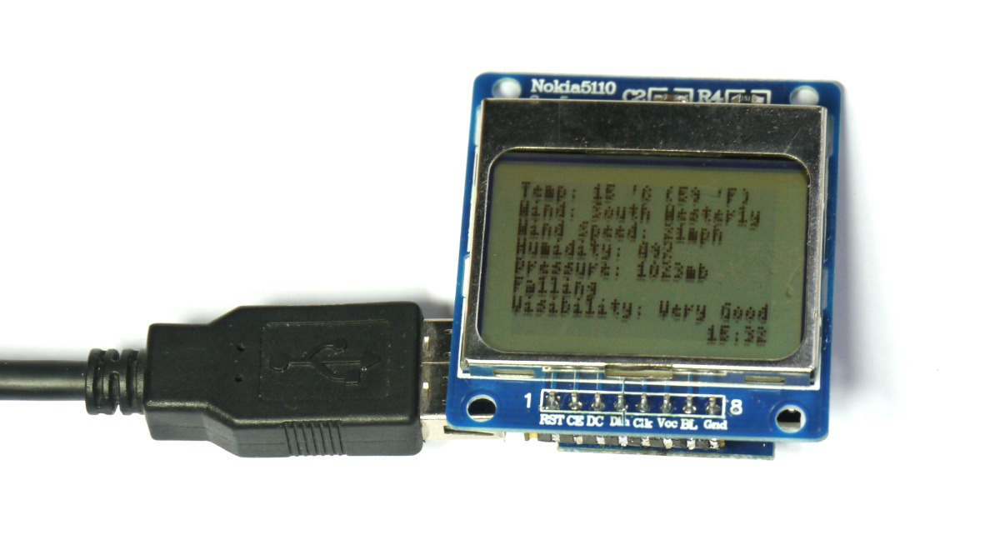
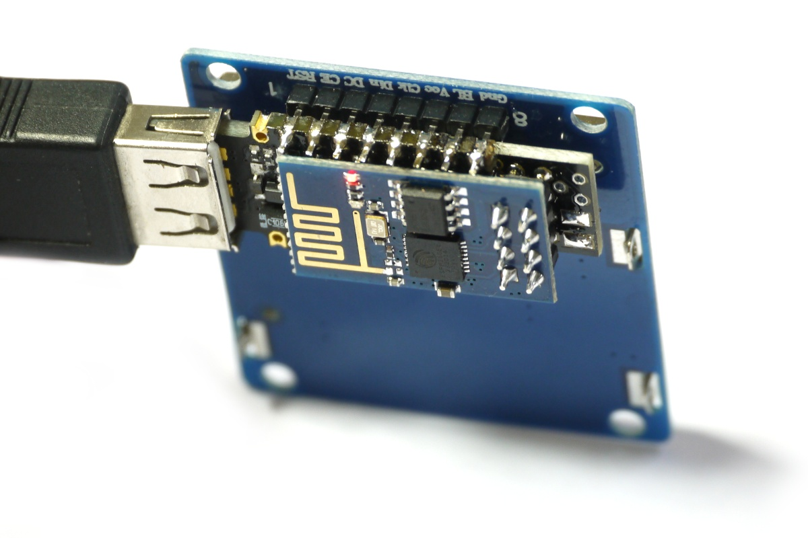

<!--- Copyright (c) 2015 Gordon Williams, Pur3 Ltd. See the file LICENSE for copying permission. -->
Pico Weather Station
=================

<span style="color:red">:warning: **Please view the correctly rendered version of this page at https://www.espruino.com/Pico Weather Station**. Links, lists, videos, search, and other features will not work correctly when viewed on GitHub.</span>

* KEYWORDS: Pico,LCD,Weather,RSS,Feed
* USES: Pico,PCD8544,ESP8266

Introduction
-----------

We'll connect the Pico up to an LCD and WiFi module, and use it to grab the current english weather off of the [BBC Weather](http://www.bbc.co.uk/weather/) website's RSS feed and then display it on the screen.

This is basically the code from the [[Pico LCD Hello World]] tutorial plus the code on the [[ESP8266]] page, with one extra function `parseWeather` which grabs the weather data out of the website's response and puts in on the LCD.



You'll Need
----------

* An Espruino [[Pico]]
* A [Nokia 5110 LCD](/PCD8544)
* An [ESP8266 WiFi module](/ESP8266)
* [[Breadboard]] (unless soldering)

Wiring Up
--------

To connect the ESP8266 module up, see the [[ESP8266]] page for instructions. 4 wires are needed, or you can use the [adaptor shim](/Shims)



The LCD draws so little power that we can power it from Espruino's GPIO lines... Follow the instructions on the [[Pico LCD Hello World]] tutorial if using breadboard, but if you're soldering you can make exactly the same connections by soldering the LCD straight to the Pico as shown in the picture above.

Software
-------

When you place a query to the [BBC Weather RSS feed](http://open.live.bbc.co.uk/weather/feeds/en/2647937/observations.rss), you get a result like this:

```
<?xml version="1.0" encoding="UTF-8"?>
<rss xmlns:atom="http://www.w3.org/2005/Atom" xmlns:georss="http://www.georss.org/georss" version="2.0">
  <channel>
    <atom:link href="http://open.live.bbc.co.uk/weather/feeds/en/2647937/observations.rss" rel="self" type="application/rss+xml" />
    <title>BBC Weather - Observations for  Greenwich, United Kingdom</title>
    <link>http://www.bbc.co.uk/weather/2647937</link>
    <description>Latest observations for Greenwich from BBC Weather, including weather, temperature and wind information</description>
    <language>en</language>
    <copyright>Copyright: (C) British Broadcasting Corporation, see http://www.bbc.co.uk/terms/additional_rss.shtml for more details</copyright>
    <pubDate>Sun, 12 Apr 2015 15:37:05 +0100</pubDate>
    <item>
      <title>Sunday - 15:00 BST: Sunny, 17°C (63°F)</title>
      <link>http://www.bbc.co.uk/weather/2647937</link>
      <description>Temperature: 17°C (63°F), Wind Direction: South Westerly, Wind Speed: 19mph, Humidity: 40%, Pressure: 1024mb, Falling, Visibility: Excellent</description>
      <pubDate>Sun, 12 Apr 2015 15:37:05 +0100</pubDate>
      <guid isPermaLink="false">http://www.bbc.co.uk/weather/2647937-2015-04-12T15:37:05.000+01:00</guid>
      <georss:point>51.47785 -0.01176</georss:point>
    </item>
  </channel>
</rss>
```

**Note:** To get the weather for a different area, go to the [BBC weather](http://www.bbc.co.uk/weather/) page for the place you're interested in, then click on the orange 'RSS' logo choose 'Observations' and copy the link.

As Espruino doesn't have an XML parser built-in, we're going to stick the XML in a string, and search for the first `<description>` tag that comes after the first `<item>` tag.

The code for this is below - see the documentation in line. Simple copy this and paste it into the right hand side of the Web IDE (changing the WiFi credentials up the top). Click `Send to Espruino` and it should display `Please Wait` on the LCD and start connecting to the WiFi network.


```
var WLAN_NAME = "...";
var WLAN_KEY = "...";
var WEATHER_URL = "http://open.live.bbc.co.uk/weather/feeds/en/2647937/observations.rss";

var wifi;
var g;

A5.write(0); // LCD GND
A7.write(1); // LCD VCC

// This gets the weather out of the XML and writes it to the LCD
function parseWeather(xml, date) {
  // No XML parser, so we have to be nasty
  var item = xml.indexOf("<item>");
  var descStart = xml.indexOf("<description>", item);
  var descEnd= xml.indexOf("</description>", descStart);
  var desc = xml.substring(descStart+13,descEnd);
  // replace the degrees symbol with a quote - built in font only does first 128 chars
  desc = desc.replace("°","'").replace("°","'");
  // make sure things fit on the tiny screen!
  desc = desc.replace("Wind Direction","Wind").replace("Temperature:","Temp:");
  // draw one item per line
  var weather = desc.split(", ");
  g.clear();
  weather.forEach(function(s,i) {
    g.drawString(s,0,i*6);
  });
  // Finally print the time from the HTTP request (so we know it's up to date!)
  var d = new Date(date);
  var timeStr = d.getHours()+":"+("0"+d.getMinutes()).substr(-2);
  g.drawString(timeStr, g.getWidth()-g.stringWidth(timeStr), g.getHeight()-5);
  // Now send this to the LCD
  g.flip();
}

// Actually get weather off the net and display it
function getWeather() {
  // do an HTTP request
  require("http").get(WEATHER_URL, function(res) {
    // console.log("Response: ",res);
    
    // read the whole response into a variable
    // note: this works here but isn't a great idea - big responses can
    // easily use up all the available memory
    var xml = "";
    res.on('data', function(d) { xml += d; });
    // when the connection closes, parse the weather and write to the LCD
    res.on('close', function(d) { parseWeather(xml, res.headers.Date); });
  });
}

// When we start up...
function onInit() {
  // if we save()d to flash after we'd already run onInit() we need to clear existing intervals
  clearInterval();
  // Set up the ESP8266
  Serial2.setup(9600, { rx: A3, tx : A2 });
  console.log("Init ESP8266...");
  wifi = require("ESP8266WiFi").connect(Serial2, function(err) {
    if (err) throw err;
    wifi.reset(function(err) {
      if (err) throw err;
      console.log("Connecting to WiFi");
      wifi.connect(WLAN_NAME, WLAN_KEY, function(err) {
        if (err) throw err;
        console.log("Connected");
        // Now start getting weather...
        setInterval(getWeather, 60000); // every 60s
        getWeather(); // do the first one right away
      });
    });
  });
  // Setup SPI for LCD
  var spi = new SPI();
  spi.setup({ sck:B1, mosi:B10 });
  // Initialise the LCD
  g = require("PCD8544").connect(spi,B13,B14,B15, function() {
    g.drawString("Please wait...",0,0);
    g.flip();
  });
}

onInit();
```
