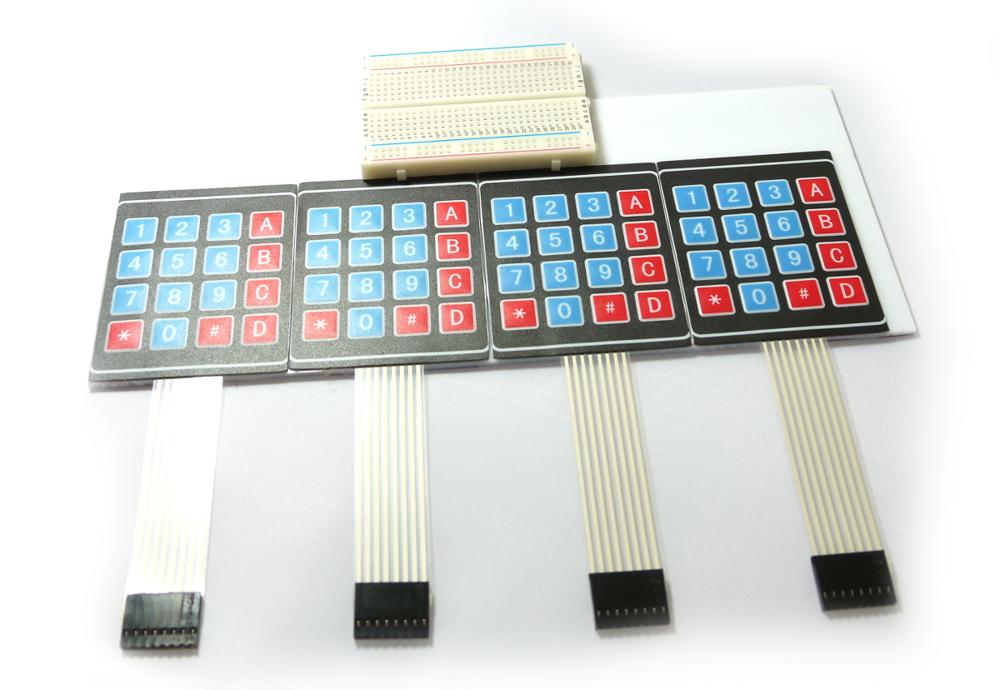
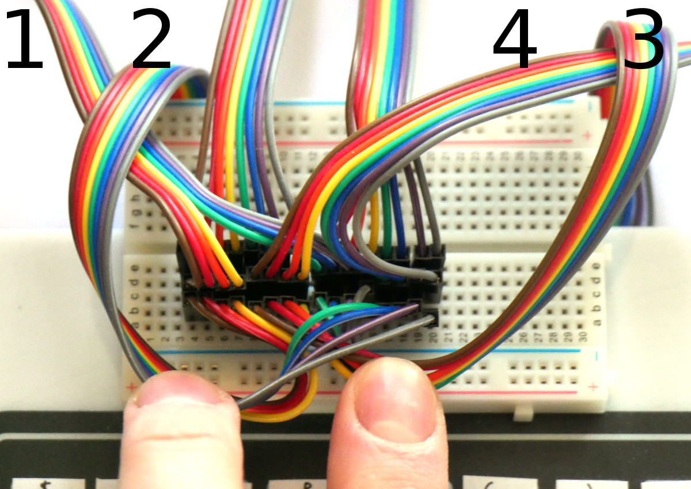

<!--- Copyright (c) 2015 Gordon Williams, Pur3 Ltd. See the file LICENSE for copying permission. -->
Pixl.js Home Computer
======================

<span style="color:red">:warning: **Please view the correctly rendered version of this page at https://www.espruino.com/Pixl.js+Home+Computer. Links, lists, videos, search, and other features will not work correctly when viewed on GitHub** :warning:</span>

* KEYWORDS: PC,Computer,Spectrum,Commodore,Micro,Home PC
* USES: KeyPad,Pixl.js,Breadboard,Graphics,

Many of us learnt to program on Sinclair Spectrums, Commodore 64s, BBC Micros or similar. Computers that booted straight up to a prompt and that encouraged you to play with them.

In this tutorial you'll learn how to make your own JavaScript computer in a few hours using Espruino - no soldering required!


Also see [the original Espruino Home Computer](/Espruino Home Computer] that
uses an Espruino [[Pico]] with a [VGA](/Television) output.  


You'll Need
----------

* An Espruino [Pixl.js](/Pixl.js)
* A piece of plastic or wood to act as a base
* A [[Breadboard]]
* 4x 4x4 [[KeyPad]]s
* Lots of Stickers
* 6 sets of 8x Male->Male Dupont-style Jumper wires (48 wires total) - matching multicoloured strips make life a lot easier

Wiring Up
--------

* Stick your 4 [[KeyPad]]s next to each other on your base (they're sticky-back). You may want to trim their edges down, but be careful not to trim too far or you might cut some contacts off.

* Stick your breadboard down in the middle - it's sticky-back too!



* Split the jumper wire into 4 lengths of 8 - try and keep the colours the same on each.

* Stick the wires into the KeyPads, making sure the colours all match.

* Fold the wires back and tape them to the rear of your base. You might want to add some sticky feet to save the wires from getting bent at too much of an angle.


* Now you need to wire the keyboard. Each 4x4 keypad is arranged as a grid,
and we're wiring them as if they were themselves in a 2x2 grid - making
a big 8x8 grid of buttons.

With the keypads numbered left to right this would look like:

|    | D8| D9|D10|D11|D12|D13|SDA|SCL|      
|----|---|---|---|---|---|---|---|---|
| D0 | 1 | 1 | 1 | 1 | 2 | 2 | 2 | 2 |
| D1 | 1 | 1 | 1 | 1 | 2 | 2 | 2 | 2 |
| D2 | 1 | 1 | 1 | 1 | 2 | 2 | 2 | 2 |
| D3 | 1 | 1 | 1 | 1 | 2 | 2 | 2 | 2 |
| D4 | 3 | 3 | 3 | 3 | 4 | 4 | 4 | 4 |
| D5 | 3 | 3 | 3 | 3 | 4 | 4 | 4 | 4 |
| D6 | 3 | 3 | 3 | 3 | 4 | 4 | 4 | 4 |
| D7 | 3 | 3 | 3 | 3 | 4 | 4 | 4 | 4 |

Wire as below into 4 groups of 4 wires across the breadboard (check the colours of wires in the images), with left to right:

  * KeyPad 1 First 4 wires -> first group of 4 on breadboard -> `D0,D1,D2,D3`
  * KeyPad 1 Second 4 wires -> third group of 4 on breadboard -> `D8,D9,D10,D11`
  * KeyPad 2 First 4 wires -> first group of 4 on breadboard -> `D0,D1,D2,D3`
  * KeyPad 2 Second 4 wires -> fourth group of 4 on breadboard -> `D12,D13,SDA,SCL`
  * KeyPad 3 First 4 wires -> second group of 4 on breadboard -> `D4,D5,D6,D7`
  * KeyPad 3 Second 4 wires -> third group of 4 on breadboard -> `D8,D9,D10,D11`
  * KeyPad 4 First 4 wires -> second group of 4 on breadboard -> `D4,D5,D6,D7`
  * KeyPad 4 Second 4 wires -> fourth group of 4 on breadboard -> `D12,D13,SDA,SCL`



**Note:** Above we have 6 sets of 8 wires. The first 2 are from keypads 1 and 2, the
second 2 are going to the Pixl.js, and the third 2 are to keypads 4 and 3.

* Add labels for the keys on your keyboard as below. If you're not in the UK you'll probably want to make your own key labels,
but you will need to change the `KEYMAP` variables in the code below.


Software
--------

Make sure your Puck.js has up to date firmware!

Put the following in the right-hand side of the Web IDE, click `Send to Espruino`, and when that is done type `save()` in the left-hand side.

The keyboard should now enter characters in the Web IDE window, and if you disconnect from Bluetooth then everything will start appearing on the Pixl's LCD.

```
// Keyboard wiring
var KEYROW = [ D7, D6, D5, D4, D3, D2, D1, D0 ];
var KEYCOL = [ A5, A4, D13, D12, D11, D10, D9, D8 ];

// Key Maps for Keyboard
var KEYMAPLOWER = [
  "`1234567890-=\x08",
  "\tqwertyuiop[]\n",
  "\0asdfghjkl;'#\x84\x82\x85",
  "\x01\\zxcvbnm,./ \x80\x83\x81",
  ];
var KEYMAPUPPER = [
  "¬!\"£$%^&*()_+\x08",
  "\tQWERTYUIOP{}\n",
  "\0ASDFGHJKL:@~\x84\x82\x85",
  "\x01|ZXCVBNM<>? \x80\x83\x81",
  ];

/* If a char in the keymap is >=128,
subtract 128 and look in this array for
multi-character key codes*/
var KEYEXTRA = [
  String.fromCharCode(27,91,68), // 0x80 left
  String.fromCharCode(27,91,67), // 0x81 right
  String.fromCharCode(27,91,65), // 0x82 up
  String.fromCharCode(27,91,66), // 0x83 down
  String.fromCharCode(27,91,53,126), // 0x84 page up
  String.fromCharCode(27,91,54,126), // 0x85 page down
];
// Shift status
var hasShift = false;
function setShift(s) {
  hasShift = s;
  // draw shift indicator on the screen
  if (hasShift) {
    g.setColor(1);
    g.fillRect(105,0,128,6);
    g.setColor(0);
    g.drawString("SHIFT",107,1);    
    g.setColor(1);
  } else {
    g.setColor(0);
    g.fillRect(105,0,128,6);
    g.setColor(1);
  }
  g.flip();
}

// Convert an actual key into a sequence of characters
// And send to Loopback (where the console is)
function handleKeyPress(e) {
  var kx = e>>3;
  var ky = e&7;
  if (ky>3) { // turn into long row
    kx+=8;
    ky-=4;
  }
  var key = hasShift ? KEYMAPUPPER[ky][kx] : KEYMAPLOWER[ky][kx];
  if (key=="\x01") {
    setShift(!hasShift);
  } else {
    setShift(false);
    if (key && key.length) {
      if (key.charCodeAt(0)>127)
        key = KEYEXTRA[key.charCodeAt(0)-128];
      Terminal.inject(key);
    }
  }
}

// set up the keypad
require("KeyPad").connect(KEYROW, KEYCOL, handleKeyPress);
```

Using
-----


Now it's working:

* The keyboard can only detect one press at a time, so `Shift` toggles uppercase
letters (with an indicator in the top right), and typing a letter reverts to lowercase. Holding
down `Shift` and another key won't work.
* Typing can be quite painful, so use the `Tab` key (on the left) as much
as possible to fill in words!
* The graphics for the screen is available via methods on the `g` variable -
eg, `g.fillRect(20,20,40,40)` or `g.clear()`.
* A lot of IO is used for the keyboard, but you still have pins `A0`, `A1`, `A2` and `A3`
that you can use for connecting external hardware.
* `reset()` will reset *everything* - including your code for keyboard handling.
To avoid this, turn on `save on send, even after reset` in the Web IDE's communications
options and upload again.
* Your computer is surprisingly power efficient - you could still expect a roughly
20 day battery life - always on - off a single CR2032 battery!


What next?
----------

* You could wire up a keyboard using proper tactile switches on protoboard
* With separate switches the `Shift` key could be moved to its own wire,
allowing it to be pressed alongside other keys.
