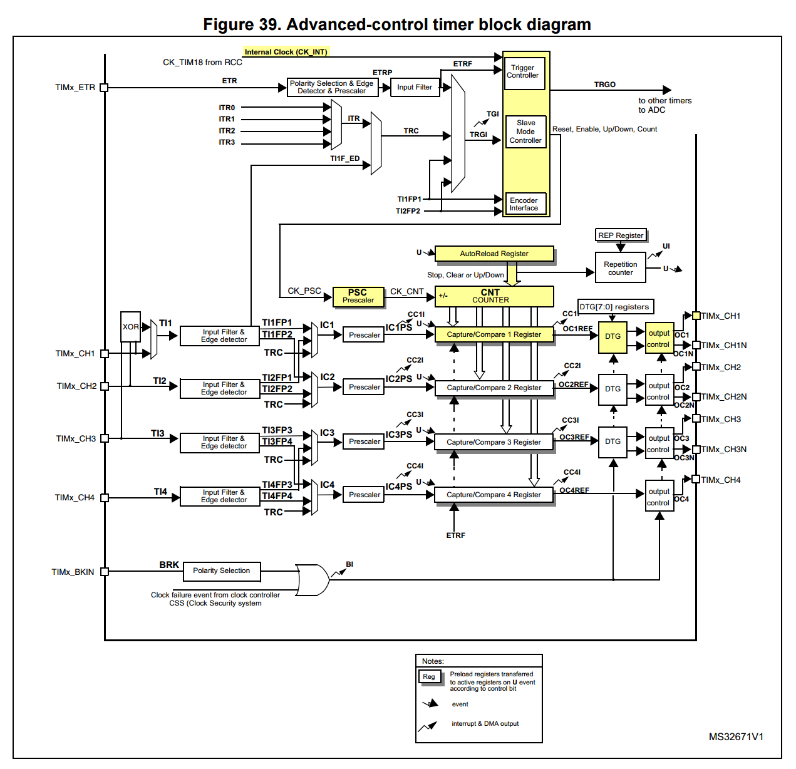
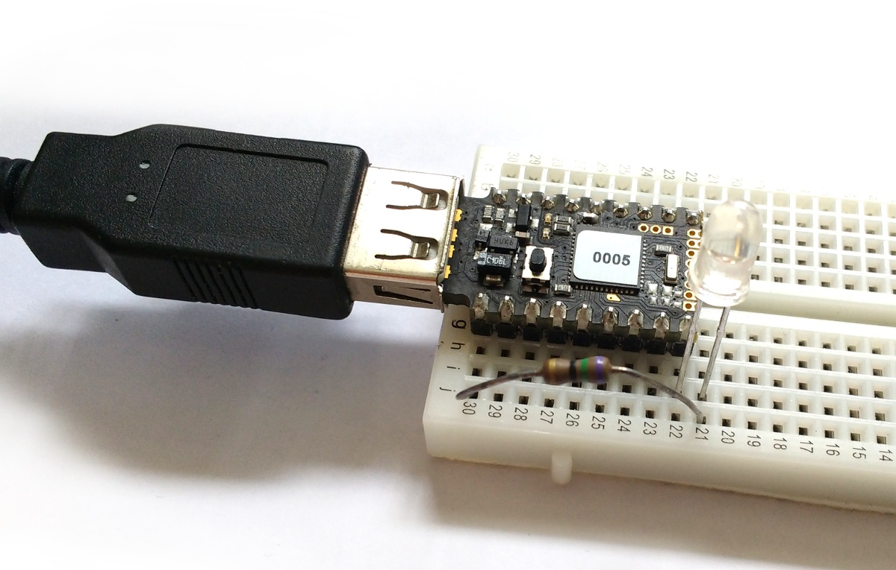
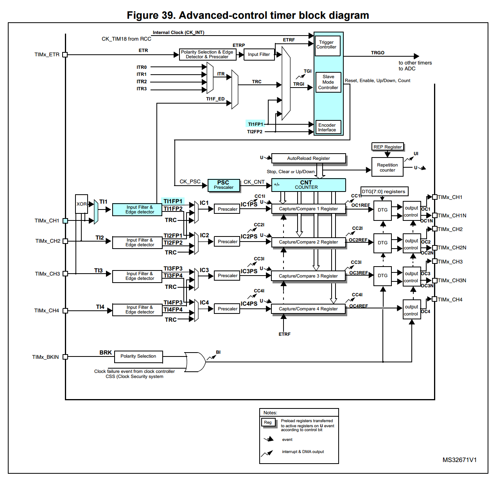
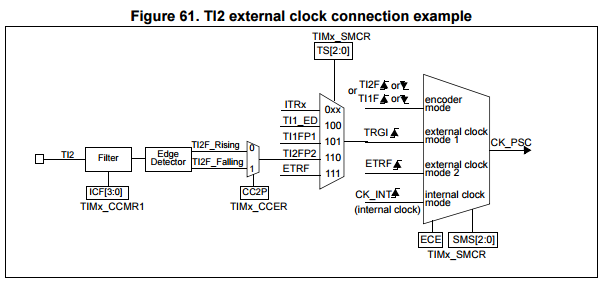
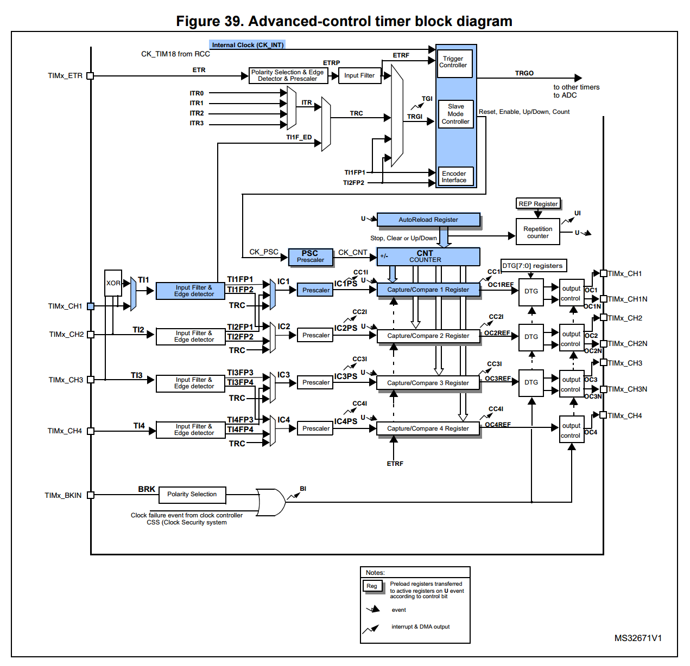

<!--- Copyright (c) 2015 Gordon Williams, Pur3 Ltd. See the file LICENSE for copying permission. --> 
Low-level STM32 Peripheral access
=============================

<span style="color:red">:warning: **Please view the correctly rendered version of this page at https://www.espruino.com/STM32 Peripherals**. Links, lists, videos, search, and other features will not work correctly when viewed on GitHub.</span>

* KEYWORDS: STM32,peripherals,advanced,direct,peek,poke,timers,registers,counter,input capture,capture compare,capacitive touch
* USES: STM32,Pico

While Espruino provides an easy-to use way to access the peripherals on the microcontroller,
the hardware itself is amazingly complex and capable, and can do far more than can be exposed
to you in JavaScript.

If you want to really make the most of the hardware, you'll have to access it directly. Here,
we'll detail how to access the timer hardware to measure pulse length on the STM32
microcontrollers used in the [Original Espruino](/EspruinoBoard) and the [Espruino Pico](/Pico).


Documentation
------------

The best source of documentation on the chip's peripherals come from the manufacturer
themselves - [ST](http://www.st.com). You'll need the Reference Manual and Datasheet for the particular
chip. The easiest way to do this is to go to the page on espruino.com for your board ([Original](/EspruinoBoard) or 
[Pico](/Pico) and to find the links there).

We're going to cover the [Pico](/Pico), so [this is the STM32F401CD Reference Manual](/datasheets/STM32F401xD_ref.pdf)
and [this is the STM32F401CD Datasheet](/datasheets/STM32F401xD.pdf).

It's a huge manual, but you're only interested in specific parts of it.


What happens for [PWM](/PWM)
------------------

First off, look at `Advanced-control timer (TIM1)` on page 241. We're going to look at what happens when you
write `analogWrite(A8, 0.5, {freq:10})`.

You'll see a diagram of the timer a few pages in:



Here, we've coloured what bits get used during `analogWrite(A8, 0.5, {freq:10})`.

First, Espruino looks around to see what peripherals are available on the pin `A8`. That information
is in the Datasheet, under `Pinouts and pin description` in a table called `Table 8. STM32F401xD/xE pin definitions` (look for `PA8` in it). 
It's actually pretty painful to read, so we've documented it all properly on the [Pico](/Pico) page. 
Under the `Pinout` heading hover your mouse over the `PWM` tag below the pin `A8`. It'll say `TIM1_CH1` - 
so Channel 1 of the `TIM1` peripheral.

Now, Espruino will make sure the STM32 applies power to `TIM1` (it'll be off by default to save power).

Then, Espruino configures the pin itself:

* On STM32F4 chips (like in the Pico), each pin has a 4 bit
register associated with it called the 'Alternate Function' register. Internally, the pin can be
'wired' to different peripherals (in this case I2C3, TIM1, and USART1) and the number you write
into that register determines what it's connected to. If you look at `Table 9. Alternate function mapping`
in the datasheet you'll see that to get `TIM1_CH1` in `PA8` you need `AF01` - so Espruino writes
`1` into that register.
* STM32F1 chips (like in the Original Espruino) are a bit older, and as such have a slightly
more painful way of handling alternate functions. Each **peripheral** has an alternate function
register, so for instance if you wanted to put `TIM1_CH1N` onto pin `A7` on an STM32F1, you'd set
`TIM1`'s alternate function to 1 - but then it'd move `TIM1_CH1` to pin `E9`, along with everything else!

Now Espruino's done all that painful stuff, it'll configure the timer itself. It:

* Sets up the prescaler to divide the Pico's 84Mhz clock down, such that the 16 bit 
counter `CNT` counts up from 0 to 65535 just less than 10 times per second 
(because we set the frequency to s0).
* Sets the `AutoReload Register` (`ARR`) to fine-tune the frequency, by only letting the
counter count up to a value a bit less than the full 16 bit value 65535
 (just setting the prescaler wouldn't have been accurate enough!)
* Sets `Capture/Compare register 1` (`CCR1`) to the `AutoReload Register` multiplied by the duty cycle (in this case it's `0.5`)
* Sets up the `Output control` register so that `TIM1_CH1` is high whenever `CNT` is less than the `Capture/Compare register`'s value
* Enable the timer itself by writing to the enable bit.

Finally it's done, and the `A8` will be outputting a square wave at 10Hz.


Accessing the Timer
-----------------

So, that was all pretty heavy. While the Reference manual does walk you through what's needed, that's a lot to learn for a [PWM](/PWM) output.

All of those things that Espruino did were done by modifying the peripheral registers - bits of memory at certain locations that control how the peripherals work.

If you go to the end of the chapter in the reference manual, you'll find `12.4 TIM1 registers`. These are descriptions of exactly which bits of the registers do what.

So let's access `CCR1` (Capture/Compare register 1) - the register that Espruino put the duty cycle in, and see what it is. If you look it up,
at `12.4.14 TIM1 capture/compare register 1 (TIMx_CCR1)` you'll see it says `Address offset: 0x34` - this is the address offset in `TIM1`.

So now, you want to find the address of `TIM1` itself. Go to `2.3 Memory map` in the reference and look at the table. The entry for `TIM1` says: `0x40010000 - 0x400103FF   -   TIM1`.

Ok, so we're getting somewhere - the address of `CCR1` is `0x40010000 + 0x34` - so `0x40010034`. Let's look in there at what's in the register - it's a 16 bit value, so we'll use `peek16`.

First, type `var CCR1 = 0x40010034;` to store the address. Then type `peek16(CCR1)` and you should get `0` - because we haven't run `analogWrite` yet.

Get some breadboard, and connect up an LED to pin `A8`, with a 100 Ohm (or close) resistor:



Then run `analogWrite(A8, 0.5, {freq:10})` - the LED should now be blinking 10 times a second, all done by hardware.

Try `peek16(CCR1)` again to get the value of `CCR1` - it's now saying `32307`.

Try setting the LED to blink only very quickly with `analogWrite(A8, 0.05, {freq:10})` and then check `peek16(CCR1)`. You'll see that as you'd expect, the value is now one tenth of what is was. It's `3230`.

By itself that's not useful, but we can actually change it ourself, using `poke`. 

* Try `poke16(CCR1, 0)` - this should set the duty cycle to 0, turning it off.
* Or try `poke16(CCR1, 40000)` to make it stay on most of the time.

We can guess at how far the counter `CNT` is counting, because we knew that a duty 
cycle of 50% meant `32307` in `CCR1` (it'll be around `2 * 32307`). However, to check,
we can look in `ARR` (`AutoReload Register`). The Reference Manual say's it's at offset `0x2C`,
so let's try `var ARR = 0x4001002C;` and then `peek16(ARR)`. It returns `64615` which is again what we'd expect.

But we can change that. If we make it lower, the timer will count down from a lower value so the LED will blink faster.

Try `poke16(ARR, 30000)` and the timer should now count twice as fast. The LED will now be on constantly though, because the counter is counting between 30000 and 0, but we set `CCR1` to 40000. Set it to something lower, with `poke16(CCR1, 1000)` and the LED will now be flickering. If you experiment with poking different values into `ARR` you'll get different speeds.

Finally, let's actually look at the value in the counter. It'll be moving quite quickly, so let's call `analogWrite` again to slow it down: `analogWrite(A8, 0, {freq:0.1})`

The counter will now be counting up over a period of 10 seconds. In the reference manual, TIM1's counter `CNT` is at offset `0x24`, so let's access that:

```
var CNT = 0x40010024;
peek16(CNT);
```

and now, keep hitting `up arrow` followed by `enter`, you should see something like:
 
```
>peek16(CNT);
=31807
>peek16(CNT);
=33273
>peek16(CNT);
=34583
>peek16(CNT);
=35900
>peek16(CNT);
=37161
>peek16(CNT);
=38458
>peek16(CNT);
=39767
>peek16(CNT);
```

So the counter is actually counting up.


Counting edges
------------

So that was interesting, but not really useful. What if we wanted to actually count the amount of times a pin changed state?

Looking at the diagram again, we could use different parts of `TIM1`:



So assuming Espruino has already set the timer up for our `analogWrite`, what do we have to change?

* Set `A8` to the correct state
* Enable the edge detector
* Make sure the 3 multiplexers are forwarding the signal from A8 to the right place
* Reset the prescaler so it doesn't prescale at all
* Reset the `Autoreload Register` (`ARR`) to 0 so we can count all the way up to 65535

Ok, so let's jump in. First, connect pin `A8` to pin `A5` that's opposite on the Pico. We'll send some pulses from there later in order to test our timer.


Then, let's gets some registers defined - copied from the Reference manual again:

```
// slave mode control register 
var SMCR = 0x40010008;
// event generation register
var EGR = 0x40010014;
// Capture compare mode register
var CCMR1 = 0x40010018;
// Capture/compare enable register 
var CCER = 0x40010020;
// counter 
var CNT = 0x40010024;
// prescaler 
var PSC = 0x40010028;
// auto reload register
var ARR = 0x4001002C;
```

Now, let's go through in sequence:

### Set `A8` to the correct state

It turns out that `A8` is already in the correct state - it was set as 'alternate function' and connected to TIM1 by `analogWrite`, and that's enough.

### Enable the edge detector

Take a look at `12.3.4 Clock selection` and under it, `Internal clock source (CK_INT)` in the reference manual.



That's showing `TI2` as an input, but `TI1` is basically the same - we just change `2` for `1` in the instructions.

So we need to:

> * Configure channel 1 to detect edges on the `TI1` input by writing `CC1S = ‘01’` in the `CCMR1` register.

> * Configure the input filter duration by writing the IC1F[3:0] bits in the `CCMR1` register - we don't need a filter so write `IC1F = 0000`

Taking a quick look at the register definitions at the end of the chapter, `CC1S` is the bottom 2 bits of `CCMR1`, and `IC1F` is bits 7 to 4.

**However:** in small text at the bottom of that it also says:

>  CC1S bits are writable only when the channel is OFF (CC1E = ‘0’ in TIMx_CCER).

As the channel is definitely on already (because we're using it for PWM) we've got to turn it off. Looking at the documentation for `CCER`, `CC1E` is bit 0.

So we need to change just those bits - we do it by getting the existing value, masking out the old bits with `&` and `~`, and putting in new ones with `|` like this:

```
// CC1E[0] = 0 (Turn channel 1 off)
poke16(CCER1, peek16(CCER1) & ~1);
// CC1S[1:0]=01 (rising edge), IC1F[7:4]=0 (no filter)
poke16(CCMR1, (peek16(CCMR1) & ~0b11110011) | (0b00000001));
```

And then...

> * Select rising edge polarity by writing `CC1P=0` and `CC1NP=0` in the `CCER` register.

Looking at the reference again, `CC1P` is bit 1, and `CC1NP` is bit 3.

However in the last step we turned the channel off, so let's turn it back on as well.

```
// CC1P=0, CC1NP=0 (detect rising edge), CC1E[0] = 1 (Turn channel 1 on)
poke16(CCER, peek16(CCER) & ~(0b1011) | (0b0001));
```


### Make sure the 3 multiplexers are forwarding the signal from A8 to the right place

The page also says:

> * Configure the timer in external clock mode 1 by writing `SMS=111` in the `SMCR` register.

> * Select `TI1` as the trigger input source by writing `TS=101` in the `SMCR` register (it actually says write `TS=110` for `TI2`, but `TI1` is what we want)

`SMS` is bits `2:0` and `TS` is `6:4`, so:

```
// SMS[2:0]=111 (ext clock), TS[6:4]=101 (CH1 as trigger)
poke16(SMCR, (peek16(SMCR) & ~0b1110111) | 0b1010111);
```

It also says:

> * Enable the counter by writing `CEN=1` in the `CR1` register

But Espruino already did that for us with `analogWrite`.

### Resetting registers 

We just do this with:

```
// Prescaler to 0 - use every transition
poke16(PSC, 0);
// auto-reload with the full range of values
poke16(ARR, 65535);
```

However there's another footnote:

> PSC contains the value to be loaded in the active prescaler register at each update event
> (including when the counter is cleared through UG bit of TIMx_EGR register or through
> trigger controller when configured in "reset mode").

So we've got to do that...

```
// poke the UG[0] bit to reset the counter and update the prescaler
poke16(EGR, 1);
```


And putting it all together we have:

```
// slave mode control register 
var SMCR = 0x40010008;
// event generation register
var EGR = 0x40010014;
// Capture compare mode register
var CCMR1 = 0x40010018;
// Capture/compare enable register 
var CCER = 0x40010020;
// counter 
var CNT = 0x40010024;
// prescaler 
var PSC = 0x40010028;
// auto reload register
var ARR = 0x4001002C;


// enable PWM on A8 (TIM1 CH1)
analogWrite(A8,0.5,{freq:10}); 
// CC1E = 0 (Turn channel 1 off)
poke16(CCER, peek16(CCER) & ~1);
// CC1S[1:0]=01 (rising edge), IC1F[7:4]=0 (no filter)
poke16(CCMR1, (peek16(CCMR1) & ~0b11110011) | (0b00000001));
// CC1P=0, CC1NP=0 (detect rising edge), CC1E[0] = 1 (Turn channel 1 on)
poke16(CCER, peek16(CCER) & ~(0b1011) | (0b0001));
// SMS[2:0]=111 (ext clock), TS[6:4]=101 (CH1 as trigger)
poke16(SMCR, (peek16(SMCR) & ~0b1110111) | 0b1010111);
// Prescaler to 0 - use every transition
poke16(PSC, 0);
// auto-reload with the full range of values
poke16(ARR, 65535);
// poke the UG[0] bit to reset the counter and update the prescaler
poke16(EGR, 1);
```

You can now look at the counter contents with `peek16(CNT)` - it should return 0.

But now, if you turn `A5` on and off (you connected it to `A8` earlier) with `digitalWrite(A5,1);digitalWrite(A5,0);` it should increase the counter.

Check the counter again with `peek16(CNT)` - it should return 1.

Now if you do lots of pulses:

```
for (var i=0;i<1000;i++) {
  digitalWrite(A5,1);digitalWrite(A5,0);
}
```

And then `peek16(CNT)`, it should return 1001.

If you wanted to measure frequency, you could now use `setInterval` to check the value of `CNT` every second. The amount it increased would tell you the frequency of the square wave on `A8`.

`TIM1` itself is only 16 bit so this may not be as useful as you want. However other timers such as `TIM2` and `TIM5` behave in exactly the same way (you can just change the base address from `0x40010000` to the base address of the other timer), and have a 32 bit counter. The only other thing you'll have to do is to use `peek32` instead of `peek16` to read the counter.

Input Capture
--------------

Input capture is another useful function. In this mode, you can set `CNT` to run at whatever speed you want (with `analogWrite(A8, 0.5, {freq : my_frequency})`), but every time a bit changes state it'll save the value of `CNT` into the relevant `CCR` register.

For this we'll use the timer in this configuration:



The relevant section of the reference manual is `12.3.6 Input capture mode`, but I won't cover it in detail here.

All we need to do is:

* Enable and configure the counter (prescaler, autoreload) with `analogWrite`
* Reconfigure Channel 1 to listen for events, rather that outputtting [PWM](/PWM)

Obviously the first step is easy, and for the second step we can actually steal some of the code that we'd written previously for the counter - with one small tweak. This time we're using channel 1's prescaler `IC1PS`, so we want to make sure we reset it's value as well so it doesn't do anything. It's just a matter of making sure we clear 2 extra bits in the `CCMR1` register:

```
// Status Register
var SR= 0x40010010;
// Capture/compare enable register 
var CCER = 0x40010020;
// Capture compare mode register
var CCMR1 = 0x40010018;
// counter 
var CNT = 0x40010024;
// Capture Compare 1
var CCR1 = 0x40010034;

// enable PWM on A8 (TIM1 CH1)
analogWrite(A8,0.5,{freq:10}); 
// CC1E = 0 (Turn channel 1 off)
poke16(CCER, peek16(CCER) & ~1);
// CC1S[1:0]=01 (rising edge),  IC3PSC[3:2]=00 (no prescaler), IC1F[7:4]=0 (no filter),
poke16(CCMR1, (peek16(CCMR1) & ~0b11111111) | (0b00000001));
// CC1P=0, CC1NP=0 (detect rising edge), CC1E[0] = 1 (Turn channel 1 on)
poke16(CCER, peek16(CCER) & ~(0b1011) | (0b0001));

```

And that's it. We can check that the counter is rising by looking at `peek16(CNT)` - the number you get should keep changing.

However, if you check the Capture Compare Register for channel 1 with `peek16(CCR1)` it shouldn't stay the same. You can also check whether it has triggered (register `CC1IF`) using `peek16(SR)&2`, and this should return `0`.

But now, assuming we've still got `A8` connected to `A5` from the last bit of code, we can raise and lower `A8` and see what gets captured:

```
digitalWrite(A5,1);digitalWrite(A5,0);
```

Typing `peek16(SR)&2` now will return nonzero, showing something was captured. And if we check the capture compare register with `peek16(CCR1)` we'll see it has changed.

The act of reading `CCR1` actually cleared the `CC1IF` flag, so `peek16(SR)&2` will now return 0.

But what if the timer triggers twice, before we can read the last value? We can detect that too - that's in the `Capture Compare 1 Overflow flag` `CC1OF`, which you can check with `peek16(SR)&512`.

This may have marked an overflow already, and it can be cleared with `poke16(SR,peek16(SR)&~512)`. But now, if you pulse the pin twice, without reading from `CCR1`, the overflow flag will get set.

Capacitive Touch Sensor
-----------------------

Input capture really shines when you use it alongside another timer channel on the same timer. Let's say you use pin `A10` on the Pico (`TIM1_CH3`) as a normal [PWM](/PWM) output, but then enable capture compare on `A8` using the code above. You can now measure how long it takes `A8`'s input to rise after `A10`'s output rose.

It turns out this is very useful for capacitive touch (amongst other things).

Remove everything from the breadboard apart from the Pico, and then get a 1 Million Ohm resistor (100k Ohm will do, just not as well) and connect it between `A10` (on the small holes at the end of the board - the resistor should just push into the hole) and `A8`. Now get a 10cm length of wire, bend it into a circle, and connect it to `A8` as well. What you've got now is a very large resistor, and a very small capacitor (the wire loop). When you move your hand near the capacitor your body increases the size of the capacitor.

So what does this mean? Well, as the capacitor gets bigger, it takes longer to charge and discharge (which is done via the resistor connected to `A10`). Using Input Capture we can detect this (without having to use any computational time in JavaScript).

Simply upload the following code:

```
// Status Register
var SR= 0x40010010;
// Capture/compare enable register 
var CCER = 0x40010020;
// Capture compare mode register
var CCMR1 = 0x40010018;
// counter 
var CNT = 0x40010024;
// Capture Compare 1
var CCR1 = 0x40010034;
var PSC = 0x40010028;

// enable PWM on A8 (TIM1 CH1)
analogWrite(A8,0.5,{freq:1000}); 
// enable PWM on A10 (TIM1 CH3)
analogWrite(A10,0.5,{freq:1000}); 
// CC1E = 0 (Turn channel 1 off)
poke16(CCER, peek16(CCER) & ~1);
// CC1S[1:0]=01 (rising edge),  IC3PSC[3:2]=00 (no prescaler), IC1F[7:4]=0 (no filter),
poke16(CCMR1, (peek16(CCMR1) & ~0b11111111) | (0b00000001));
// CC1P=0, CC1NP=0 (detect rising edge), CC1E[0] = 1 (Turn channel 1 on)
poke16(CCER, peek16(CCER) & ~(0b1011) | (0b0001));

function getCap() { return peek16(CCR1); }
```

This is identical to the Input Capture code, but:

* The frequency is now 1000Hz
* We're writing a square wave to A10 as well now
* We put the read of `CCR1` into a convenience function

So now, if you call `getCap()` you should get a number (which depends on the resistor you used, and the capacitance of the coil of wire).

But, if you keep calling `getCap()` while moving you hand near the wire, when you hand gets within less that a centimeter of the wire you should see the value rise up. If you were to call `getCap()` from `setInterval` like this:

```
// a value slightly above what you get from getCap() when you hand isn't close
var thresh = 300; 

setInterval(function () {
  digitalWrite(LED1, getCap() > thresh);
}, 10);
```

Then you'd have your own capacitive touch sensor!

