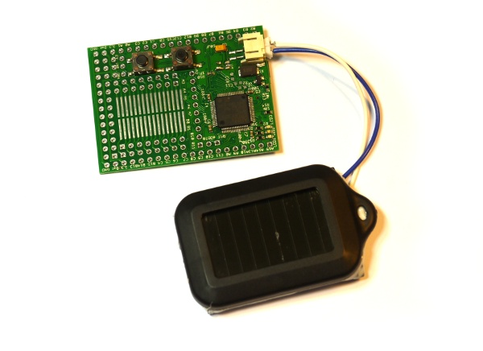
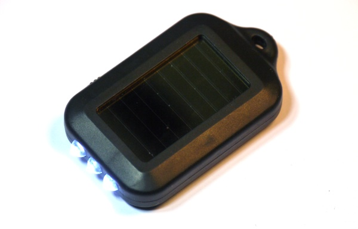
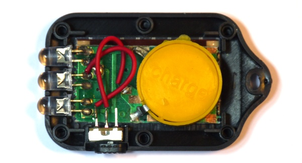
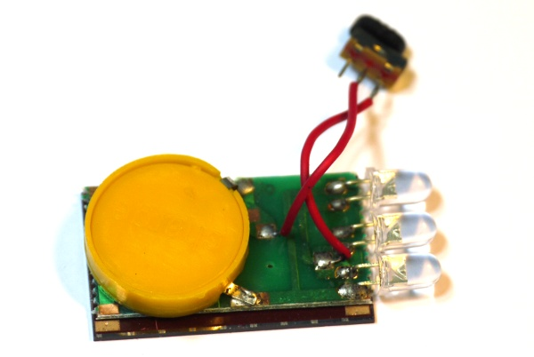
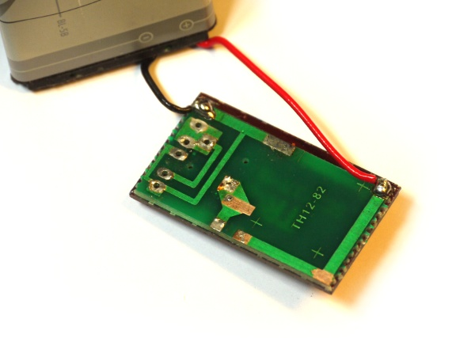
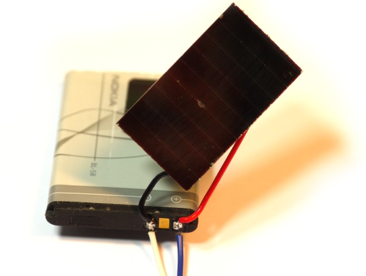

<!--- Copyright (c) 2013 Gordon Williams, Pur3 Ltd. See the file LICENSE for copying permission. -->
Small Solar Powered Espruino
============================

<span style="color:red">:warning: **Please view the correctly rendered version of this page at https://www.espruino.com/Small Solar Powered**. Links, lists, videos, search, and other features will not work correctly when viewed on GitHub.</span>

* KEYWORDS: Power,Solar,Light,Energy Harvesting
* USES: Espruino Board,Solar Panel,Battery



Introduction
-----------

So you've made a program in Espruino, and now you want to put it somewhere and have it run without you having to worry about changing batteries.

The obvious solution to this is to use a solar panel and a battery (to keep Espruino working overnight). A really good, cheap source of these seems to be solar powered torches. They're advertised as having a 3.6v rechargable lithium battery inside, which would be perfect for Espruino.

You'll Need
-----------

* An Espruino board
* A Small Solar Powered Torch (available for around $2 on eBay).
* An old Mobile phone battery (see below)
* A JST battery connector (see [[EspruinoBoard]] for where to get these)



The Torch
--------

For $2, a little device containing a battery and solar panel sounds too good to be true. At least in the devices I've looked at, it is!

Crack the device open by sticking a knife in the seam around the side and levering. It may help to bend and remove the metal loop that holds the keychain.



Inside we seem to be off to a good start. There's a little PCB with 3 LEDs, a switch, and a circular plastic battery helpfully named with 'charge'.

However looking a bit closer there are some problems.



* Right at the bottom of this picture, you can just see the dark red solar panel with two metal pads on it. They're not attached to anything. This torch is not solar powered at all - but they have still fitted a working solar panel onto it!
* If you take the plastic disc labelled 'charge' off, you'll see that there are two CR2016 batteries inside. This makes 6v, not 3.6v, and **they are not rechargeable**.
* If you put a voltmeter on the circuit, you'll see that the battery and LEDs are fitted **back to front** - so the traces labelled with **+** are actually **-** and vice-vera. The solar panel is correct, so if you were to connect the panel it would just discharge the batteries rather than charging them!

Fixing it
--------

If your torch is actually as described (with a rechargable battery and a connected panel) [please let us know!](http://forum.espruino.com) If not, you're going to have to fit a proper rechargeable battery to it. 



* Carefully unsolder all the components from the board
* Put two blobs of solder between the solar panel and the PCB - finally connecting everything up!
* Get your old phone battery and figure out which pin is **+** and which is **-**. Often it will be marked, but you could use a voltmeter. Check the solar panel as well.
* Get some wire and solder the panel and the JST battery connector to the battery. For more information about the JST connector, see [[EspruinoBoard]]



Now, you should have a solar-powered battery! You can always glue the torch's top back onto the top of the battery to help protect the panel (as in the image at the top of this page).

**Note:** Li-Ion batteries are not supposed to be charged past 4.2v and there is no circuitry to protect against this. However the solar panel produces so little power that this is unlikely to be a problem.

Power Consumption
---------------

Let's look at how much power is going in to and out of the battery:

| Power | Reason |
| ----- | ------ |
| -110uA | Espruino in Deep Sleep - see the [[Power Consumption]] page |
| -60uA  | Espruino might wake up (drawing 35mA) for 0.1 sec every minute - that's `35000uA * 0.1 sec / 60 sec = 58uA` | 
| +150uA | The solar panel produces around 300uA in bright sunlight, but that's maybe only half the day |
| =&nbsp;-20uA | |

So it's not looking good. We're 20uA short on power (unless you're near the equator where the solar panel will work better). We could wake up less often and for less time, and that would help. It's also not the end of the world - with a 20uA power draw, a charged 750mAh phone battery will still last for 4 years!

The issue here is the solar panel. At 150uA, the panel (with no Espruino) will still take over 6 months just to charge the battery!

We can do better with Espruino though - in Deep Sleep, the majority of the power draw on the Espruino board is from the voltage regulator. If we're running from a Li-Ion battery we don't need the regulator and we can save a lot of power. See the [[Power Consumption]] page for details on how to remove the regulator. This brings our power draw down as follows:

| Power | Reason |
| ----- | ------ |
| -30uA | Espruino in Deep Sleep with voltage regulator removed |
| -60uA | Espruino might wake up (drawing 35mA) for 0.1 sec every minute - that's `35000uA * 0.1 sec / 60 sec = 58uA` | 
| +150uA | The solar panel produces around 300uA in bright sunlight, but that's maybe only half the day |
| =&nbsp;+60uA | |

Great! We're now at the point where Espruino will run off the tiny solar panel - and the battery gets charged.


Software
-------

Now for the software. Enabling deep sleep mode is as easy as calling `setDeepSleep(1);`. Here we're going to flash an LED every 10 seconds, and we'll also log the battery voltage into an array. Note that we add 0.7 to the battery voltage, because when the voltage regulator was removed we added a diode instead (which lowers the voltage by 0.7v) - it's not a very accurate measurement of the voltage, but it's a good example.

```
var history = new Uint8Array(64);
var currentHistory = 0;

function onTimer() {
  currentHistory = (currentHistory+1) % history.length;
  history[currentHistory] = E.getAnalogVRef()+0.7;
                           
  digitalWrite(LED1, 1);
  setTimeout(function () {
    digitalWrite(LED1, 0);
  }, 10);
}

setInterval(onTimer, 10000);
setDeepSleep(1);
```

Now just unplug the USB connector and you're sorted. Espruino should run forever!

As we mentioned earlier, Li-Ion and Li-Po batteries shouldn't be charged past 4.2v. Given that the solar panel produces so little power, we can ensure that the battery never gets charged past this level just by detecting when the voltage gets too high and the turning on an LED (which draws more power than the solar panel produces).

If you use the following `onTimer` function, that's what'll happen:

```
function onTimer() {
  var voltage = E.getAnalogVRef()+0.7;
  digitalWrite(LED2, voltage>4.2);

  currentHistory = (currentHistory+1) % history.length;
  history[currentHistory] = voltage;
                           
  digitalWrite(LED1, 1);
  setTimeout(function () {
    digitalWrite(LED1, 0);
  }, 10);
}

```
