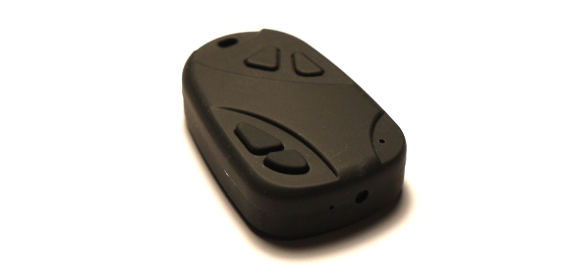
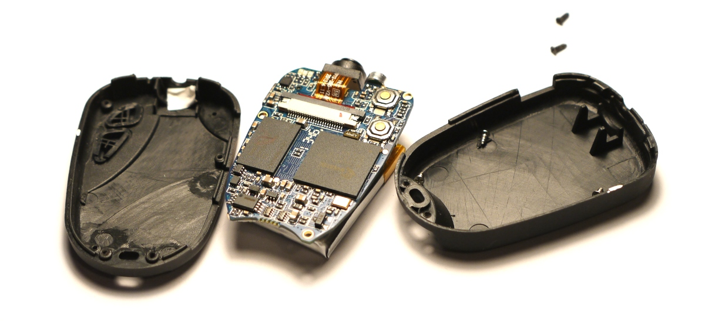
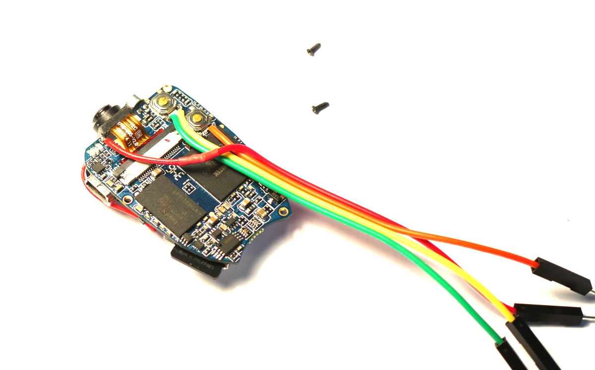
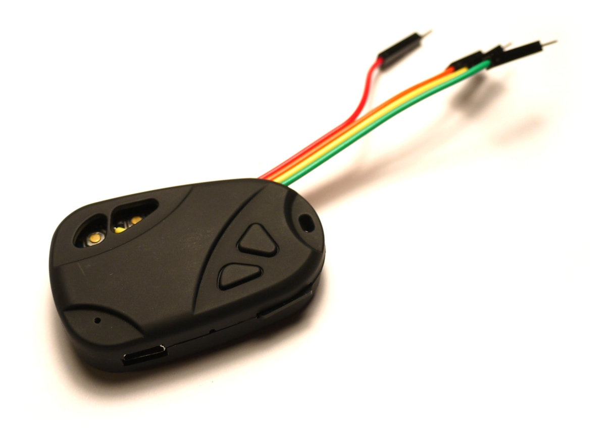
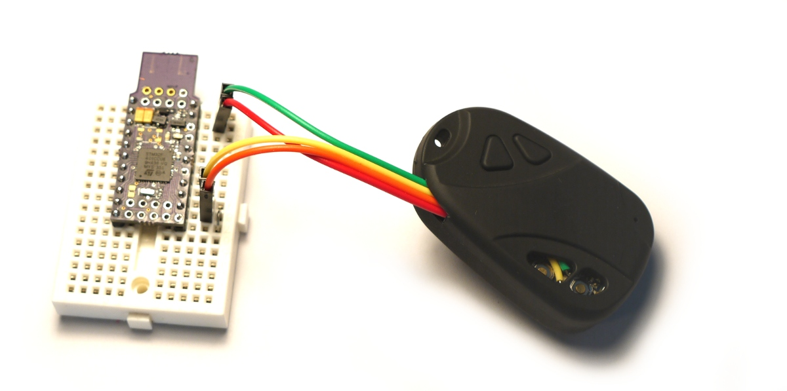

<!--- Copyright (c) 2014 Gordon Williams, Pur3 Ltd. See the file LICENSE for copying permission. --> 
Time Lapse Camera
=================

<span style="color:red">:warning: **Please view the correctly rendered version of this page at https://www.espruino.com/Time Lapse Camera**. Links, lists, videos, search, and other features will not work correctly when viewed on GitHub.</span>

* KEYWORDS: Camera,Time,Time Lapse
* USES: Battery,Camera



While the Espruino board doesn't have enough memory to take proper pictures, nothing stops it from controlling other devices. In many cases this is a cheaper and more power efficient way to get the same result!

Here, we'll show you how to make a time lapse camera using a cheap keyring camera and an Espruino board.

The Espruino board will fake the keypresses needed to turn the camera on, put it into picture mode, take a picture, and then turn it off.

You'll Need
----------

* An '808' key ring camera. There are a few different types with different specifications - see [this excellent guide](http://www.chucklohr.com/808/index.shtml) for more information. The type I've used is the '#16'.
* Some thin, insulated wire
* A relatively fine Soldering Iron tip and a steady hand!

Wiring
------



* Take the camera to pieces - there are two screws on the 'keyring' end of the camera
* Remove the PCB from the case (there are 3 screws), and disconnect the battery



* Connect the wires as shown in the picture. You need:
  * One wire to the battery's positive terminal (red)
  * One wire to each side of the 'shutter' switch. The (green) wire nearest the camera sensor is ground, the other (yellow) wire is the shutter signal.
  * One wire to the power button nearest the edge of the board (orange) 



* Re-assemble everything. If your wires are thick then you may need to leave out the two plastic buttons and the three internal screws.
* Now connect to Espruino:

| Wire   | Function  | Espruino |
|--------|-----------|----------|
| Red    | Battery + | Vin / JST Battery |
| Green  | Battery - | GND               |
| Yellow | Shutter   | A7                |
| Orange | Power     | A5 and A6         |



The image above shows an Espruino Pico prototype, but you can also use a 'classic' Espruino board for this.

How it works
-----------

The manual says the following:


So (while Espruino can't check the SD card!), we need to follow the steps given which we'll do using timeouts and callbacks.

The one slight 'gotcha' is that the camera requires quite a lot of power across the 'power' button to be able to turn itself on. In order to get this from Espruino without any external components we're just going to join two outputs together (A5 and A6).

Software
--------

Load the code below into Espruino, type `save()`, and you're sorted! Espruino will run off the keyring camera's battery and take a picture every 60 seconds.

Just edit the last few lines of code below to change the time period that the camera is active for...

```
var PWR = [A5,A6];
// PWR active high - we need a lot of current to force the camera on, so use 2 pins
var SHUTTER = A7;
// SHUTTER active low


// Pulse the power pin(s) high for the given time period, wait, and call the callback
function pulsePWR(time, callbackDelay, callback) {
  digitalWrite(PWR,255);
  setTimeout(function() {
    digitalRead(PWR); // set to open circuit
    if (callback) setTimeout(callback,callbackDelay);
  },time);
}

// Turn power on
function powerOn(callback) {
  pulsePWR(2000, 2000, callback);
}

// Turn power off
function powerOff(callback) {
  pulsePWR(3000, 2000, callback);
}

// Short-press power to switch modes
function toggleMode(callback) {
  pulsePWR(100, 1000, callback);
}

// Short-press shutter to take picture
function shutter(callback) {
  digitalWrite(SHUTTER,0);
  setTimeout(function() {
    digitalRead(SHUTTER); // set to open circuit
    if (callback) setTimeout(callback,1000);
  },100);
}

// Glue all the commands together to turn the camera on and take a picture
function takePicture() {
  powerOn(function() {
    toggleMode(function() {
      shutter(function() {
        powerOff();
      });
    });
  });
}

// Flash every 15s to show we're alive
setInterval(function() {
  digitalPulse(LED1,1,20);
}, 15000);
// Take a picture every 60s
setInterval(function() {
  takePicture();
}, 60*1000);

// Go into power save mode
setDeepSleep(1);
```

Now you have this framework, you could easily use it to record a few seconds of video every few minutes, or when a [[Pyroelectric]] sensor detected motion!
