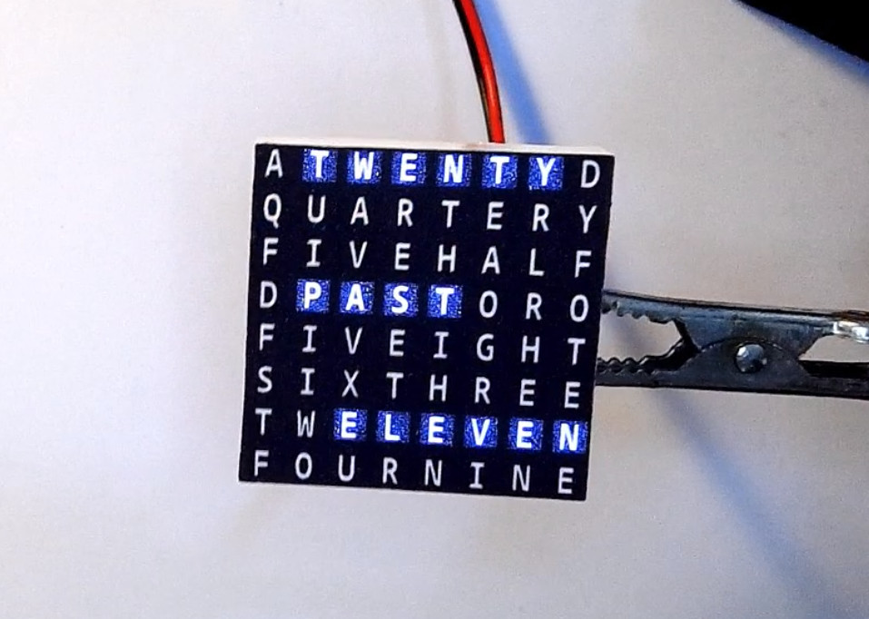
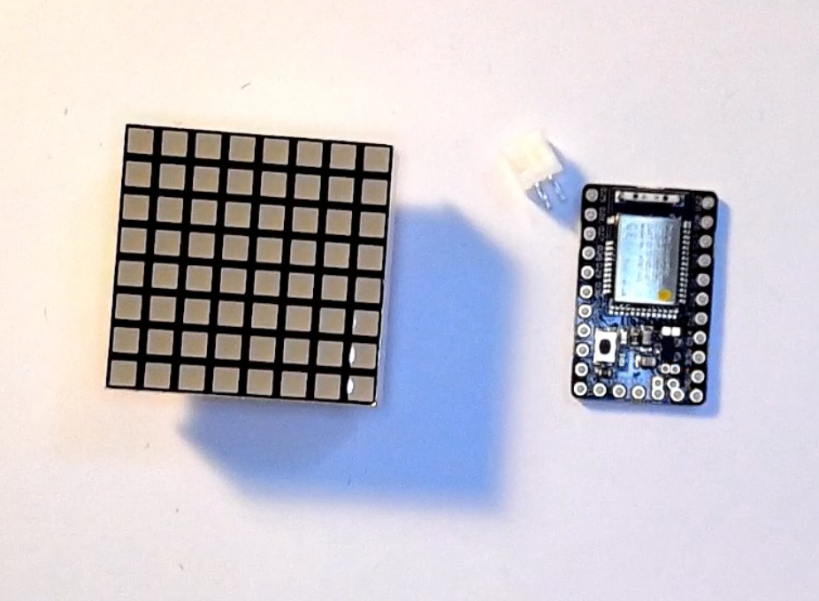
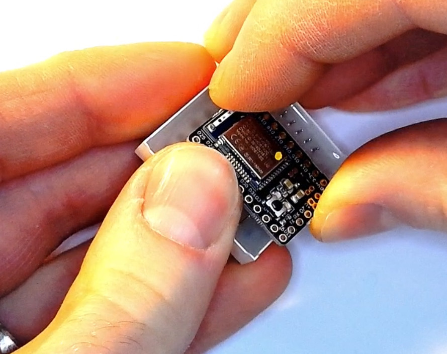
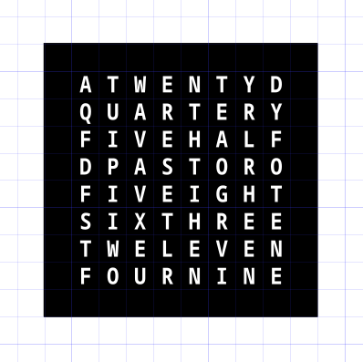

<!--- Copyright (c) 2019 Gordon Williams, Pur3 Ltd. See the file LICENSE for copying permission. -->
Tiny Word Clock
================

<span style="color:red">:warning: **Please view the correctly rendered version of this page at https://www.espruino.com/Tiny+Word+Clock. Links, lists, videos, search, and other features will not work correctly when viewed on GitHub** :warning:</span>

* KEYWORDS: Tutorials,Clock,Time,Word Clock
* USES: MDBT42Q,LEDMatrix



Word clocks display the current time by lighting up letters that spell out
the time in words. This tutorial shows you how to make a Tiny Word clock using
a cheap 8x8 LED Matrix and an Espruino microcontroller board:

[[http://youtu.be/NL0ehzrf1qQ]]


You'll need
-----------



* An 8x8 [LED Matrix](/LED+Matrix)
* A [MDBT42Q Breakout](/MDBT42Q) board
* A JST connector and [[Battery]] (or other way of powering your board)
* A label printed with the 8x8 pattern of letters


Wiring Up
---------

Just connect the LED matrix to **any** available IO pins. For the MDBT42Q
it's best to position the board over the very top pins on one side, and then
push inwards. After a few attempts on each side you should have bent the pins
enough that both sides will fit onto the MDBT42Q.



On the board in the pictures, I've also pushed the PCB downwards so that
it doesn't stick out of the side of the LED matrix.

As in the video, if your LED Matrix is different, you used different pins,
or wired it in a different orientation, check out the [LED Matrix wiring guide](/LED+Matrix#wiring)
for some code that'll work out which wire goes where.

**NOTE:** It's not good practice to connect LEDs directly to microcontroller
pins like we have here, **however** because the display is multiplexed we're
only turning LEDs on for a tiny amount of time, which is extremely unlikely
to cause damage to your LEDs or microcontroller.


Labelling the display
---------------------



The PDF file that was printed for the word clock [is available here](/files/wordclock_8x8_label.pdf).

The label in the video was printed on an inkjet printer, however there is some
light bleed visible as black isn't entirely opaque. If you have access to one,
printing on a laser printer (or in the highest quality possible on an inkjet)
will help with this,


Software
--------

Just copy this to the right-hand side of the IDE and click `Upload`. When
it's as you like it you can just type `save()` on the left-hand side to save
the state permanently.

The current time will be lost if the board is powered off. In this case you
can use the [Bluetooth Time Setter](https://www.espruino.com/Bluetooth+Time)
page on any Web Bluetooth device (PC/Mac running Chrome, Android Phone, or
  iPhone running [the WebBLE app](https://itunes.apple.com/us/app/webble/id1193531073?mt=8))


```
/*
8x8 pattern from https://github.com/andydoro/WordClock-NeoMatrix8x8

  01234567
0 ATWENTYD
1 QUARTERY
2 FIVEHALF
3 DPASTORO
4 FIVEIGHT
5 SIXTHREE
6 TWELEVEN
7 FOURNINE
*/

// The indices of each word as XY
var WORDS = {
  "a":[00],
  "_five":[02,12,22,32],
  "_ten":[10,30,40],
  "_quarter":[01,11,21,31,41,51,61],
  "_twenty":[10,20,30,40,50,60],
  "_half":[42,52,62,72],

  "past":[13,23,33,43],
  "to":[43,53],

  "one":[17,47,77],
  "two":[06,16,17],
  "three":[35,45,55,65,75],
  "four":[07,17,27,37],
  "five":[04,14,24,34],
  "six":[05,15,25],
  "seven":[05,46,56,66,67],
  "eight":[34,44,54,64,74],
  "nine":[47,57,67,77],
  "ten":[74,75,76],
  "eleven":[26,36,46,56,66,76],
  "twelve":[06,16,26,36,56,66]
};

const ANODES = [D25,D26,D30,D16,D31,D18,D19,D28];
const CATHODES = [D17,D20,D15,D22,D29,D14,D27,D3];
var g = Graphics.createArrayBuffer(8,8,1);

// Start scanning out the LED display
function startScanning() {
  var b = new Uint8Array(g.buffer);
  // Pre-bind digitalWrites to make things faster
  var a = digitalWrite.bind(undefined,ANODES);
  var c = digitalWrite.bind(undefined,CATHODES.concat(ANODES));
  return setInterval(function() {
    b.map((d,i)=>{c(65280^(256<<i));a(d);});c(65280);
  },10); // 100 Hz
}

// Given an array of words, set the relevant LEDs to light up
// in rainbow colours
function outputWords(wordList) {
  g.clear();
  wordList.forEach(function(word) {
    WORDS[word].forEach(function(led) {
      var y = led%10;
      var x = (led-y)/10;
      g.setPixel(x,y);
    });
  });
}

// Convert hours and minutes (seconds are ignored) into a string such as '_five minutes past six'
// We prefix the first part with an underscore so we don't accidentally light the wrong 'five' up
function timeToWords(h,m,s) {
  var mins = ["","_five","_ten","_quarter","_twenty","_twenty _five","_half"];
  var hours = ["", "one","two","three","four","five","six","seven","eight","nine","ten","eleven","twelve"];

  var str = "";
  // the nearest 5 minutes
  var midx = Math.round(m/5);
  var hidx = h;
  // work out if we're 'past' or 'to' and adjust hour accordingly
  if (midx>6) {
    if (midx==12) midx=0;
    hidx++;
  }
  hidx = hidx % 12;
  if (hidx==0) hidx=12;
  // finally output minutes and hours
  if (midx!=0) {
    if (midx<=6)
      str += mins[midx]+" past ";
    else {
      str += mins[12-midx]+" to ";
    }
  }
  str += hours[hidx];
  return str;
}

// Every minute, update what is displayed
function onMinute() {
  // Get the time as a string
  var d = new Date();
  var timeWords = timeToWords(d.getHours(),d.getMinutes(),d.getSeconds());
  // convert it to an array of words and light up the LEDs
  outputWords(timeWords.split(" "));  
}

setInterval(onMinute, 60000);
onMinute();
startScanning();
```

Buying
------

* [MDBT42Q Breakout](/MDBT42Q) boards can be [ordered from here](/Order#mdbt42q)
* The [LED Matrix page](/LED+Matrix#buying) has information on where to buy matrices from
